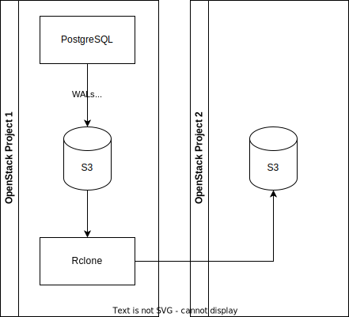

# PostgreSQL - Enable external replication

- Status: accepted
- Deciders: arch meeting
- Date: 2022-10-27

## Context and Problem Statement

We have received a few requests from Application Developers to enable external replication on PostgreSQL so that they are able to create copies of the PostgreSQL cluster themselves to use for testing, development, tuning and disaster recovery purposes.
Should we allow and enable external replication for PostgreSQL, or should we offer an alternative that can mimic that?

## Decision Drivers

- We want to best serve the Application Developer needs.
- We want to make the Platform Administrators life easier.
- We want to ensure platform security and stability.
- We want to make it hard for Application Developers to break the platform via trivial mistakes.

## Considered Options

- Allow external replication on PostgreSQL.
- Do not allow external replication on PostgreSQL.
- Allow read access to the S3 bucket containing the files that can mimic the replication.
- Clone the S3 bucket containing the files using rclone to another bucket in a new project preferably owned by the Application Developer and from there the Application Developer is free to use it.

## Decision Outcome

Chosen options: Clone the S3 bucket containing the files using rclone to another bucket in a new project preferably owned by the Application Developer and from there the Application Developer is free to use it.
We rclone the backups (once per night) in this new S3 bucket.
We provide no SLA on the rclone job.

The option `Allow external replication on PostgreSQL` is putting the platform stability and integrity at risk, because external replication is done via the replication slots and if the destination of the replication is unreachable or stopped, then the WAL files are kept on disc until the files are sent to destination and confirmed to be received. This means that the WAL files will pile up until the cluster runs out of space and crashes. This also leads to data loss and data corruption.

On Infrastructure Providers that do not have native S3 support with ACL capabilities we need endpoint/credentials from the user to a S3 bucket of their choosing that we can rclone to. We rclone the backups (once per night) in this new S3 bucket and provide credentials to the Application Developer. We provide no SLA on the rclone job.
The diagram of the solution looks like this:

### Positive Consequences

- We make the Platform Administrators life easier by offering them a possibility to clone/replicate their PostgreSQL cluster from the S3 bucket containing the basebackup and WAL files.
- Platform Administrators can now use 3rd party tools that can pull the basebackup and WAL files and clone the PostgreSQL cluster in another location.
- Increase Application Developer autonomy

### Negative Consequences

- For providers that do not offer S3 with ACL, we need to create and maintain an rclone job that copies the files from the initial S3 backup bucket to a new S3 bucket (preferably owned by the Application Developer)
- When rclone is involved, the time to recover will be up to 24 hours old as we will rclone once per day.

## Recommendation to Platform Administrators

On providers that offer S3 with ACL, this can be done with small effort.
On providers that do not offer S3 with ACL we need to clone the bucket containing the file to another S3 bucket that is preferably owned by the Application Developer.
This is done with no SLA on it.
Offer this only on request.

## Pros and Cons of the Options <!-- optional -->

### [option 1] - Allow external replication on PostgreSQL

- Good, because we satisfy the Application Developer need
- Bad, because it comes with a big risk of breaking the PostgreSQL cluster and cause downtime.

### [option 2] - Do not allow external replication on PostgreSQL

- Good, because we do not have to do any changes/work.
- Good, because the integrity and stability of the platform is kept intact.
- Bad, because we are not flexible and do not try to satisfy the Application Developer need.

### [option 3] - Allow read access to the S3 bucket containing the files that can mimic the replication

- Good, we can satisfy the custmer need and demonstrate we are flexible and Application Developer oriented.
- Good, because we keep the platform stability and integrity intact.
- Bad, because it involves extra work and some snowflakiness.

## Links <!-- optional -->

- [PostgreSQL replication](https://www.postgresql.org/docs/current/runtime-config-replication.html)
- [Streaming ReplicationHNC](https://www.postgresql.org/docs/current/warm-standby.html#STREAMING-REPLICATION)
