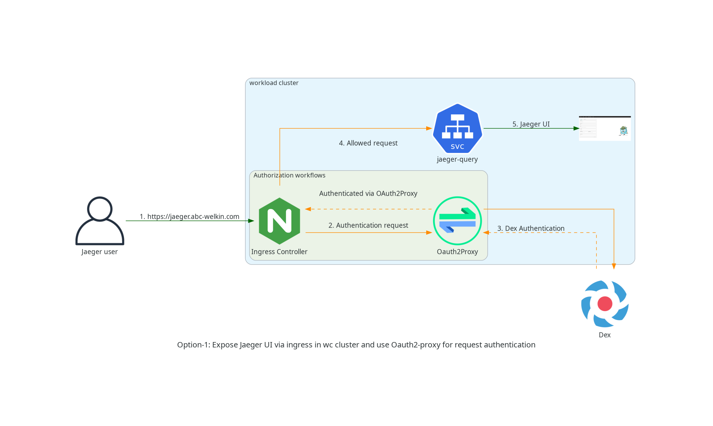
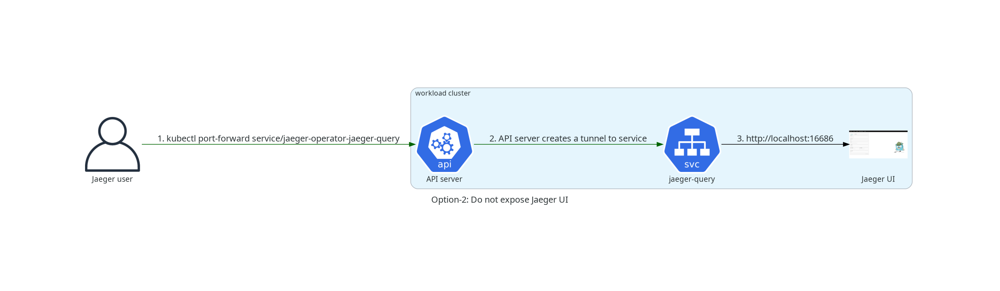
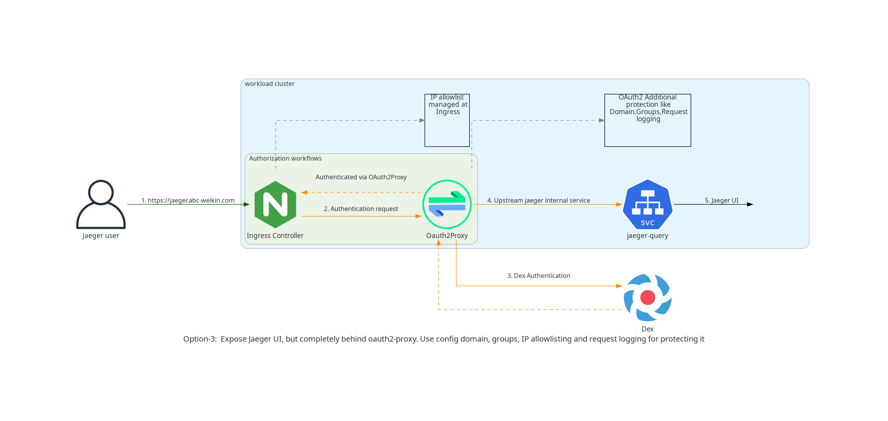
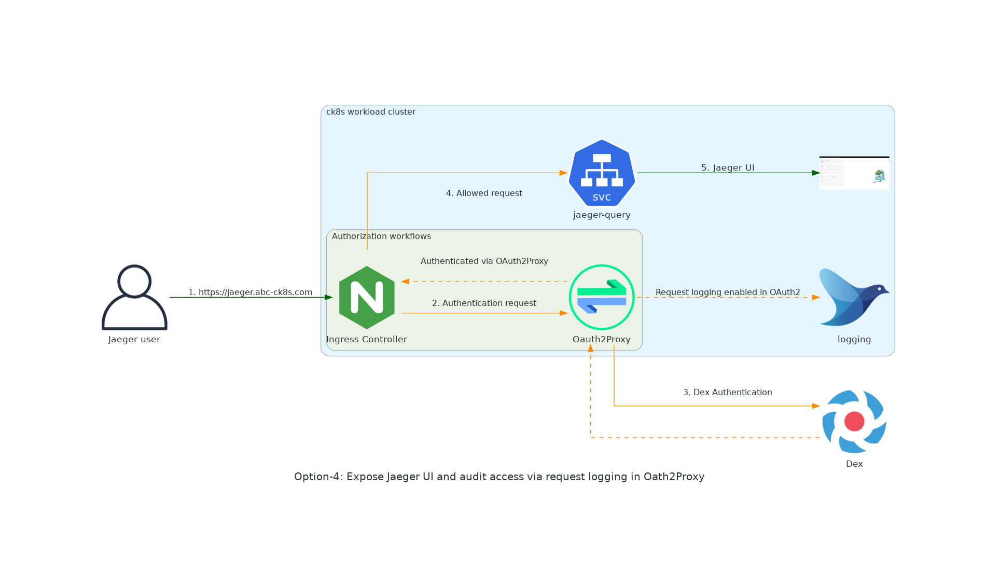

# Expose Jaeger UI in WC

- Status: accepted
- Deciders: arch meeting
- Date: 2023-01-12

## Context and Problem Statement

## Decision Drivers

- We want to deliver a platform that is easy to use and easy to access.
- We want to ensure platform security and stability.
- We want to make it hard for customers to break the platform via trivial mistakes.
- We want to best serve our customer needs.

## Considered Options

- Expose Jaeger UI via Ingress in Workload Cluster and use Oauth2-proxy for request authentication.
- Do not expose Jaeger UI in Workload Cluster.
- Expose Jaeger UI, but completely behind oauth2-proxy. Configure domain, groups, IP allowlisting and request logging for protecting it.
- Expose Jaeger UI and auditing access via request logging in Oath2Proxy.

## Decision Outcome

Chosen options: `Expose Jaeger UI, but completely behind oauth2-proxy. Use config domain, groups, IP allowlisting and request logging for protecting it.` .
If this solution turns out to serve our customer needs and our needs, we will consider adopting it for exposing other services UI's like Alertmanager and Prometheus.

### Positive Consequences

- Security and stability of the platform is maintained.
- We serve our customer needs.
- We deliver a platform that is easy to use and easy to access.

### Negative Consequences

- We need to add an additional component that needs to be configured, installed and maintained.

## Recommendation to Operators

Make sure that you use domain listing, groups and IP allowlisting.

## Pros and Cons of the Options

### [option 1] - Expose Jaeger UI via Ingress in Workload Cluster and use Oauth2-proxy for request authentication

- Good, because we deliver a platform that is easy to use and easy to access.
- Good, because we serve our customer need
- Bad, because we lose the ability to audit the access to it as they do not have the concept of users and does not have RBAC.

### [option 2] - Do not expose Jaeger UI

- Good, because the integrity and stability of the platform is kept intact.
- Bad, because we do not satisfy the customer need to easily access the UI
- Bad, because we do not serve our customer needs.

### [option 3] - Expose Jaeger UI, but completely behind oauth2-proxy. Configure domain, groups, IP allowlisting and request logging for protecting it

- Good, because we deliver a platform that is easy to use and easy to access.
- Good, because we serve our customer need
- Good, because we do not loose the ability to audit the access to it as using this option we can audit the access.
- Good, because we the security and stability of the platform is maintained by using the domain listing, groups and IP allowlisting.
- Bad, because we need to add an additional component that needs to be configured, installed and maintained.

### [option 4] - Expose Jaeger UI and audit access via request logging in Oath2Proxy

- Good, because we deliver a platform that is easy to use and easy to access.
- Good, because we serve our customer need
- Good, because we do not loose the ability to audit the access to it as using this option we can audit the access.
- Bad, because it is less secure then the `option 3`
- Bad, because we need to add an additional component that needs to be configured, installed and maintained.
