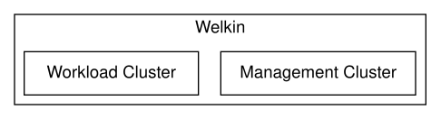

---
tags:
  - MSBFS 2020:7 2 kap. 4 §
  - NIST SP 800-171 3.1.11
  - NIST SP 800-171 3.12.4
---

# Architecture

Below we present the architecture of Welkin, using the [C4 model](https://c4model.com/).

For the nitty-gritty details, see [Architectural Decision Records](adr/index.md).

## Level 1: System Context

Let us start with the system context.

Compliance imposes restrictions on all levels of the tech stack. Your compliance focus should mostly lie on your application. Welkin ensures that the platform hosting your application is compliant. Finally, you need the whole software stack on a hardware that is managed in a compliant way, either via an ISO 27001-certified Infrastructure Provider or using on-prem hardware.

## Level 2: Clusters

Most regulations require logging to a tamper-proof environment. This is usually interpreted as an attacker gaining access to your application should not be able to delete logs showing their attack and the harm caused by their attack.

To achieve this, Welkin is implemented as two Kubernetes clusters

- A **Workload Cluster**, which hosts your application, and
- A **Management Cluster**, which hosts services for monitoring, logging and vulnerability management.

## Level 3: Individual Components

Click on the diagram below to see the nuts-and-bolts of Welkin.

!!!note

    Due to technical limitations, some compliance-related components still need to run in the Workload Cluster. These are visible when inspecting the Workload Cluster, for example, via the [Kubernetes API](user-guide/kubernetes-api.md). Currently, these components are:

    - Falco, for intrusion detection;
    - Prometheus, for collecting metrics;
    - Fluentd, for collecting logs;
    - OpenPolicyAgent, for enforcing Kubernetes API policies.

    Note that, the logs, metrics and alerts produced by these components are immediately pushed into the tamper-proof logging environment, hence this technical limitation does not weaken compliance.

## Level 3: Authentication

Click on the diagram below to see the nuts-and-bolts of Welkin authentication.

## Level 3: Backup

Click on the diagram below to see the nuts-and-bolts of Welkin backup.

## Level 3: Metrics and Metrics-based Alerting

## Level 3: Logs and Log-based Alerting

## Level 3: Access Control

