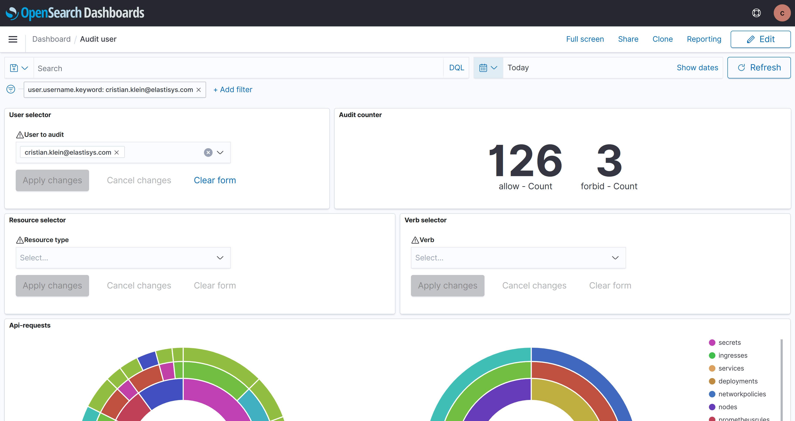
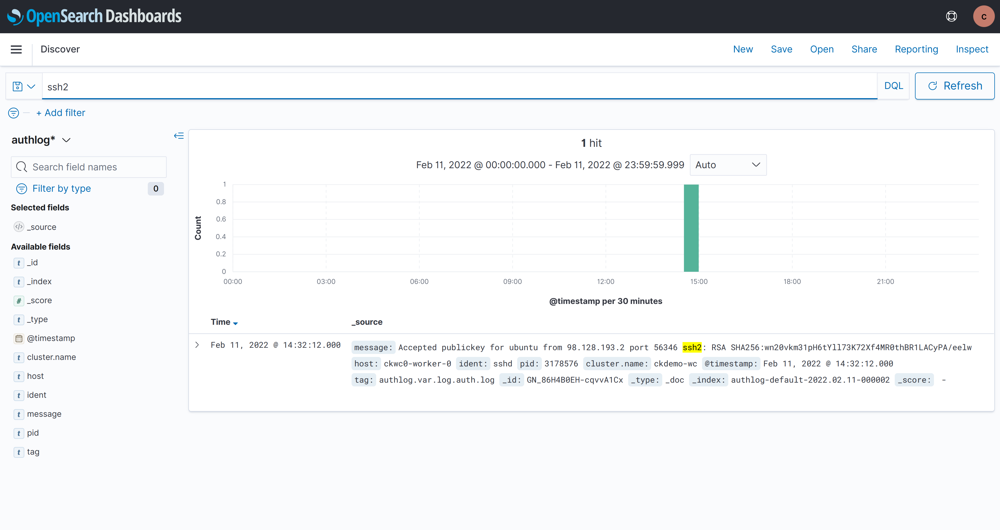

---
tags:
- ISO 27001 A.12.4.3 Administrator & Operator Logs
- HIPAA S18 - Security Awareness, Training, and Tools - Log-in Monitoring - § 164.308(a)(5)(ii)(C)
- HIPAA S48 - Audit Controls - § 164.312(b)
- MSBFS 2020:7 4 kap. 16 §
- HSLF-FS 2016:40 4 kap. 9 § Kontroll av åtkomst till uppgifter
- NIST SP 800-171 3.1.7
- NIST SP 800-171 3.3.1
---
# Audit Logs

To help comply with various data protection regulations, Compliant Kubernetes comes built-in with audit logs, which can be accessed via [OpenSearch Dashboard](../user-guide/logs.md).

## What are audit logs?

In brief, audit logs are lines answering "**who** did **what** and **when**?".

## Why are audit logs important?

Audit logs help both with proactive and reactive security:

* Regular audit [log reviews](log-review.md) give you a chance to catch an attacker before they succeed.
* After-the-fact, audit logs allow you to gather evidence for forensics and assess the extend of the damage caused by an attacker.

## What audit logs are included?

Compliant Kubernetes follow a risk-based approach to audit logs.
We enable audit logs on all APIs which can be used to compromise data security.
Then we filter high-volume low-risk audit logs.
Don't forget that, at the end of the day, logs are only as useful as someone looks at them.
See [log review](log-review.md) for details.

Specifically, the following audit logs are configured by default:

- Kubernetes API audit logs;
- SSH access logs.

Further audit logs can be configured on a case-by-case basis, as described below.

## Kubernetes API Audit Logs

The audit logs are stored in the `kubeaudit*` index pattern.
The audit logs cover calls to the Kubernetes API, specifically **who** did **what** and **when** on **which** Kubernetes cluster.

Thanks to integration with [your Identity Provider](../user-guide/kubernetes-api.md#authentication-and-access-control-in-compliant-kubernetes) (IdP), if who is a person, their email address will be shown. If who is a system -- e.g., a CI/CD pipeline -- the name of the ServiceAccount is recorded.

Your change management or incident management process should ensure that you also cover **why**.

Both users (Application Developers) and administrators will show in the audit log. The former will change resources related to their application, whereas the latter will change Compliant Kubernetes system components.

The exact configuration of the Kubernetes audit logs can be found [here](https://github.com/elastisys/compliantkubernetes-kubespray/blob/main/config/common/group_vars/k8s_cluster/ck8s-k8s-cluster.yaml).

To view the audit logs for a specific user:
   1. Open the `Audit user` dashboard in Opensearch;
   2. Under `User selector` add the name of the user you want to audit (e.g admin@example.com);
   3. Apply changes;

## SSH Access Logs

Compliant Kubernetes also captures highly privileged SSH access to the worker Nodes in the `authlog*` index pattern. Only administrators should have such access.

!!!note
    This section helps you implement ISO 27001, specifically:

    * A.9.2.1 User Registration and Deregistration

    Many data protection regulation will require you to [individually identify administrators](../adr/0005-use-individual-ssh-keys.md), hence individual SSH keys. This allows you to individually identify administrators in the SSH access log.

## Audit Logs for Additional Services

The Kubernetes Audit Logs capture user access to additional services, i.e., `kubectl exec` or `kubectl port-forward` commands. Additional services usually do not have audit logging enabled, since that generates a lot of log entries. Too often the extra bandwidth, storage capacity, performance loss comes with little benefit to data security.

**Prefer audit logs in your application to capture audit-worthy events**, such as login, logout, patient record access, patient record change, etc. Resist the temptation to enable audit logging too "low" in the stack. Messages like "Redis client connected" are plenty and add little value to your data protection posture.

Out of all additional services, audit logging for the [database](../user-guide/additional-services/postgresql.md) makes the most sense. It can be enabled via [pgaudit](https://github.com/pgaudit/pgaudit/blob/master/README.md). Make sure you discuss your auditing requirements with the service-specific administrator, to ensure you find the best risk-reduction-to-implementation-cost trade-off. Typically, you want to discuss:

- which databases and tables are audited: e.g., audit `app.users`, but not `app.emailsSent`;
- what operations are audited: e.g., audit `INSERT/UPDATE/DELETE`, but not `SELECT`;
- by which users: e.g., audit person access, but not application access.

## Further Reading

* [Kubernetes Auditing](https://kubernetes.io/docs/tasks/debug/debug-cluster/audit/)
* [pgaudit](https://www.pgaudit.org/)
