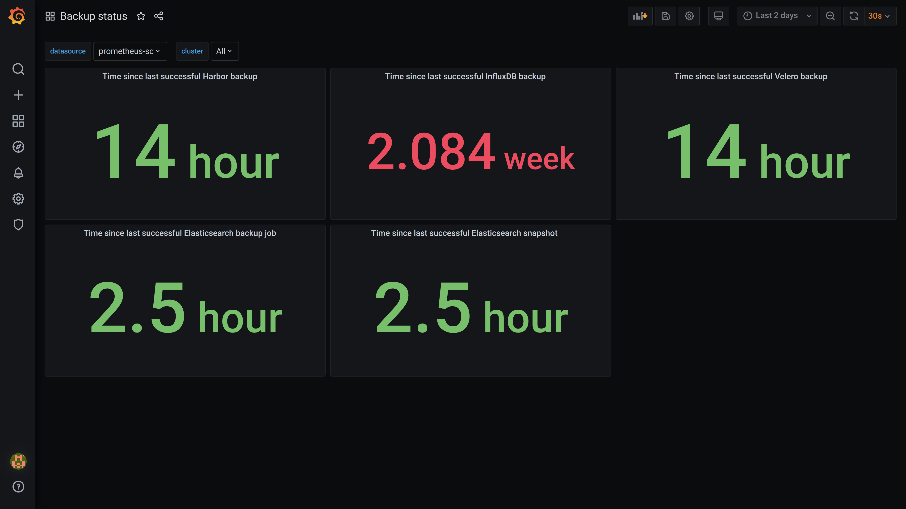

# Backup Dashboard

## Relevant Regulations

* [GDPR Article 32](https://gdpr-info.eu/art-32-gdpr/):

    > In assessing the appropriate level of security account shall be taken in particular of the risks that are presented by processing, **in particular from accidental or unlawful destruction, loss**, alteration, unauthorised disclosure of, or access to personal data transmitted, stored or otherwise processed. [highlights added]

* [HIPAA Part 164—SECURITY AND PRIVACY](https://www.hhs.gov/sites/default/files/ocr/privacy/hipaa/administrative/combined/hipaa-simplification-201303.pdf)

    > (A) Data backup plan (Required). Establish and implement procedures to create and maintain retrievable exact copies of electronic protected health information.
    > (B) Disaster recovery plan (Required). Establish (and implement as needed)
procedures to restore any loss of data.

## Mapping to ISO 27001 Controls

* [A.12.3.1 Information Backup](https://www.isms.online/iso-27001/annex-a-12-operations-security/)
* [A.17.1.1 Planning Information Security Continuity](https://www.isms.online/iso-27001/annex-a-17-information-security-aspects-of-business-continuity-management/)

## Compliant Kubernetes Backup Dashboard

The Compliant Kubernetes Backup Dashboard allows to quickly audit the status of backups and ensure the [Recovery Point Objective](https://en.wikipedia.org/wiki/Disaster_recovery#Recovery_Point_Objective) are met.

## Handling Non-Compliance

In case there is a violation of backup policies:

* Ask the operator to check the status of the [backup jobs](../operator-manual/disaster-recovery.md).
* Ask the developers to check if they correctly marked Kubernetes resources with the necessary [backup annotations](../user-guide/backup.md).
