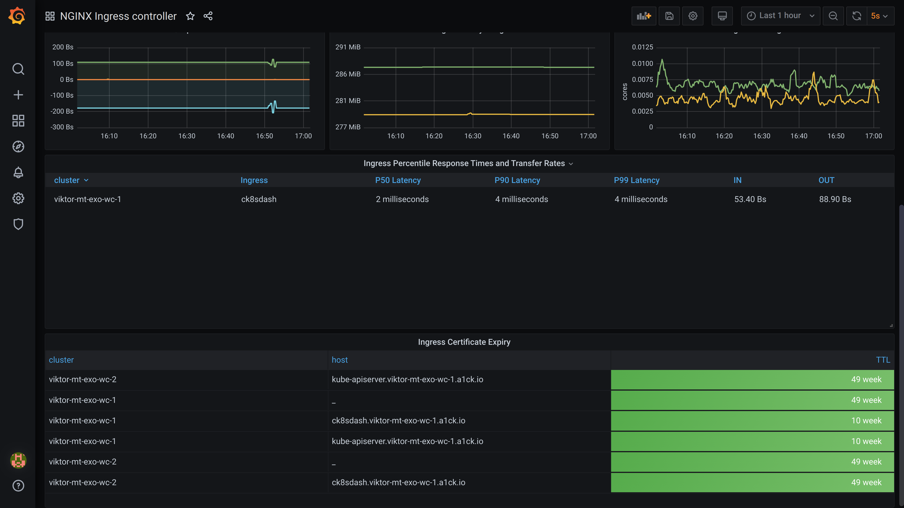

# Cryptography Dashboard

## Relevant Regulations

* [GDPR Article 32](https://gdpr-info.eu/art-32-gdpr/):

    > Taking into account the state of the art [...] the controller and the processor shall implement [...] as appropriate [...] encryption of personal data;
    >
    > In assessing the appropriate level of security account shall be taken in particular of the risks that are presented by processing, in particular from accidental or unlawful destruction, loss, alteration, **unauthorised disclosure of, or access to personal data transmitted**, stored or otherwise processed. [highlights added]

* [HIPAA Part 164—SECURITY AND PRIVACY](https://www.hhs.gov/sites/default/files/ocr/privacy/hipaa/administrative/combined/hipaa-simplification-201303.pdf)

    > (ii) Encryption (Addressable). Implement a mechanism to encrypt electronic protected health information whenever deemed appropriate.

## Mapping to ISO 27001 Controls

* [A.10 Cryptography](https://www.isms.online/iso-27001/annex-a-10-cryptography/)

## Compliant Kubernetes Cryptography Dashboard

The Compliant Kubernetes Cryptography Dashboard allows to quickly audit the status of cryptography. It shows, amongst others, the public Internet endpoints (Ingresses) that are encrypted and the expiry time. Default Compliant Kubernetes configurations automatically renew certificates before expiry.

## Handling Non-Compliance

In case there is a violation of cryptography policies:

* If a certificate is expired and was not renewed, ask the administrator to check the status of `cert-manager` and `ingress-controller` component.
* If an endpoint is not encrypted, ask the developers to set the necessary [Ingress annotations](https://cert-manager.io/docs/usage/ingress/).
