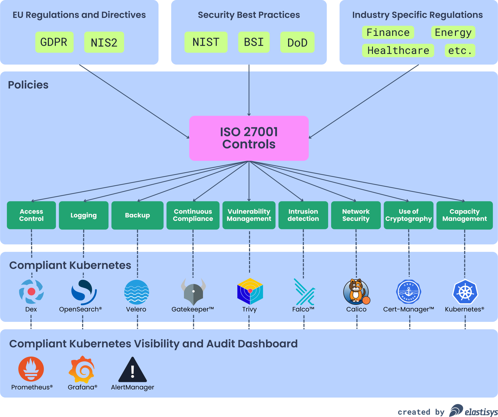

# CISO and DPO Guide Overview

This part of our open source documentation is intended for CISOs, DPOs or similar.
Our goal is to help users of Elastisys Welkin prove to both internal or external auditors that the application runs on top of a secure and compliant platform.

The vision of the project is to secure Europe’s digital future for services critical to society.
One very important aspect in order for us to deliver on that vision is to provide best in class documentation for how we enable users to fulfill their security and compliance requirements, control by control.

From the start, Elastisys Welkin has been built based on relevant EU regulations and industri best practices.
We've drawn inspiration from, and based architectural decision on information gathered from GDPR, NIS, NIS2, NIST, ENISA, MSB (Swedish Civil Contingencies Agency), BSI (German Federal Office for Information Security), US Department of Defense, industry specific regulations and much more.

## Platform architecture influenced by information security best practices

## Additional resources

Resources for the Chief Information Security Officer (CISO) or similar:

- [ISO 27001](./controls/iso-27001.md)
- [NIS2](./controls/nis2.md)

Resources for the Data Protection Officers (DPO) or similar:

- [GDPR](./controls/gdpr.md)
- [HSLF-FS 2016:40](./controls/hslf-fs-201640.md)

You might also want to read the [Frequently Asked Questions (FAQ)](faq.md).
