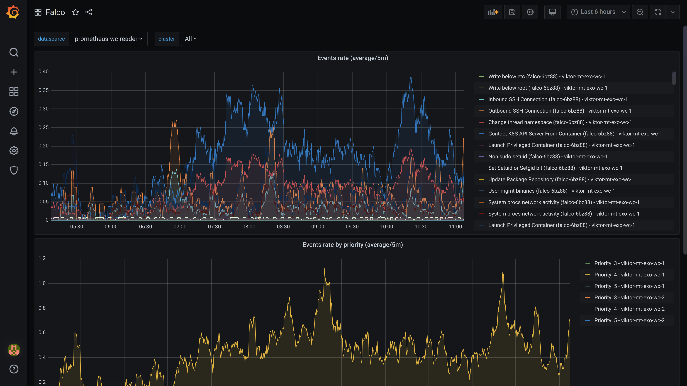

---
tags:
- ISO 27001 A.12.2.1
- ISO 27001 A.12.6.1
- ISO 27001 A.16.1.7
- HIPAA S20 - Security Incident Procedures - § 164.308(a)(6)
- MSBFS 2020:7 4 kap. 18 §
---
# Intrusion Detection Dashboard

## Relevant Regulations

### GDPR

[GDPR Article 32](https://gdpr-info.eu/art-32-gdpr/):

> Taking into account the state of the art [...] the controller and the processor shall implement [...] as appropriate [...] encryption of personal data;
>
> In assessing the appropriate level of security account shall be taken in particular of the risks that are presented by processing, in particular from accidental or unlawful destruction, loss, alteration, **unauthorised disclosure of, or access to personal data transmitted**, stored or otherwise processed. [highlights added]

### Swedish Patient Data Law

!!!note
    This regulation is only available in Swedish. To avoid confusion, we decided not to produce an unofficial translation.

[HSLF-FS 2016:40](https://www.socialstyrelsen.se/globalassets/sharepoint-dokument/artikelkatalog/foreskrifter-och-allmanna-rad/2016-4-44.pdf):

> **Utvärdering av skyddet mot olovlig åtkomst**
>
> 18 § Vårdgivaren ska årligen utvärdera skyddet mot såväl intern som extern olovlig åtkomst till datornätverk och informationssystem som används för behandling av personuppgifter.

## Mapping to ISO 27001 Controls

* [A.12.2.1 Controls Against Malware](https://www.isms.online/iso-27001/annex-a-12-operations-security/)
* [A.12.6.1 Management of Technical Vulnerabilities](https://www.isms.online/iso-27001/annex-a-12-operations-security/)
* [A.16.1.7 Collection of Evidence](https://www.isms.online/iso-27001/annex-a-16-information-security-incident-management/)

## Compliant Kubernetes Intrusion Detection Dashboard

The Compliant Kubernetes Intrusion Detection Dashboard allows to quickly audit any suspicious activity performed by code inside the cluster, such as writing to suspicious files (e.g., in `/etc`) or attempting suspicious external network connections (e.g., SSH to a command-and-control server). Such activities may indicate anything from a misconfiguration issue to an ongoing attack. Therefore, this dashboard should be regularly reviewed, perhaps even daily.

## Handling Non-Compliance

Make sure you have a proper incident management policy in place. If an attack is ongoing, it might be better to take the system offline to protect data from getting in the wrong hands. Operators need to be trained on what events justify such an extreme action, otherwise, escalating the issue along the reporting chain may add delays that favor the attacker.

In less severe cases, simply contact the developers to investigate their code and fix any potential misconfiguration.
