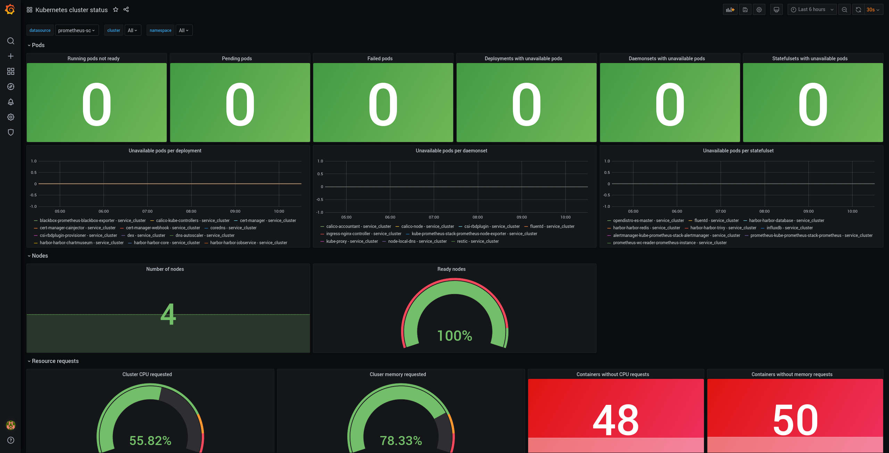

# Kubernetes Status Dashboard

## Relevant Regulations

* [GDPR Article X](https://gdpr-info.eu/):

    > Lorem ipsum

## Mapping to ISO 27001 Controls

* [A.YY.Z.N Some regulation](https://www.isms.online/iso-27001/)

## Compliant Kubernetes Intrusion Detection Dashboard

The Compliant Kubernetes Status Dashboard shows a quick overview of the status of your kubernetes cluster.
This includes:

* Unhealthy pods
* Unhealthy nodes
* Resource requested of the total resources in the cluster
* Pods with missing resource requests

This makes it easy to identify when your cluster is not working correctly and helps you identify configuration that isn't following best practise.
