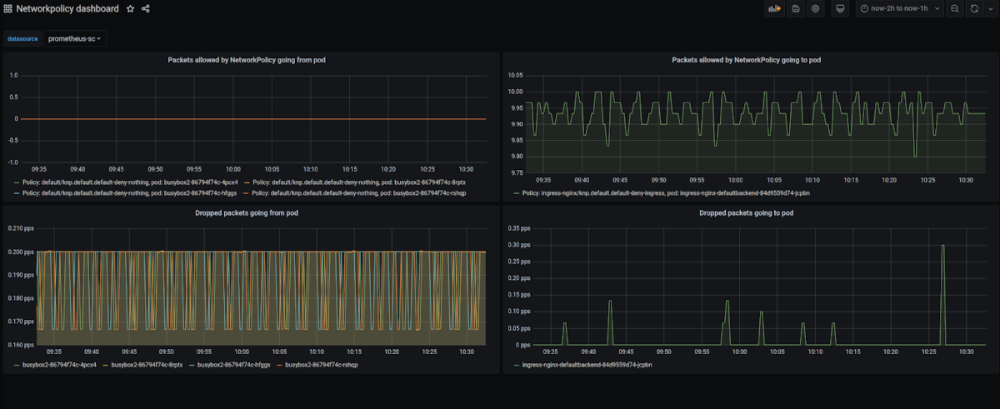

---
tags:
  - ISO 27001 A.13 Network Security
---

# Network Security Dashboard

## Relevant Regulations

### GDPR

[GDPR Article 32](https://gdpr.fan/a32):

> Taking into account the state of the art [...] the controller and the processor shall implement [...] as appropriate [...] encryption of personal data;
>
> In assessing the appropriate level of security account shall be taken in particular of the risks that are presented by processing, in particular from accidental or unlawful destruction, loss, alteration, **unauthorised disclosure of, or access to personal data transmitted**, stored or otherwise processed. [highlights added]

### Swedish Patient Data Law

!!!note

    This regulation is only available in Swedish. To avoid confusion, we decided not to produce an unofficial translation.

[HSLF-FS 2016:40](https://www.socialstyrelsen.se/globalassets/sharepoint-dokument/artikelkatalog/foreskrifter-och-allmanna-rad/2016-4-44.pdf):

<!-- vale off -->
> **Utvärdering av skyddet mot olovlig åtkomst**
>
> 18 § Vårdgivaren ska årligen utvärdera skyddet mot såväl intern som extern olovlig åtkomst till datornätverk och informationssystem som används för behandling av personuppgifter.
<!-- vale on -->

## Mapping to ISO 27001 Controls

- [A.13 Communications Security](https://www.isms.online/iso-27001/annex-a-13-communications-security/)

## Welkin Network Security Dashboard

The Welkin Network Security Dashboard allows to audit violations of NetworkPolicies (i.e., "firewall rules"). In the best case, denied traffic indicates a misconfiguration. In worst case, denied traffic indicates an ongoing security attack.

Significant or unexpected increases of allowed traffic should also be closely monitored. In best case, these may indicate inefficient application code which may cause capacity issues later. In worst case, these may indicate an attempt to exfiltrate large amounts of data or to use the cluster as a reflector for an [amplification attack](https://en.wikipedia.org/wiki/Denial-of-service_attack#Amplification).

Therefore, this dashboard should be regularly reviewed, perhaps even daily.

## Handling Non-Compliance

Make sure you have a proper incident management policy in place. If an attack is ongoing, it might be better to take the system offline to protect data from getting in the wrong hands. Platform Administrator need to be trained on what events justify such an extreme action, otherwise, escalating the issue along the reporting chain may add delays that favor the attacker.

In less severe cases, simply contact the developers to investigate their code, fix needless communication attempts or update their NetworkPolicies accordingly to fix any potential misconfiguration.

## Further Reading

- [Network Policies](https://kubernetes.io/docs/concepts/services-networking/network-policies/)
