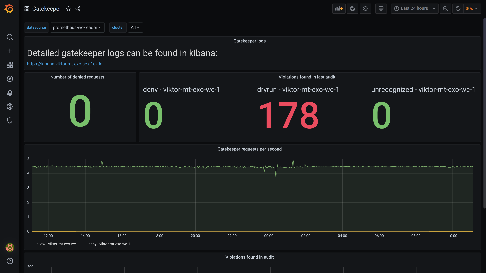

---
tags:
- ISO 27001 A.18.2.2 Compliance with Security Policies & Standards
- ISO 27001 A.18.2.3 Technical Compliance Review
---
# Policy-as-Code Dashboard

## Relevant Regulations

Although "policy-as-code" is not explicit in any regulation, enforcing policies in a consistent technical manner ("policy-as-code") is seen as an important strategy to reduce compliance violations, as well as reduce the overhead of complying.

## Mapping to ISO 27001 Controls

* [A.18.2.2 Compliance with Security Policies & Standards](https://www.isms.online/iso-27001/annex-a-18-compliance/)
* [A.18.2.3 Technical Compliance Review](https://www.isms.online/iso-27001/annex-a-18-compliance/)

## Compliant Kubernetes Policy-as-Code Dashboard

Some of your policies are best enforced in code, e.g., Ingress resources do not have encryption set up or PersistentVolumeClaims do not have the necessary backup annotations. Setting up such policies as code is highly dependent on your organization, your risk appetite and your operations. Policies that make sense enforcing by code may be required in some organizations, whereas others might see it as unnecessary and prefer simply treat codified policies as aspirational.

Whatever your situation, the Compliant Kubernetes Policy-as-Code Dashboard allows to quickly audit what Kubernetes resources are set up in a non-compliant way or how many policy violations were avoided by Compliant Kubernetes.

## Handling Non-Compliance

If an application or user keeps violating a policy, start by reviewing the policy. If the policy seems well codified, contact the developer or the application owner to determine why policy violations occurs or need to be prevented by Compliant Kubernetes.

If a policy is missing or too strict, contact the Compliant Kubernetes administrators.
