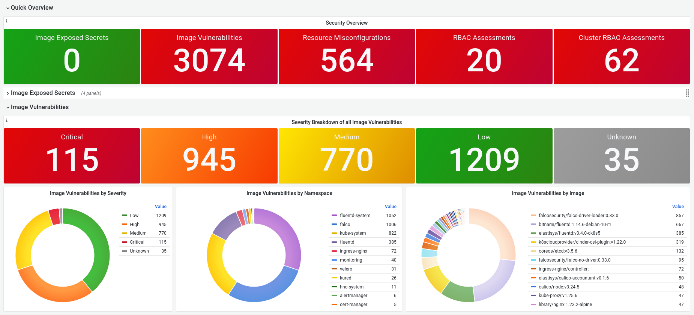

# Vulnerability Dashboard

## Relevant Regulations

* [GDPR Article 32](https://gdpr-info.eu/art-32-gdpr/):

    > Taking into account the state of the art [...] the controller and the processor shall implement [...] as appropriate [...] a process for regularly testing, assessing and evaluating the effectiveness of technical and organisational measures for ensuring the security of the processing.
    >
    > In assessing the appropriate level of security account shall be taken in particular of the risks that are presented by processing, in particular from accidental or unlawful destruction, loss, alteration, **unauthorised disclosure of, or access to personal data transmitted**, stored or otherwise processed. [highlights added]

* [HIPAA Part 164—SECURITY AND PRIVACY](https://www.hhs.gov/sites/default/files/ocr/privacy/hipaa/administrative/combined/hipaa-simplification-201303.pdf)

    > (2) Protect against any reasonably anticipated threats or hazards to the security or integrity of such information.

## Mapping to ISO 27001 Controls

* [A.12.6.1 Management of Technical Vulnerabilities](https://www.isms.online/iso-27001/annex-a-12-operations-security/)

## Compliant Kubernetes Vulnerability Dashboard

The Compliant Kubernetes Vulnerability Dashboard allows to audit what vulnerable container images are running in production. The dashboard allows to asses increase or decrease of exposure over time. It also allows to prioritize vulnerabilities based on CVE score (CVSS).

Therefore, this dashboard should be regularly reviewed, perhaps even daily. A vulnerability management process should be in place to decide how to systematically handle vulnerabilities.

## Handling Non-Compliance

Containers should preferably be redeployed with an image that received the necessary security fixes. In case the security fix cannot be deployed in a timely manner -- e.g., due to a slow fix from the vendor -- then the affected containers should be terminated. In all cases, isolating a container using NetworkPolicies, non-root user accounts, no service account token, etc. can make a vulnerability more difficult to exploit.

## Further Reading

* [Vulnerability management](https://en.wikipedia.org/wiki/Vulnerability_management)
* [CVE](https://cve.mitre.org/)
* [CVSS](https://www.first.org/cvss/)
* [Starboard](https://github.com/aquasecurity/starboard)
