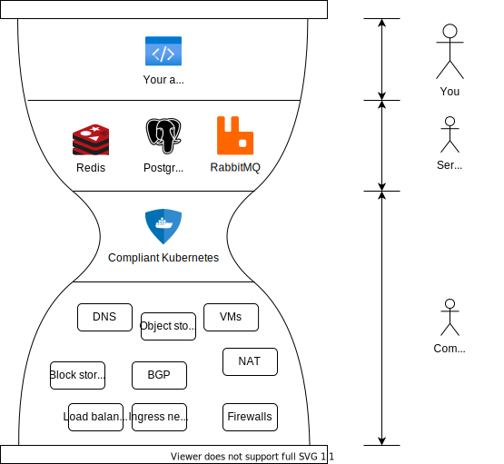

Additional Services
===================

Compliant Kubernetes simplifies usage of a complex and diverse infrastructure. By exposing simple and uniform concepts, it allows you to focus on application development.

However, your application needs more than just running stateless containers. At the very least, you will need a database -- such as PostgreSQL -- to persist data. More complex applications will require a distributed cache -- such as Redis -- to store session information or offload the database. Finally, background tasks are best handled by separate containers, connected to your user-facing backend code via a message queue -- such as RabbitMQ.

These additional services need to be delivered as securely as the rest of the platform. Access control, business continuity, disaster recovery, security patching and maintenance need to be a core feature, not an afterthought.

It turns out, the same simple and uniform concepts that benefit your application can also be used to simplify hosting additional services. And thanks to security-hardening included in Compliant Kubernetes, the burden of delivering additional services with the security you need is also reduced.

Compliant Kubernetes is the "hourglass waist" of the platform. Think of it like HTTPS being the "hourglass waist" of the Internet: It unites the sprawl of wired and wireless network technologies to offer a uniform concept on which various web, gaming, chat and video streaming protocols can run.

In the end, you win by having a feature-full platform to host your application. Not just VMs, but useful services. Administrators win by avoiding to re-invent the wheel and focus on the specifics of each additional service.

This section of the user guide will help you benefit the most from the additional services hosted within Compliant Kubernetes.
