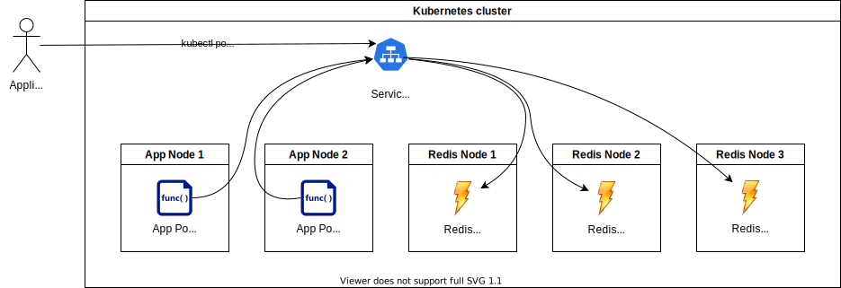

Redis™
======



This page will help you succeed in connecting your application to a low-latency in-memory cache Redis which meets your security and compliance requirements.

## Provision a New Redis Cluster

Ask your service-specific administrator to install a Redis cluster inside your Compliant Kubernetes environment. The service-specific administrator will ensure the Redis cluster complies with your security requirements, including:

* **Business continuity**: We recommend a highly available setup with at minimum three instances. The Redis client library that you use in your application needs to support [Redis Sentinel](https://redis.io/topics/sentinel). Notice that clients with Sentinel support need [extra steps to discover the Redis primary](https://redis.io/topics/sentinel-clients).
* **Capacity management**: Your service-specific administrator will ensure Redis has enough capacity to meet your needs.
* **Incident management**: Your administrator will set up the necessary Probes, dashboards and alerts, to discover issues and resolve them, before they become a problem.

!!!important "Important: Improve Access Control with NetworkPolicies"
    Please note the follow information about [Redis access control](https://redis.io/topics/security) from the upstream documentation:

    > Redis is designed to be accessed by trusted clients inside trusted environments.

    For improved security, discuss with your service-specific administrator what Pods and/or Namespaces need access to the Redis cluster. They can then set up the necessary [NetworkPolicies](/compliantkubernetes/user-guide/safeguards/enforce-networkpolicies/).

!!!important "Important: No Disaster Recovery"

    We do not recommend using Redis as primary database. Redis should be used to store:

    * Cached data: If this is lost, this data can be quickly retrieved from the primary database, such as the PostgreSQL cluster.
    * Session state: If this is lost, the user experience might be impacted -- e.g., the user needs to re-login -- but no data should be lost.

Compliant Kubernetes recommends the [Spotahome operator](https://github.com/spotahome/redis-operator).

## Install Prerequisites

Before continuing, make sure you have access to the Kubernetes API, as describe [here](/compliantkubernetes/user-guide/setup/).

Make sure to install the Redis client on your workstation. On Ubuntu, this can be achieved as follows:

```bash
sudo apt install redis-tools
```

## Getting Access

Your administrator will set up a Secret inside Compliant Kubernetes, which contains all information you need to access your Redis cluster.
The Secret has the following shape:

```yaml
apiVersion: v1
kind: Secret
metadata:
  name: $SECRET
  namespace: $NAMESPACE
stringData:
  # REDIS_SENTINEL_HOST represents a cluster-scoped Redis Sentinel host, which only makes sense inside the Kubernetes cluster.
  # E.g., rfs-redis-cluster.redis-system
  REDIS_SENTINEL_HOST: $REDIS_SENTINEL_HOST

  # REDIS_SENTINEL_PORT represents a cluster-scoped Redis Sentinel port, which only makes sense inside the Kubernetes cluster.
  # E.g., 26379
  REDIS_SENTINEL_PORT: "$REDIS_SENTINEL_PORT"
```

!!!important
    The Secret is very precious! Prefer not to persist any information extracted from it, as shown below.

To extract this information, proceed as follows:

```bash
export SECRET=            # Get this from your administrator
export NAMESPACE=         # Get this from your administrator

export REDIS_SENTINEL_HOST=$(kubectl -n $NAMESPACE get secret $SECRET -o 'jsonpath={.data.REDIS_SENTINEL_HOST}' | base64 -d)
export REDIS_SENTINEL_PORT=$(kubectl -n $NAMESPACE get secret $SECRET -o 'jsonpath={.data.REDIS_SENTINEL_PORT}' | base64 -d)
```

!!!important
    At the time of this writing, we do not recommend to use a Redis cluster in a multi-tenant fashion. Once Redis cluster should have only one purpose.

## Create a Secret

First, check that you are on the right Compliant Kubernetes cluster, in the right **application** namespace:

```bash
kubectl get nodes
kubectl config view --minify --output 'jsonpath={..namespace}'; echo
```

Now, create a Kubernetes Secret in your application namespace to store the Redis Sentinel connection parameters:

```bash
cat <<EOF | kubectl apply -f -
apiVersion: v1
kind: Secret
metadata:
    name: app-redis-secret
type: Opaque
stringData:
    REDIS_SENTINEL_HOST: $REDIS_SENTINEL_HOST
    REDIS_SENTINEL_PORT: "$REDIS_SENTINEL_PORT"
EOF
```

## Expose Redis Connection Parameters to Your Application

To expose the Redis cluster to your application, follow one of the following upstream documentation:

* [Create a Pod that has access to the secret data through a Volume](https://kubernetes.io/docs/tasks/inject-data-application/distribute-credentials-secure/#create-a-pod-that-has-access-to-the-secret-data-through-a-volume)
* [Define container environment variables using Secret data](https://kubernetes.io/docs/tasks/inject-data-application/distribute-credentials-secure/#define-container-environment-variables-using-secret-data)

!!!important
    Make sure to use a Redis client library with Sentinel support. For example:

    * [Django-Redis Client that supports Sentinel Cluster HA](https://github.com/danigosa/django-redis-sentinel-redux#how-to-use-it)
        If the linked code example doesn't work, try `LOCATION: redis://mymaster/db`.

## Follow the Go-Live Checklist

You should be all set.
Before going into production, don't forget to go through the [go-live checklist](../go-live.md).

## Further Reading

* [Redis Sentinel](https://redis.io/topics/sentinel)
* [Guidelines for Redis clients with support for Redis Sentinel](https://redis.io/topics/sentinel-clients)
* [Redis Commands](https://redis.io/commands)
* [Kubernetes Secrets](https://kubernetes.io/docs/concepts/configuration/secret/)
