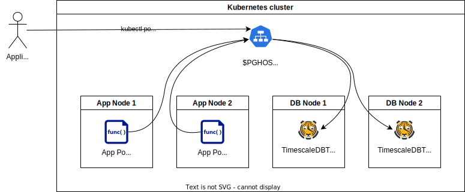

TimescaleDB®
============



This page will help you succeed in connecting your application to a primary relational database TimescaleDB which meets your security and compliance requirements.

TimescaleDB is an extension on top of our managed PostgreSQL.
This means that your administrator will be setting up a complete PostgreSQL cluster for you and you just use it for TimescaleDB via the TimescaleDB extension.

!!!Note
    TimescaleDB is not a viable option for collecting all metrics from the Kubernetes cluster. The data is uncompressed and would take a lot of space to store and use a lot of resources to analyze, unless you want to use it with a very short retention period.
    This is not usually a problem for collecting application specific metrics, since they are not as many as the metrics that are generated from the Kubernetes cluster.

!!!important
    Due to very different performance-tuning characteristics, Timescale and PostgreSQL databases should never run on the same PostgreSQL cluster.
    To comply with this, it is essential that every PostgreSQL database that gets created on the PostgreSQL cluster also has the Timescale extension created for it.

If you want to use TimescaleDB on your Compliant Kubernetes cluster, ask your administrator to [provision a new standard PostgreSQL cluster](https://elastisys.io/compliantkubernetes/user-guide/additional-services/timescaledb/#provision-a-new-postgresql-cluster) inside your Compliant Kubernetes environment. Then set up the TimescaleDB extension.



## Set up the TimescaleDB extension on PostgreSQL

* Connect to the created database:
```bash
\c $APP_DATABASE
```
* Add the TimescaleDB extension:
```bash
CREATE EXTENSION IF NOT EXISTS timescaledb;
```

## Follow the Go-Live Checklist

You should be all set.
Before going into production, don't forget to go through the [go-live checklist](../go-live.md).

## CK8S TimescaleDB Release Notes

Check out the [release notes](../../release-notes/postgres.md) for the TimescaleDB/PostgreSQL cluster that runs in Compliant Kubernetes environments!

## Further Reading

* [Getting started with Timescale](https://docs.timescale.com/getting-started/latest/)
* [Creating users](https://www.postgresql.org/docs/13/sql-createuser.html)
* [Creating databases](https://www.postgresql.org/docs/13/sql-createdatabase.html) - Remember to [create Timescale extension](https://elastisys.io/compliantkubernetes/user-guide/additional-services/timescaledb/#set-up-the-timescaledb-extension-on-postgresql) on the new databases.
* [Granting permissions](https://www.postgresql.org/docs/13/sql-grant.html)
* [Kubernetes Secrets](https://kubernetes.io/docs/concepts/configuration/secret/)
