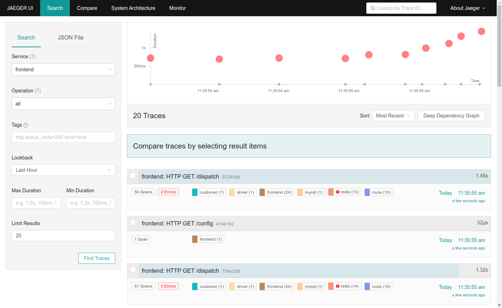

# Distributed Tracing

## Prerequisite: Preparing your Harbor for a new project

0. Log into your Harbor and, unless you've already done so, create and obtain your CLI credentials by setting your username and then, via the top right avatar and the User Profile, get your password from the `CLI Secret` field. Use these with `docker login` to your Harbor.
0. Create a new project called `microservices-demo` in your Harbor
0. Create a Harbor robot account in the `microservices-demo` project, inputting `deployer` as Name and setting Never as Expiration time. Remove all permissions except for Pull Artifact. Download the file that the system provides to you.
0. To make the Harbor Robot account known to your cluster, run the following command: `kubectl create secret docker-registry microservices-demo-deployer --docker-server=harbor.${DOMAIN} --docker-username='robot$microservices-demo+deployer' --docker-password='PASSWORD GOES HERE'`

## Getting Jaeger installed in Compliant Kubernetes

!!!note
    These instructions for Jaeger are for **demo purposes only**, since they rely on the all-in-one component that only uses an in-memory backend for data storage.

We need the [Jaeger](https://www.jaegertracing.io/) system to get the data and to visualize it, so let's get that deployed first.

0. Download the all-in-one template for Jaeger: `wget https://raw.githubusercontent.com/jaegertracing/jaeger-kubernetes/master/all-in-one/jaeger-all-in-one-template.yml`
0. Since these instructions are for demo purposes, download a recent Jaeger all-in-one image: `docker pull jaegertracing/all-in-one:1.35`
0. It's a bit old, so modify the `jaeger-all-in-one-template.yml` such that it lists the `apiVersion` of the `Deployment` to be `apps/v1`
0. Jaeger components want to run as root by default, so change that by making a new Docker image that has a non-privileged user by doing the following (or by downloading the [Dockerfile.jaeger](Dockerfile.jaeger)) in a new, empty directory:
```
cat > Dockerfile.jaeger <<HERE
FROM jaegertracing/all-in-one:1.35
RUN addgroup -S -g 10000 jaeger && adduser -S -u 10000 -G jaeger jaeger
USER jaeger
HERE
```
0. Build your image with `docker build -f Dockerfile.jaeger -t harbor.${DOMAIN}/microservices-demo/jaeger-all-in-one:1.35 .`
0. Push what you just created to your Harbor: `docker push harbor.${DOMAIN}/microservices-demo/jaeger-all-in-one:1.35`
0. Go back to your previous directory with `cd -`
0. Update the image tag: `sed -i -e "s%image:.*%image: harbor.${DOMAIN}/microservices-demo/jaeger-all-in-one:1.35%" jaeger-all-in-one-template.yml`
0. Make the Deployment conform to [Compliant Kubernetes safeguards](../safeguards) by making sure it contains something like this in it:
```
      spec:
        imagePullSecrets:
          - name: microservices-demo-deployer
        containers:
        - env:
          - name: COLLECTOR_ZIPKIN_HTTP_PORT
            value: "9411"
          image: harbor.${DOMAIN}/microservices-demo/jaeger-all-in-one:1.35
          name: jaeger
          resources:
            requests:
              cpu: 100m
              memory: 128Mi
          securityContext:
            runAsUser: 10000
```
0. And a network policy like so:
```
- apiVersion: networking.k8s.io/v1
  kind: NetworkPolicy
  metadata:
    name: jaeger
    labels:
      app.kubernetes.io/name: jaeger
      app.kubernetes.io/component: all-in-one
  spec:
    podSelector:
      matchLabels:
        app: jaeger
        app.kubernetes.io/name: jaeger
        app.kubernetes.io/component: all-in-one
    egress: []
    ingress: []
```
0. Deploy the Jaeger all-in-one stack with: `kubectl apply -f jaeger-all-in-one-template.yml`

(Hint: you can also obtain a working copy of [Dockerfile.jaeger](Dockerfile.jaeger) and [jaeger-all-in-one-template.yml](jaeger-all-in-one-template.yml) by following the links, but do keep in mind to change the `CHANGE-ME-PLESE` part that should be your `${DOMAIN}` in it.)

## Deploying an instrumented demo application

Jaeger has an example application, Hot R.O.D., that has been instrumented for distributed tracing. It reports its metrics directly into the Jaeger Agent that is included in the all-in-one component deployed previously.

### Enabling a non-privileged user in the Hot R.O.D. example application

The demo application does not conform to Compliant Kubernetes safeguards, because it tries to run as the root user. To fix that, make a `Dockerfile.hotrod` as such (or download it: [Dockerfile.hotrod](Dockerfile.hotrod)):

```
cat > Dockerfile.hotrod <<HERE
FROM jaegertracing/example-hotrod:1.35 as hotrod

FROM alpine:3
EXPOSE 8080 8081 8082 8083
RUN addgroup -S -g 10000 jaeger && adduser -S -u 10000 -G jaeger jaeger

COPY --from=hotrod /go/bin/hotrod-linux /usr/local/bin/hotrod

USER jaeger

ENTRYPOINT ["/usr/local/bin/hotrod"]
CMD ["all"]
HERE
```

Build and push with Docker:

0. `docker build -t harbor.${DOMAIN}/microservices-demo/example-hotrod:1.35 -f Dockerfile.hotrod .`
0. `docker push harbor.${DOMAIN}/microservices-demo/example-hotrod:1.35`

### Deploying Hot R.O.D. to Compliant Kubernetes

Next, let's get this deployed to Compliant Kubernetes. For that purpose, also make a `hotrod.yaml` with the following contents (or download it: [hotrod.yaml](hotrod.yaml), but do change the `CHANGE-ME-PLEASE` to the value of your `${DOMAIN}`):

```
cat > hotrod.yaml <<HERE
---
apiVersion: v1
kind: List
items:
  - apiVersion: networking.k8s.io/v1
    kind: NetworkPolicy
    metadata:
      name: hotrod
      labels:
        app.kubernetes.io/name: jaeger
        app.kubernetes.io/component: hotrod
    spec:
      podSelector:
        matchLabels:
          app.kubernetes.io/name: jaeger
          app.kubernetes.io/component: hotrod
      egress:
        - {}
      ingress:
        - {}
  - apiVersion: apps/v1
    kind: Deployment
    metadata:
      name: hotrod
      labels:
        app.kubernetes.io/name: jaeger
        app.kubernetes.io/component: hotrod
    spec:
      replicas: 1
      selector:
        matchLabels:
          app.kubernetes.io/name: jaeger
          app.kubernetes.io/component: hotrod
      strategy:
        type: Recreate
      template:
        metadata:
          labels:
            app.kubernetes.io/name: jaeger
            app.kubernetes.io/component: hotrod
        spec:
          imagePullSecrets:
            - name: microservices-demo-deployer
          containers:
            - name: hotrod
              image: harbor.${DOMAIN}/microservices-demo/example-hotrod:1.35
              imagePullPolicy: Always
              args: ["all"]
              resources:
                requests:
                  cpu: 100m
                  memory: 128Mi
              securityContext:
                runAsUser: 10000
              ports:
                - containerPort: 8080
                  protocol: TCP
                - containerPort: 8081
                  protocol: TCP
                - containerPort: 8082
                  protocol: TCP
                - containerPort: 8083
                  protocol: TCP
              env:
                - name: JAEGER_AGENT_HOST
                  value: "jaeger-agent"
                - name: JAEGER_AGENT_PORT
                  value: "6831"
  - apiVersion: v1
    kind: Service
    metadata:
      name: hotrod
      labels:
        app.kubernetes.io/name: jaeger
        app.kubernetes.io/component: hotrod
    spec:
      ports:
        - name: frontend
          port: 80
          protocol: TCP
          targetPort: 8080
      selector:
        app.kubernetes.io/name: jaeger
        app.kubernetes.io/component: hotrod
HERE
```

0. `kubectl apply -f hotrod.yaml` deploys the application to the Compliant Kubernetes cluster!

## Creating some traces and visualizing them in Jaeger

0. Port-forward to the Hot R.O.D. main user interface: `kubectl port-forward svc/hotrod 8080:80`
0. Open your web browser to [localhost:8080](http://localhost:8080) and generate some traces by hitting the buttons in the web user interface.
0. In a new terminal, port-forward to the Jaeger user interface: `kubectl port-forward svc/jaeger-query 16686:80`
0. Open a new browser tab to [localhost:16686](http://localhost:16686) to access your Jaeger web UI

You can new view your traces that you have generated!


