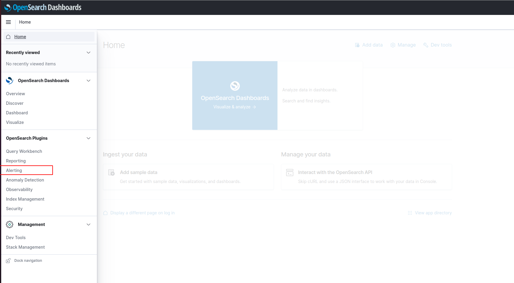
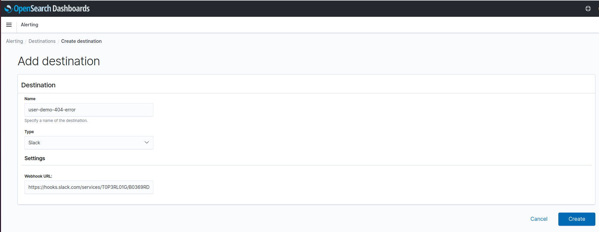
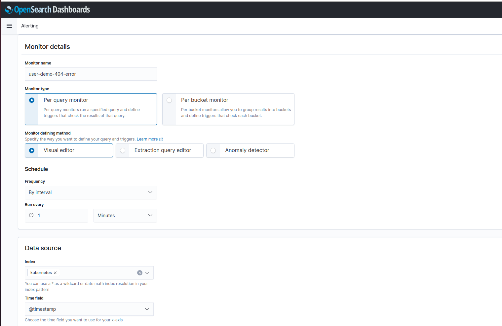
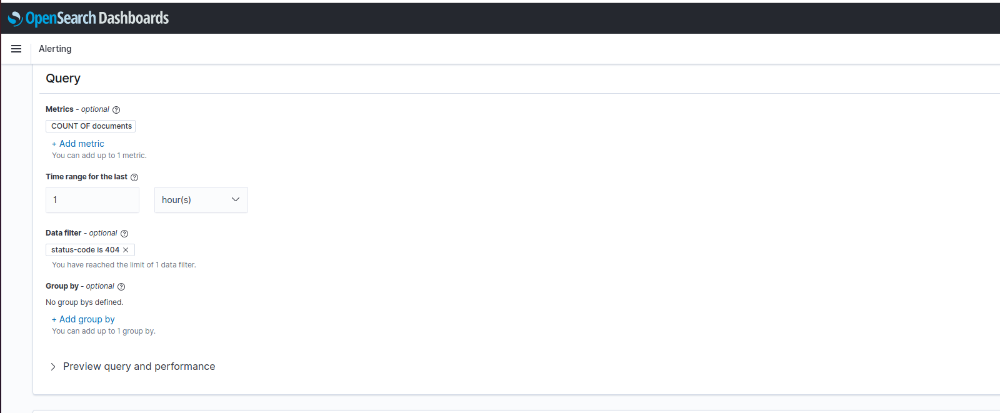
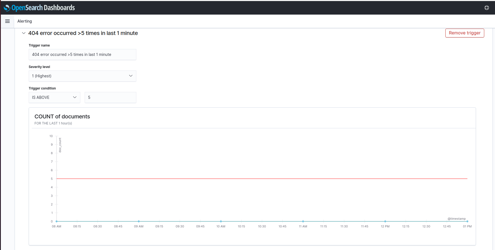
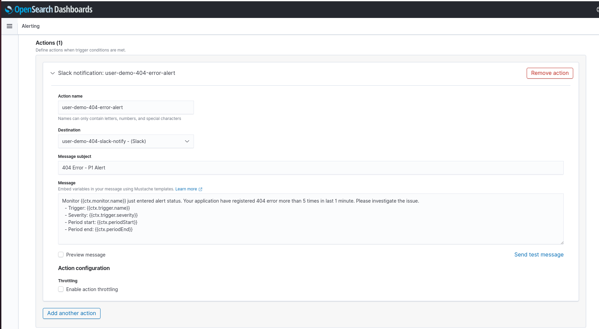
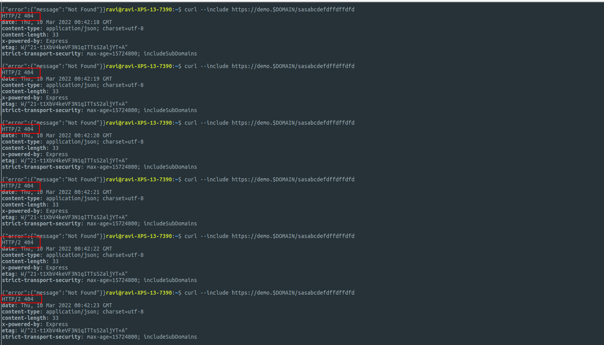
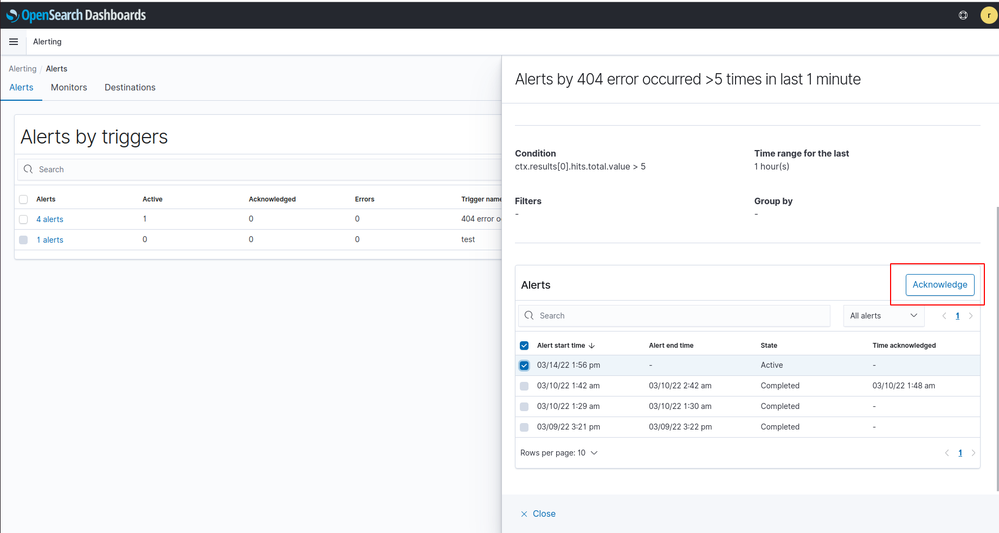

#OpenSearch Alert

The alerting feature notifies you when data from one or more OpenSearch indices meets certain conditions. For example, you might want to notify a Slack channel if your application logs more than five HTTP 404 errors in one hour/minute, or you might want to page a developer if no new documents have been indexed in the past 20 minutes.

Alerting features have been enabled by default in Compliant Kubernetes as of version 0.19.X

You can find the more information here - [OpenSearch alerting](https://opensearch.org/docs/latest/monitoring-plugins/alerting/index/)

#OpenSearch Alert Demo

When you log into **OpenSearch Dashboards**, you will start at the home page as shown below.

From here click **"Visualize & analyze"** to continue and you will be greeted with the options to go forward to either **Dashboard** or **Discover**. Opening the sidebar in the top left will also provide navigation to OpenSearch Dashboards features, and here **Alerting** can be found in the page shown below.

Once you click  **Alerting**, it will navigate to the below page.

To use OpenSearch alerting feature, it involves two steps described below.

1. **Create Destination** - A reusable location for the information that you want the monitor to send out after being triggered. Supported locations are Amazon Chime, Email, Slack, or custom webhook.
2. **Create Monitor** - A job that runs on a defined schedule and queries OpenSearch indices. The results of these queries are then used as input for one or more triggers (Conditions that, if met, generate alerts).

**Step 1 - Create Destination**

Go to Destination & Create Destinations as shown in the below.

-  **Name** - Name of the destination, for example “**user-demo-404-slack-notify**”
-  **Type** - choose Slack or any other available types you want to use it.
-  **Webhook URL** - If using Slack, paste the webhook URL. Please refer for more information [slack-webhook](https://api.slack.com/incoming-webhooks)

**Step 2 - Create Monitors**

Go to Monitors & Create Monitor as shown in the below.

- **Monitor Name** -  Name of the monitor, for example **“user-demo-404-error”**
- Select **Per query monitor or Per bucket monitor**. - For more information [Monitor-types](https://opensearch.org/docs/latest/monitoring-plugins/alerting/monitors/#create-monitors)
- **Frequency** -  How often to monitor, for instance, to check every 1 minute
- **Data source**
     - **Index**  where your logs are stored, for instance, “kubernetes” (per default, Compliant Kubernetes will store all application logs indices that match the **“kubernetes*”** index pattern)

     - **Time field** should be set to **“@timestamp”**

- **Query**
    - **Metrics** - optional
    - **Time range for the last** - Time frame of data the plugin should monitor . Ex-  1 minute(s)
     Data filter - **status-code is 404**

- **Triggers**
     - **Trigger name** -  Name of the trigger. Ex- **“404-error occurred >5 times in last 1 minute”**
     - **Severity level** - Select the severity level range with **1**(Highest) & **5**(Lowest)
     - **Trigger condition** - Select the condition according to your applications . Ex- **IS ABOVE = 5**
     - **Actions** - Create an action with name , destination and customized message notification accordingly.

- Finally click - **Create** button to complete the creation of the monitor.

- You can see the status of the monitor under **Alerting> Monitors> user-demo-404-error** as shown below.

#Test alert notification to Slack.

- Demo application deployed and users get 404 errors many times (5 is the condition set before) as shown below.

- We get the Slack notifications as shown below.

- Users can view the alert status under the **Alerting** tab as shown below and accordingly take the required action.

- Users can **acknowledge** the alerts under the **Alerting** tab as shown below.

#Alert state

- **Active** - The alert is ongoing and unacknowledged. Alerts remain in this state until you acknowledge them, delete the trigger associated with the alert, or delete the monitor entirely.
- **Acknowledged** - Someone has acknowledged the alert, but not fixed the root cause.
- **Completed** - The alert is no longer ongoing. Alerts enter this state after the corresponding trigger evaluates to false.
- **Error** - An error occurred while executing the trigger—usually the result of a bad trigger or destination.
- **Deleted** - Someone deleted the monitor or trigger associated with this alert while the alert was ongoing.
