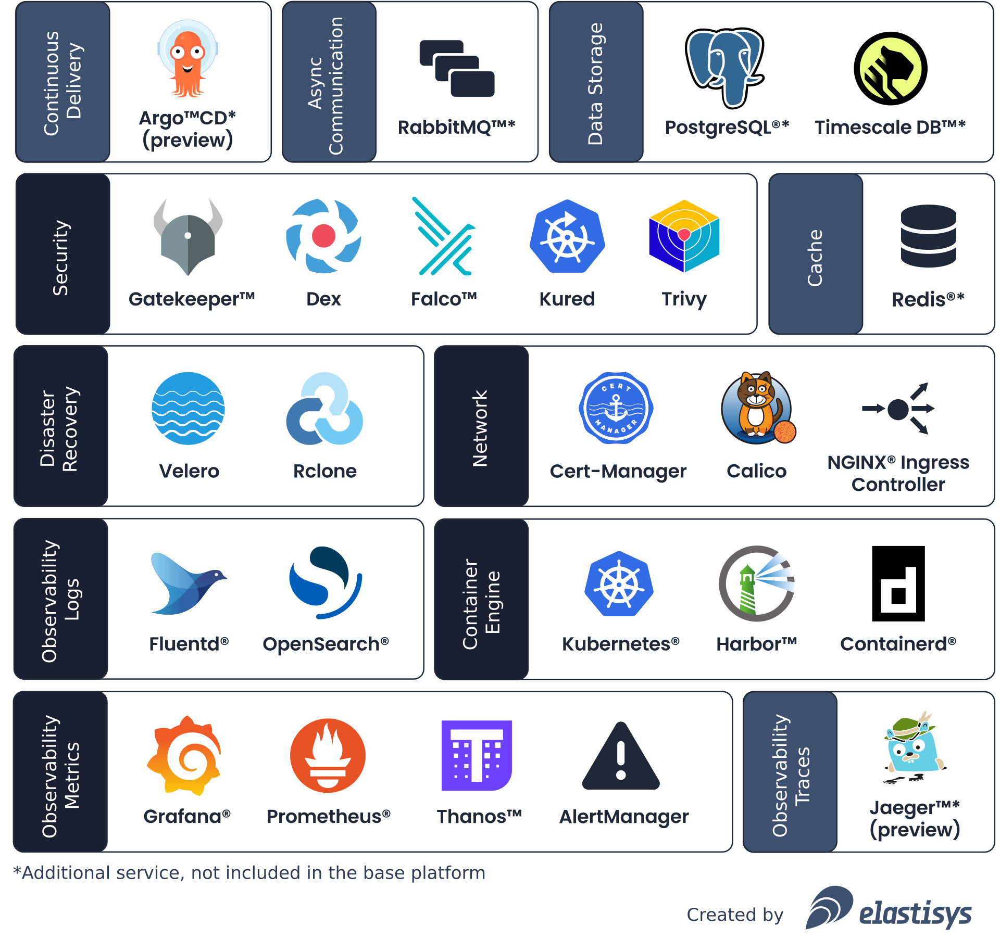
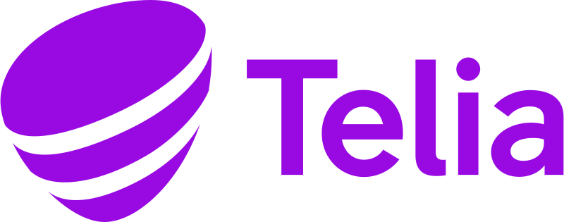

<!-- markdownlint-disable-file first-line-h1 -->

# Innovate at speed in regulated industries

Welcome to Welkin, the Kubernetes platform for software critical to our society!

Welkin enables organizations across Europe to accelerate innovation through open source cloud-native technology, while ensuring security and regulatory compliance.

<nav markdown="1">
<dl class="columns-1" markdown="1">
  

    <dt markdown="span" class="grow-me">
      :fontawesome-solid-code:
      For application developers
    </dt>
    <dd class="grow-me">
      Learn how Welkin helps you deploy and observe your application in production.
    </dd>
    <dd><a role="button" href="./user-guide/">Get started</a></dd>
  

  

    <dt markdown="span" class="grow-me">
      :fontawesome-solid-user-secret:
      For CISOs and DPOs
    </dt>
    <dd class="grow-me">
      Learn how Welkin helps you comply with European regulations, such as NIS2 and GDPR.
    </dd>
    <dd><a role="button" href="./ciso-guide/">Help me comply</a></dd>
  

  

    <dt markdown="span" class="grow-me">
      :fontawesome-solid-users-gear:
      For platform administrators
    </dt>
    <dd class="grow-me">
      Learn how to set up Welkin on any cloud provider or on-prem.
    </dd>
    <dd><a role="button" href="./operator-manual/">Set up Welkin</a></dd>
  

</ul>
</nav>

## What is Welkin?

## Benefits of Welkin

<dl class="columns-1" markdown="1">
  

    <dt markdown="span">
      :fontawesome-solid-user-check:
      The platform you would build yourself
    </dt>
    <dd markdown="span">
        Built with CNCF projects,
        public [Architectural Decision Records](adr/index.md),
        as well as great documentation for [application developers](user-guide/index.md).
    </dd>
  

  

    <dt markdown="span">
      :fontawesome-solid-heart:
      Loved❤️ by CISOs👮 and DPOs🧑‍⚖️
    </dt>
    <dd>
        Built around controls to achieve EU regulatory compliance with:
        <a href="./ciso-guide/controls/gdpr/">GDPR</a>,
        <a href="./ciso-guide/controls/iso-27001/">ISO 27001</a>,
        <a href="./ciso-guide/controls/bsi-it-grundschutz/">NIS2 (BSI IT-Grundschutz)</a>.
    </dd>
  

  

    <dt markdown="span">
      :fontawesome-solid-cloud:
      Cloud agnostic, running in production in 10+ clouds
    </dt>
    <dd>
        Runs on many EU clouds or <a href="./operator-manual/on-prem-standard/">on-prem</a>.
    </dd>
  

</dl>

## Welkin is trusted by industry leaders

<ul class="columns-always">
    <li></li>
    <li></li>
    <li></li>
    <li></li>
    <li></li>
</ul>

<section>
  <!--
    The Customer Quotes carousel contains way too much CSS. We don't really want to
    deal with such complexity, plus the complexity of that CSS interacting with
    mkdocs-material's CSS. Hence, we separate the two HTMLs.
  -->
  <!-- embed type="text/html" src="customer-quotes/" width="100%" height="384px" -->
</section>

## Power member of the cloud native community

<ul class="columns">
    <li>
        
         
        Maintained by Elastisys, proud CNCF silver member
    </li>
    <li>
        
         
        Runs in production hosting critical applications
    </li>
    <li>
        
         
        Our platform is a CNCF Certified Kubernetes® Distribution
    </li>
</ul>

## Commercial offering

<nav markdown="1">
<dl class="columns-2" markdown="1">
  

    <dt markdown="span">
      :fontawesome-solid-user-gear:
      Managed Services
    </dt>
    <dd>
      A secure and fully managed Kubernetes platform for organizations that build and operate applications critical to our society.
    </dd>
    <dd>
      <a role="button" href="https://elastisys.com/managed-services/">Go to Managed Services</a>
    </dd>
  

  

    <dt markdown="span">
      :fontawesome-solid-laptop-code:
      Consulting
    </dt>
    <dd class="grow-me">
      Extend your team with our cloud native experts. Develop and deploy apps faster and with more confidence in a DevSecOps fashion.
    </dd>
    <dd>
      <a role="button" href="https://elastisys.com/consulting/">Go to Consulting</a>
    </dd>
  

  

    <dt markdown="span">
      :fontawesome-solid-user-graduate:
      Training
    </dt>
    <dd class="grow-me">
      Level up your team's skills with our wide range of courses, both tailor-made and official Kubernetes ones from the Linux Foundation.
    </dd>
    <dd>
      <a role="button" href="https://elastisys.com/training/">Go to Training</a>
    </dd>
  

  

    <dt markdown="span">
      :fontawesome-solid-handshake:
      Self-Managed
    </dt>
    <dd class="grow-me">
      Leverage Welkin on-prem with implementation and continuous support.
    </dd>
    <dd>
      <a role="button" href="https://elastisys.com/self-managed/">Go to Self-Managed</a>
    </dd>
  

</dl>
</nav>

