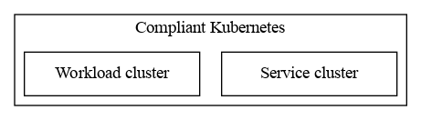

# Welcome to Compliant Kubernetes

Compliant Kubernetes is a [Certified Kubernetes](https://landscape.cncf.io/organization=elastisys&selected=elastisys-compliant-kubernetes) distribution, i.e., an opinionated way of packaging and configuring Kubernetes together with other projects. Compliant Kubernetes reduces the compliance burden, as required to comply with:

* [Health Insurance Portability and Accountability Act (HIPAA)](https://elastisys.com/hipaa-compliance-kubernetes-privacy-rule/)
* [Swedish Healthcare (Patientdatalagen)](https://elastisys.com/how-to-use-kubernetes-in-swedish-healthcare/)
* General Data Protection Regulation (GDPR)
* Payment Card Industry Data Security Standard (PCI DSS)
* Finansinspektionen's Regulatory Code (e.g., FFFS 2014:7)
* Other regulations that map to information security standards, such as ISO 27001

## Why Compliant Kubernetes?

Kubernetes has established itself as a go-to solution for high development velocity without vendor lock-in. However, vanilla Kubernetes is not usable in regulated industry, since it is [not secure by default, nor by itself](https://searchitoperations.techtarget.com/news/252487963/Kubernetes-security-defaults-prompt-upstream-dilemma). Therefore, if you want to benefit from the speed of cloud native development in regulated industries, Kubernetes needs to be carefully configured. Furthermore, Kubernetes is a laser-focused project ("Make each program do one thing well."), so it needs to be complemented with other cloud native projects.

Compliant Kubernetes fills this gap.

## Architecture

Below we present the architecture of Compliant Kubernetes, using the [C4 model](https://c4model.com/).

### Level 1: System Context

Let us start with the system context.

Compliance imposes restrictions on all levels of the teck stack. Your compliance focus should mostly lie on your application. Compliant Kubernetes ensures that the platform hosting your application is compliant. Finally, you need to the whole software stack on a hardware that is managed in a compliant way, either via an ISO 27001-certified cloud provider or using on-prem hardware.

### Level 2: Clusters

Most regulations require logging to a tamper-proof environment. This is usually interpreted as an attacker gaining access to your application should not be able to delete logs showing their attack and the harm cause by their attack.

To achieve this, Compliant Kubernetes is implemented as two Kubernetes cluster

* A **workload cluster**, which hosts your application, and
* A **service cluster**, which hosts services for monitoring, logging and vulnerability management.

