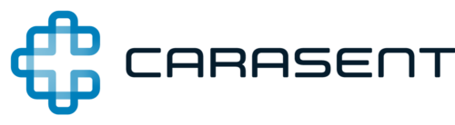

# Innovate at speed in regulated industries

Elastisys Compliant Kubernetes enables organizations across Europe to accelerate innovation through open source cloud-native technology, while ensuring security and regulatory compliance.

<nav markdown="1">
<dl class="columns" markdown="1">
  

    <dt markdown="span">
      :fontawesome-solid-code:
      For application developers
    </dt>
    <dd><a role="button" href="./user-guide/">Learn more</a></dd>
  

  

    <dt markdown="span">
      :fontawesome-solid-user-secret:
      For CISOs and DPOs
    </dt>
    <dd><a role="button" href="./ciso-guide/">Learn more</a></dd>
  

  

    <dt markdown="span">
      :fontawesome-solid-users-gear:
      For platform administrators
    </dt>
    <dd><a role="button" href="./operator-manual/">Learn more</a></dd>
  

</ul>
</nav>

## What is Elastisys Compliant Kubernetes?

<embed src="img/marchitecture.drawio.svg" alt="Components of Elastisys Compliant Kubernetes" />

## Benefits of Elastisys Compliant Kubernetes

<dl class="columns" markdown="1">
  

    <dt markdown="span">
      :fontawesome-solid-user-check:
      The platform you would build yourself
    </dt>
    <dd>
        Built with CNCF projects,
        public <a href="./adr">Architectural Decision Records</a>,
        as well as great documentation for
            <a href="./user-guide/">application developers</a>.
    </dd>
  

  

    <dt markdown="span">
      :fontawesome-solid-heart:
      Loved❤️ by CISOs👮 and DPOs🧑‍⚖️ 
    </dt>
    <dd>
        Built around controls to achieve EU regulatory compliance with:
        <a href="./ciso-guide/controls/gdpr/">GDPR</a>,
        <a href="./ciso-guide/controls/iso-27001/">ISO 27001</a>,
        <a href="./ciso-guide/controls/bsi-it-grundschutz/">NIS2 (BSI IT-Grundschutz)</a>.
    </dd>
  

  

    <dt markdown="span">
      :fontawesome-solid-cloud:
      Cloud agnostic, running in production in 10+ clouds
    </dt>
    <dd>
        Runs on many EU clouds or <a href="../operator-manual/on-prem-standard/">on-prem</a>.
    </dd>
  

</dl>

## Elastisys Compliant Kubernetes is trusted by industry leaders

<ul class="columns-always">
    <li></li>
    <li></li>
    <li></li>
    <li></li>
    <li></li>
</ul>

<section>
  <!--
    The Customer Quotes carousel contains way too much CSS. We don't really want to
    deal with such complexity, plus the complexity of that CSS interacting with
    mkdocs-material's CSS. Hence, we separate the two HTMLs.
  -->
  <!-- embed type="text/html" src="customer-quotes/" width="100%" height="384px" -->
</section>

## Power member of the cloud native community

<ul class="columns">
    <li>
        
         
        Maintained by Elastisys, proud CNCF silver member
    </li>
    <li>
        
         
        Runs in production
    </li>
    <li>
        
         
        Our platform is a CNCF Certified Kubernetes Distribution
    </li>
</ul>

## Commercial offering

<nav markdown="1">
<dl class="columns" markdown="1">
  

    <dt markdown="span">
      :fontawesome-solid-user-gear:
      Managed Services
    </dt>
    <dd>
      A full Kubernetes platform, with logging, monitoring, and more. PostgreSQL, RabbitMQ, and Redis on top. All secure and fully managed by us.
    </dd>
    <dd>
      <a role="button" href="https://elastisys.com/managed-services/">Learn more</a>
    </dd>
  

  

    <dt markdown="span">
      :fontawesome-solid-laptop-code:
      Consulting
    </dt>
    <dd>
      Extend your team with our cloud native experts. Develop and deploy apps faster and with more confidence in a DevSecOps fashion.
    </dd>
    <dd>
      <a role="button" href="https://elastisys.com/consulting/">Learn more</a>
    </dd>
  

  

    <dt markdown="span">
      :fontawesome-solid-user-graduate:
      Training
    </dt>
    <dd class="grow-me">
      Level up your team's skills with our wide range of courses, both tailor-made and official Kubernetes ones from the Linux Foundation.
    </dd>
    <dd>
      <a role="button" href="https://elastisys.com/training/">Learn more</a>
    </dd>
  

  

    <dt markdown="span">
      :fontawesome-solid-handshake:
      Support
    </dt>
    <dd class="grow-me">
      Leverage Elastisys Compliant Kubernetes on-prem with implementation and continuous support.
    </dd>
    <dd>
      <a role="button" href="https://elastisys.com/support/">Learn more</a>
    </dd>
  

</dl>
</nav>

