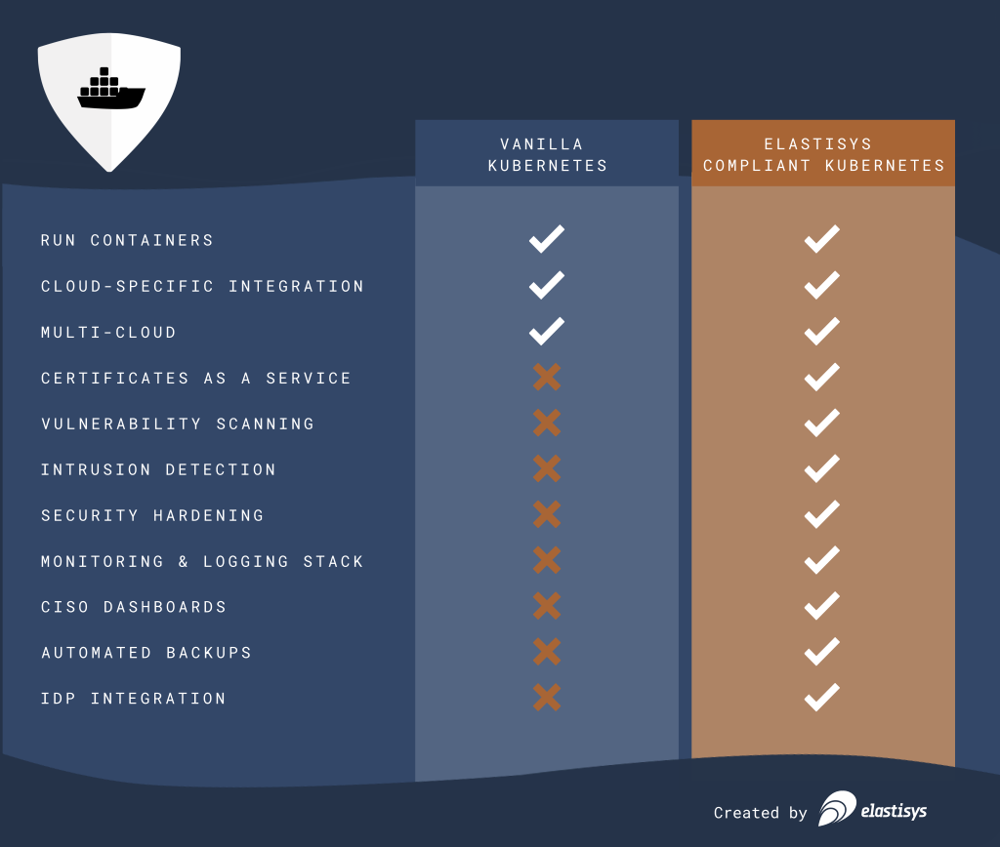

# Elastisys Compliant Kubernetes

<strong>Like vanilla Kubernetes - but with security and observability built in.</strong>

Elastisys Compliant Kubernetes is an open source, Certified Kubernetes distribution designed according to the ISO27001 controls: providing you with security tooling and observability from day one.

## Components of Elastisys Compliant Kubernetes

<embed src="img/marchitecture.drawio.svg" alt="Components of Elastisys Compliant Kubernetes" width="100%"/>

## Mapping of ISO 27001 Controls to Implementation

<embed src="img/compliance-basics.svg" alt="Mapping of ISO 27001 Control to Elastisys Compliant Kubernetes" width="100%" />

## How do I get started?

Getting started guides:

* [for Application Developers](user-guide/prepare.md)
* [for platform administrators](operator-manual/index.md)
* [for CISOs (Chief Information Security Officers)](ciso-guide/index.md)

## Would you like to contribute?

We want to build the next generation of cloud native technology where data security and privacy is the default setting.

Join us on our mission as a contributor? Go to the [guide for contributors](contributor-guide/index.md).
