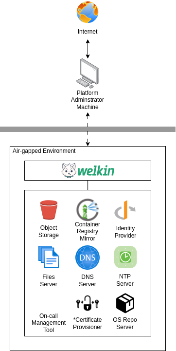
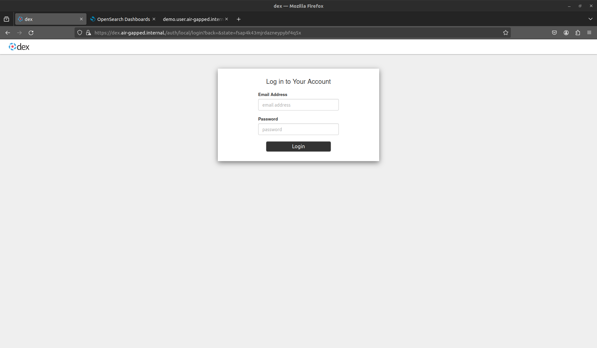
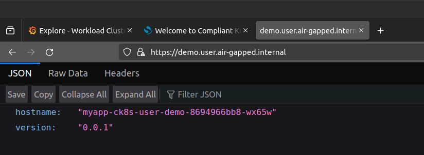
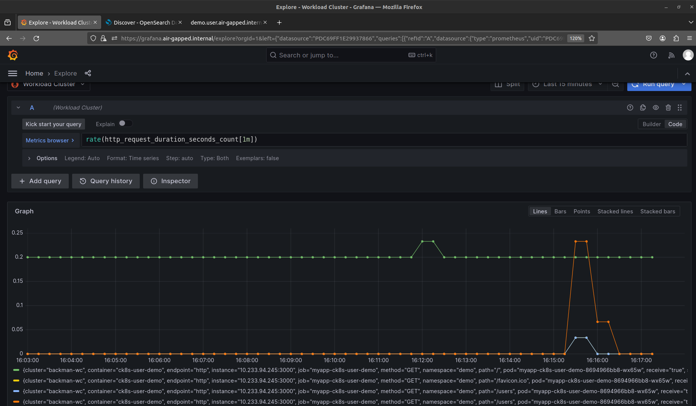
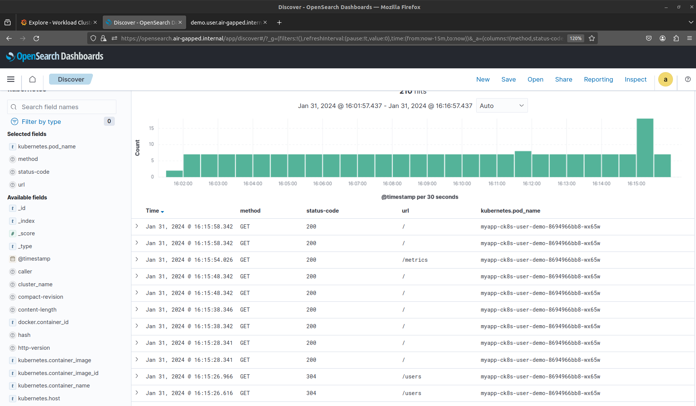

# CK8s in Air-gapped Network

!!!warning

    Each air-gapped network is different. Therefore, this page should only be taken as a guideline, not as "works out-of-the-box instructions". Contact [Elastisys Support](https://elastisys.com/self-managed/) if you need help.



## Background

In an air-gapped network, machines are isolated from insecure networks such as the public Internet. Air-gapping is used for networks that handle highly confidential data such as military or governmental systems, or in life-critical systems, for example, in nuclear power plants or for medical equipment. This document provides guidelines on how to configure Compliant Kubernetes Apps to work inside an air-gapped network.

## System Context Diagram

The following is a generic system context diagram over an air-gapped network consisting of a Compliant Kubernetes Environment. The diagram shows the Platform Administrator Machine that has access to both the Internet and the air-gapped network. Inside the air-gapped network, Compliant Kubernetes Clusters can access other services residing on the same private network such as an object storage for long-term storage, a container registry mirror, DNS and NTP servers, etc.



!!!note

    \* For Certificate Provisioning, you may want to allow DNS01 or HTTP01 challenges to a public certificate authority, such as [Let's Encrypt](https://letsencrypt.org/). However, if you want the whole network to be truly air-gapped, then you need to figure out an air-gapped solution for PKI.

## Configuring Air-gapped Compliant Kubernetes Apps

These guidelines will show how to configure Compliant Kubernetes Apps to work in an air-gapped network. For setting up the Kubernetes layer, please refer to the [Kubespray air-gap installation documentation](https://kubespray.io/#/docs/offline-environment) or [Cluster-API documentation](https://cluster-api.sigs.k8s.io/clusterctl/configuration.html?highlight=release#image-overrides) for further instructions.

This guide will assume that you have a Platform Administrator Machine that can access both the Internet and the air-gapped network over SSH, this includes SSH access to both the Cluster nodes and hosts for the different offline services described in the system context diagram above. This "Platform Administrator Machine" can be your local machine or a bastion host.

Start by initializing your Compliant Kubernetes Apps config (see the quickstart section [here](https://github.com/elastisys/compliantkubernetes-apps?tab=readme-ov-file#quickstart) for more info on initializing and deploying Compliant Kubernetes Apps) with the `air-gapped` flavor by setting the `CK8S_FLAVOR` environment variable:

```bash
export CK8S_FLAVOR=air-gapped
```

### Container Images and Registry Mirroring

All container images used for the Kubernetes layer and for Compliant Kubernetes Apps needs to be available in the air-gapped network. This can be done by setting up a private container registry (e.g. `Harbor`) that can act as a [registry mirror or registry cache](https://docs.docker.com/docker-hub/mirror/). But first these images need to be added to the private container registry. The following sections describes ways of getting images used by Compliant Kubernetes Apps.

#### Migrating Images From a Running Environment with Script

There is [a useful script](https://kubespray.io/#/contrib/offline/README?id=manage-offline-container-imagessh) in the upstream Kubespray repository that you can use to get all images from existing Compliant Kubernetes Clusters by simply pointing the `KUBECONFIG` environment variable to the correct Cluster(s). If possible it is recommended to use this script for migrating images to a container registry mirror.

#### Migrating Images Manually

If getting images from a running Cluster is not desirable, use the following commands to get **most** of the images used in Compliant Kubernetes Apps:

```bash
export KUBE_VERSION=# e.g. 1.27.5
./bin/ck8s ops helmfile sc template --kube-version=$KUBE_VERSION | yq4 '..|.image? | select(.)' | sort -u > images-sc.list
./bin/ck8s ops helmfile wc template --kube-version=$KUBE_VERSION | yq4 '..|.image? | select(.)' | sort -u > images-wc.list
```

!!!note

    We use the word **most** here since some images can only be known after deployment, since some pods are created by operators. These images will need to be managed manually.

You can then copy over the images to the host running the container registry mirror, after which the images can be tagged and pushed to. To copy over images, you can store them as tarballs, for example, you can run the following if you have a container runtime installed such as `nerdctl`, `docker` or `podman` (see the note regarding using `docker` and `podman`):

```bash
RUNTIME=nerdctl
REGISTRY= # set this to the public registry containing the image, e.g. ghcr.io
IMAGE_NAME= # include repository, image name and tag, e.g. aquasecurity/trivy-operator:0.17.1
IMAGE_FILE_NAME=image_file.tar
sudo ${RUNTIME} pull ${REGISTRY}/${IMAGE_NAME}
sudo ${RUNTIME} save -o ${IMAGE_FILE_NAME}.tar ${REGISTRY}/${IMAGE_NAME}
```

!!!note

    Be wary of images with digests as tags, as when saving the container image when using the `docker` or `podman` runtime and then loading it, the image will lose its digest (see issue discussing this [here](https://github.com/moby/moby/issues/22011)). If you use this approach, you may need to override the digest or image tag used in the Compliant Kubernetes Apps config. Using a tool like `nerdctl` will however preserve the correct image digest.

!!!tip

    If your Platform Administrator Machine has access to the air-gapped container registry mirror, you can use a tool like [`regctl` or `regsync`](https://github.com/regclient/regclient) which can help syncing images between repositories. This way, images will keep their digest and you do not have to save the images locally and move them to the air-gapped registry before pushing them.

Then copy the image tarballs to the container registry mirror host using `scp`. SSH to the host and load, tag and push the images:

```bash
PRIVATE_REGISTRY= # set this to an air-gapped registry, e.g. registry.air-gapped.internal:5000
sudo ${RUNTIME} load -i ${IMAGE_FILE_NAME}
sudo ${RUNTIME} tag ${REGISTRY}/${IMAGE_NAME} ${PRIVATE_REGISTRY}/${IMAGE_NAME}
sudo ${RUNTIME} push ${PRIVATE_REGISTRY}/${IMAGE_NAME}
```

Configure the container registry mirror for the container runtime. If you are using Kubespray and `containerd` you can configure mirrors as follows:

<!-- prettier-ignore-start -->

```yaml
registry_addr: "registry.air-gapped.internal"
registry_host: "https://registry.air-gapped.internal" # change to http:// if not available over HTTPS
registry_insecure: false # set to true if HTTP

containerd_registries_mirrors:
  - prefix: "{{ registry_addr }}"
    mirrors:
      - host: "{{ registry_host }}"
        capabilities: ["pull", "resolve"]
        skip_verify: {{ registry_verify }}
  - prefix: "docker.io"
    mirrors:
      - host: "{{ registry_host }}"
        capabilities: ["pull", "resolve"]
        skip_verify: {{ registry_verify }}
  - prefix: "gcr.io"
    mirrors:
      - host: "{{ registry_host }}"
        capabilities: ["pull", "resolve"]
        skip_verify: {{ registry_verify }}
  - prefix: "ghcr.io"
    mirrors:
      - host: "{{ registry_host }}"
        capabilities: ["pull", "resolve"]
        skip_verify: {{ registry_verify }}
  - prefix: "quay.io"
    mirrors:
      - host: "{{ registry_host }}"
        capabilities: ["pull", "resolve"]
        skip_verify: {{ registry_verify }}
  - prefix: "registry.k8s.io"
    mirrors:
      - host: "{{ registry_host }}"
        capabilities: ["pull", "resolve"]
        skip_verify: {{ registry_verify }}
```
<!-- prettier-ignore-end -->

!!!warning

    If using e.g. Harbor as private container registry mirror, you may run into issues with non-namespaced images (e.g. `registry.k8s.io/pause`) as this is currently not supported with Harbor. In Kubespray it is possible to override some images, such as the `pause` image by setting `pod_infra_image_repo: "{{ registry_addr }}/library/pause"` and pushing the `pause` image to the `library` namespace/project in the Harbor registry.

!!!note

    Depending on your setup, it might not be possible to run `ck8s update-ips` unless you configure the Platform Administrator Machine to be able to resolve domains configured in the air-gapped DNS server, or use some sort of proxy. Otherwise, configure NetworkPolicies for apps manually in the `*-config.yaml` files.

Some of the apps needs special configurations to work properly in an air-gapped network, the following sections will describe how to configure these more closely. Some of these values will already be set to `set-me` if you used the `CK8S_FLAVOR=air-gapped` which you need to configure before deploying the apps, however, there are some additional configurations you can make which you might want or need to configure depending on your setup.

### Node-local-dns

If you have configured a DNS server inside the air-gapped network that you want to use for resolving domains used for services running inside the Clusters (e.g. `grafana.air-gapped.internal`), you can configure it as an additional forwarder for `node-local-dns` in `common-config.yaml`:

```yaml
nodeLocalDns:
  customConfig: |-
    example.local:53 {  # <- set the zone name of your air-gapped network here
        log
        errors {
          consolidate 5m ".* i/o timeout$" warning
        }
        forward . 10.65.131.137 # <- change this to match your air-gapped network
        bind 169.254.20.10 10.233.0.3
        loadbalance
        cache 5
        reload
        }
```

### Falco

Falco is configured by default to retrieve and update plugins, e.g. Falco rules, from the Internet. In an air-gapped network you can disable the Falco artifact installer to avoid this, and keep the Falco rules that are packaged with the Falco container image. To disable Falco artifact installer, configure the following in `common-config.yaml`:

```yaml
falco:
  artifact:
    install:
      enabled: false
```

It is also possible to host Falco artifact indexes yourselves and configure Falco to point to the URL of these (see [here](https://github.com/falcosecurity/falcoctl/blob/main/proposals/20220916-rules-and-plugin-distribution.md#index-file-overview) for an overview on falcoctl indexes):

```yaml
falco:
  artifact:
    install:
      enabled: true
  customIndexes:
    - fileserver.air-gapped.internal:8080/falcoctl/index.yaml
```

The default Falco driver in CK8s is `module`. With this driver, Falco will attempt to download the driver from the internet, and if it fails to do so, it will build the module as a fallback, which would be the case in an air-gapped network. Unless you host driver modules yourself and configure Falco to use this file server instead:

```yaml
falco:
  driver:
    kind: module
    module:
      repoURL: "fileserver.air-gapped.internal:8080"
```

!!!important

    With this setup it is **your** responsibility to ensure that any Falco modules, rules and/or plugins are kept up to date.

If nodes in the Clusters have a kernel version >=5.8, you can use `modern-bpf` instead to avoid Falco having to download drivers from the Internet, as everything is already embedded into Falco (as long as this is supported, see requirements [here](https://falco.org/docs/event-sources/kernel/#requirements)):

```yaml
falco:
  driver:
    kind: modern-bpf
```

### OpenSearch

Compliant Kubernetes is configured to store OpenSearch data in Object storage which is configured with plugins. Normally, OpenSearch attempts to download plugins from the Internet. In an air-gapped network, you can download plugins for OpenSearch manually and host them on a file server inside the air-gapped network. To download the S3 plugin run:

```bash
OPENSEARCH_VERSION=2.8.0  # set the opensearch version of the cluster
wget "https://artifacts.opensearch.org/releases/plugins/repository-s3/${OPENSEARCH_VERSION}/repository-s3-${OPENSEARCH_VERSION}.zip"
```

To configure OpenSearch to download the S3 plugin from a file server instead of downloading from the Internet, set the following in `sc-config.yaml`:

```yaml
opensearch:
  plugins:
    installExternalObjectStoragePlugin: false
    additionalPlugins:
      - fileserver.air-gapped.internal:8080/repository-s3-${OPENSEARCH_VERSION}.zip
```

### Trivy

Trivy checks for vulnerabilities from a vulnerability database as well as a Java index database which are usually downloaded directly from GitHub (`ghcr.io`). In an air-gapped network, you can download these databases manually and push them to a private registry inside the air-gapped network. Please [read the air-gapped documentation for Trivy](https://aquasecurity.github.io/trivy/v0.47/docs/advanced/air-gap/#download-the-vulnerability-database) on how to download and copy over this database. The tool [`oras`](https://oras.land/docs/) can be useful for working with and managing OCI repositories.

Once the databases are available in the air-gapped private-registry, you need to configure the following variables in `common-config.yaml` for Trivy to download from the private registry:

```yaml
trivy:
  scanner:
    offlineScanEnabled: true
    dbRegistry: registry.air-gapped.internal
    dbRepository: aquasecurity/trivy-db
    dbRepositoryInsecure: false # set to true if the private registry is not configured with HTTPS
    javaDbRegistry: registry.air-gapped.internal
    javaDbRepository: aquasecurity/trivy-java-db

    # add registries that should be mirrored to private registry
    registry:
      mirror:
        "docker.io": registry.air-gapped.internal
        "gcr.io": registry.air-gapped.internal
        "ghcr.io": registry.air-gapped.internal
        "index.docker.io": registry.air-gapped.internal
        "quay.io": registry.air-gapped.internal
        "registry.k8s.io": registry.air-gapped.internal

    # if authorization is required to the private registry, create a pull
    # secret in the monitoring namespace and configure the secret name
    imagePullSecret:
      name: "pull-secret"
```

!!!important

    With this setup it is **your** responsibility to ensure that vulnerability databases are kept up to date.

### NetworkPolicies

A note about configuring NetworkPolicies, when using self-hosted file servers for the different services, remember to configure NetworkPolcieis accordingly, i.e. if a self-hosted file server runs on a different port than 443, you will need to override it in the config for each respective service, e.g. for OpenSearch to get plugins from `fileserver.air-gapped.internal:8080`:

```yaml
networkPolicies:
  opensearch:
    plugins:
      ips:
        - 10.65.131.137/32 # set this to the IP of fileserver.air-gapped.internal
      ports:
        - 8080 # the file-server is hosted on port 8080
```

### Custom alerting receiver

It is possible to configure your own alerting receivers for Alertmanager, which you can use to configure alerting to a on-call service that is available in your air-gapped network. The following shows a simplified example on how to configure a custom email receiver in `sc-config.yaml`:

```yaml
alerts:
  alertsTo: email
  customReceivers:
    - name: "email"
      email_configs:
        - to: "admin@example.com"
          from: "prometheus@example.com"
          require_tls: false
          send_resolved: true
```

## Demo

Following are some screenshots of an air-gapped Compliant Kubernetes Environment, accessing Service Endpoints on the local air-gapped domain by using a [SOCKS proxy](https://en.wikipedia.org/wiki/SOCKS) in Firefox over an SSH tunnel. Accessing Grafana Dashboards:


Signing in with Dex will redirect to the Dex Service Endpoint for authentication (in this case a static user is used):



Checking the endpoint of the [user demo](https://github.com/elastisys/compliantkubernetes/tree/main/user-demo) application:



Seeing HTTP metrics for the `/users` endpoint of the user demo in Grafana Dashboards:



Seeing logs from the user demo pods in OpenSearch Dashboards:



## References

- [Air gap (networking) on Wikipedia](<https://en.wikipedia.org/wiki/Air_gap_(networking)>)
- [Kubespray offline environment documentation](https://kubespray.io/#/docs/offline-environment)
