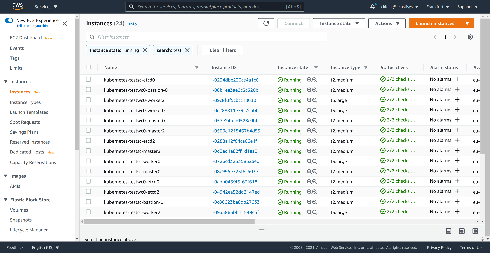

# Compliant Kubernetes Deployment on AWS

This document describes how to set up Compliant Kubernetes on AWS. The setup has two major parts:

1. Deploying at least two vanilla Kubernetes clusters
2. Deploying Compliant Kubernetes apps

Before starting, make sure you have [all necessary tools](getting-started.md).

## Setup

Choose names for your service cluster and workload clusters, as well as the DNS domain to expose the services inside the service cluster:

```bash
SERVICE_CLUSTER="testsc"
WORKLOAD_CLUSTERS="testwc0"
BASE_DOMAIN="example.com"
```

!!! Note
    If you want to set up multiple workload clusters you can add more names.
    E.g. `WORKLOAD_CLUSTERS="testwc0 testwc1 testwc2"`

    `SERVICE_CLUSTER` and each entry in `WORKLOAD_CLUSTERS` must be maximum 17 characters long.

## Deploying vanilla Kubernetes clusters

We suggest to set up Kubernetes clusters using kubespray. If you haven't done so already, clone the Elastisys Compliant Kubernetes Kubespray repo as follows:

```bash
git clone --recursive https://github.com/elastisys/compliantkubernetes-kubespray
cd compliantkubernetes-kubespray
```

### Infrastructure Setup using Terraform

1. Expose AWS credentials to Terraform.

    We suggest exposing AWS credentials to Terraform via environment variables, so they are not accidentally left on the file-system:

    ```shell
    export TF_VAR_AWS_ACCESS_KEY_ID="xyz" # Access key for AWS
    export TF_VAR_AWS_SECRET_ACCESS_KEY="zyx" # Secret key for AWS
    export TF_VAR_AWS_SSH_KEY_NAME="foo" # Name of the AWS keypair to use for the EC2 instances
    export TF_VAR_AWS_DEFAULT_REGION="bar" # Region to use for all AWS resources
    ```

    !!! tip
        We suggest generating the SSH key locally, then importing it to AWS.

2. Customize your infrastructure.

    Create a configuration for the service cluster and the workload cluster:

    ```bash
    pushd kubespray
    for CLUSTER in $SERVICE_CLUSTER $WORKLOAD_CLUSTERS; do
        cat contrib/terraform/aws/terraform.tfvars \
        | sed \
            -e "s@^aws_cluster_name =.*@aws_cluster_name = \"$CLUSTER\"@" \
            -e "s@^inventory_file =.*@inventory_file = \"../../../inventory/hosts-$CLUSTER\"@" \
            -e "s@^aws_kube_worker_size =.*@aws_kube_worker_size = \"t3.large\"@" \
        > inventory/terraform-$CLUSTER.tfvars
    done
    popd
    ```

    Review and, if needed, adjust the files in `kubespray/inventory/`.

3. Initialize and Apply Terraform.

    ```bash
    pushd kubespray/contrib/terraform/aws
    terraform init
    for CLUSTER in $SERVICE_CLUSTER $WORKLOAD_CLUSTERS; do
        terraform apply \
            -var-file=../../../inventory/terraform-$CLUSTER.tfvars \
            -auto-approve \
            -state=../../../inventory/tfstate-$CLUSTER.tfstate
    done
    popd
    ```

    !!! important
        The Terraform state is stored in `kubespray/inventory/tfstate-*`. It is precious. Consider backing it up or using [Terraform Cloud](https://www.terraform.io/docs/cloud/index.html).

4. Check that the Ansible inventory was properly generated.

    ```bash
    ls -l kubespray/inventory/hosts-*
    ```

    You may also want to check the AWS Console if the infrastructure was created correctly:

    

### Deploying vanilla Kubernetes clusters using Kubespray.

With the infrastructure provisioned, we can now deploy both the sc and wc Kubernetes clusters using kubespray. Before trying any of the steps, make sure you are in the repo's root folder.

1. Init the Kubespray config in your config path.

    ```bash
    export CK8S_CONFIG_PATH=~/.ck8s/aws
    export CK8S_PGP_FP=<your GPG key fingerprint>  # retrieve with gpg --list-secret-keys
    ```

    ```
    for CLUSTER in $SERVICE_CLUSTER $WORKLOAD_CLUSTERS; do
        ./bin/ck8s-kubespray init $CLUSTER aws $CK8S_PGP_FP
    done
    ```

    !!! important
        The key in `~/.ssh/id_rsa` must be the private key of the key referenced in `TF_VAR_AWS_SSH_KEY_NAME` above.

2. Copy the inventories generated by Terraform above in the right place.

    ```bash
    for CLUSTER in $SERVICE_CLUSTER $WORKLOAD_CLUSTERS; do
        cp kubespray/inventory/hosts-$CLUSTER $CK8S_CONFIG_PATH/$CLUSTER-config/inventory.ini
    done
    ```

3. Run kubespray to deploy the Kubernetes clusters.

    ```bash
    for CLUSTER in $SERVICE_CLUSTER $WORKLOAD_CLUSTERS; do
        ./bin/ck8s-kubespray apply $CLUSTER --flush-cache -e ansible_user=ubuntu
    done
    ```

    This may take up to 20 minutes per cluster.

4. Correct the Kubernetes API IP addresses.

    Find the DNS names of the load balancers fronting the API servers:

    ```bash
    grep apiserver_loadbalancer $CK8S_CONFIG_PATH/*-config/inventory.ini
    ```

    Locate the encrypted kubeconfigs `kube_config_*.yaml` and edit them using sops. Copy the URL of the load balancer from inventory files shown above into `kube_config_*.yaml`. Do not overwrite the port.

    ```bash
    for CLUSTER in $SERVICE_CLUSTER $WORKLOAD_CLUSTERS; do
        sops $CK8S_CONFIG_PATH/.state/kube_config_$CLUSTER.yaml
    done
    ```

5. Test access to the clusters as follows:

    ```bash
    for CLUSTER in $SERVICE_CLUSTER $WORKLOAD_CLUSTERS; do
        sops exec-file $CK8S_CONFIG_PATH/.state/kube_config_$CLUSTER.yaml \
            'kubectl --kubeconfig {} get nodes'
    done
    ```

## Deploying Compliant Kubernetes Apps

Now that the Kubernetes clusters are up and running, we are ready to install the Compliant Kubernetes apps.

1. If you haven't done so already, clone the Compliant Kubernetes apps repo and install pre-requisites.

      ```bash
      git clone https://github.com/elastisys/compliantkubernetes-apps.git
      cd compliantkubernetes-apps
      ansible-playbook -e 'ansible_python_interpreter=/usr/bin/python3' --ask-become-pass --connection local --inventory 127.0.0.1, get-requirements.yaml
      ```

2. Initialize the apps configuration.

    ```bash
    export CK8S_ENVIRONMENT_NAME=aws
    #export CK8S_FLAVOR=[dev|prod] # defaults to dev
    export CK8S_CONFIG_PATH=~/.ck8s/aws
    export CK8S_CLOUD_PROVIDER=aws
    export CK8S_PGP_FP=<your GPG key fingerprint>  # retrieve with gpg --list-secret-keys
    ./bin/ck8s init
    ```

    Three  files, `sc-config.yaml` and `wc-config.yaml`, and `secrets.yaml`, were generated in the `$CK8S_CONFIG_PATH` directory.

    ```bash
    ls -l $CK8S_CONFIG_PATH
    ```

3. Configure the apps.

    Edit the configuration files `sc-config.yaml`, `wc-config.yaml` and `secrets.yaml` and set the appropriate values for some of the configuration fields. Note that, the latter is encrypted.

    ```bash
    vim $CK8S_CONFIG_PATH/sc-config.yaml
    vim $CK8S_CONFIG_PATH/wc-config.yaml
    sops $CK8S_CONFIG_PATH/secrets.yaml
    ```

    The following are the minimum change you should perform:

    ```
    # sc-config.yaml and wc-config.yaml
    global:
      baseDomain: "set-me"  # set to $BASE_DOMAIN
      opsDomain: "set-me"  # set to ops.$BASE_DOMAIN
      issuer: letsencrypt-prod

    objectStorage:
      type: "s3"
      s3:
        region: "set-me"  # Region for S3 buckets, e.g, eu-central-1
        regionAddress: "set-me"  # Region address, e.g, s3.eu-central-1.amazonaws.com
        regionEndpoint: "set-me"  # e.g., https://s3.us-west-1.amazonaws.com

    fluentd:
      forwarder:
        useRegionEndpoint: "set-me"  # set it to either true or false

    issuers:
      letsencrypt:
        email: "set-me"  # set this to an email to receive LetsEncrypt notifications
    ```

    ```
    # secrets.yaml
    objectStorage:
      s3:
        accessKey: "set-me" #put your s3 accesskey
        secretKey: "set-me" #put your s3 secretKey
    ```

4. Create placeholder DNS entries.

    To avoid negative caching and other surprises. Create two placeholders as follows (feel free to use the "Import zone" feature of AWS Route53):

    ```
    echo "
    *.$BASE_DOMAIN     60s A 203.0.113.123
    *.ops.$BASE_DOMAIN 60s A 203.0.113.123
    "
    ```

    NOTE: 203.0.113.123 is in [TEST-NET-3](https://en.wikipedia.org/wiki/Reserved_IP_addresses) and okey to use as placeholder.

5. Installing Compliant Kubernetes apps.

    Start with the service cluster:

    ```bash
    ln -sf $CK8S_CONFIG_PATH/.state/kube_config_${SERVICE_CLUSTER}.yaml $CK8S_CONFIG_PATH/.state/kube_config_sc.yaml
    ./bin/ck8s apply sc  # Respond "n" if you get a WARN
    ```

    Then the workload clusters:
    ```
    for CLUSTER in $WORKLOAD_CLUSTERS; do
        ln -sf $CK8S_CONFIG_PATH/.state/kube_config_${CLUSTER}.yaml $CK8S_CONFIG_PATH/.state/kube_config_wc.yaml
        ./bin/ck8s apply wc  # Respond "n" if you get a WARN
    done
    ```

    **NOTE: Leave sufficient time for the system to settle, e.g., request TLS certificates from LetsEncrypt, perhaps as much as 20 minutes.**

5. Setup required DNS entries.

    You will need to set up the following DNS entries. First, determine the public IP of the load-balancer fronting the Ingress controller of the *service cluster*:

    ```
    SC_INGRESS_LB_HOSTNAME=$(sops exec-file $CK8S_CONFIG_PATH/.state/kube_config_sc.yaml 'kubectl --kubeconfig {} get -n ingress-nginx svc ingress-nginx-controller -o jsonpath={.status.loadBalancer.ingress[0].hostname}')
    SC_INGRESS_LB_IP=$(dig +short $SC_INGRESS_LB_HOSTNAME | head -1)
    echo $SC_INGRESS_LB_IP
    ```

    Then, import the following zone in AWS Route53:

    ```
    echo """
    *.ops.$BASE_DOMAIN    60s A $SC_INGRESS_LB_IP
    dex.$BASE_DOMAIN      60s A $SC_INGRESS_LB_IP
    grafana.$BASE_DOMAIN  60s A $SC_INGRESS_LB_IP
    harbor.$BASE_DOMAIN   60s A $SC_INGRESS_LB_IP
    kibana.$BASE_DOMAIN   60s A $SC_INGRESS_LB_IP
    """
    ```

6. Testing:

    After completing the installation step you can test if the apps are properly installed and ready using the commands below.

    ```bash
    ./bin/ck8s test sc
    for CLUSTER in $WORKLOAD_CLUSTERS; do
        ln -sf $CK8S_CONFIG_PATH/.state/kube_config_${CLUSTER}.yaml $CK8S_CONFIG_PATH/.state/kube_config_wc.yaml
        ./bin/ck8s test wc
    done
    ```

Done. Navigate to `grafana.$BASE_DOMAIN`, `kibana.$BASE_DOMAIN`, `harbor.$BASE_DOMAIN`, etc. to discover Compliant Kubernetes's features.

## Teardown

```bash
for CLUSTER in $WORKLOAD_CLUSTERS $SERVICE_CLUSTER; do
    sops exec-file $CK8S_CONFIG_PATH/.state/kube_config_$CLUSTER.yaml \
        'kubectl --kubeconfig {} delete --all-namespaces --all ingress,service,deployment,statefulset,daemonset,cronjob,job,pod,sa,secret,configmap'
done

# Feel free to skips this step, but remember to remove EBS volumes manually
# from the AWS Console, after Terraform teardown.
for CLUSTER in $WORKLOAD_CLUSTERS $SERVICE_CLUSTER; do
    sops exec-file $CK8S_CONFIG_PATH/.state/kube_config_$CLUSTER.yaml \
        'kubectl --kubeconfig {} delete --all-namespaces --all pvc,pv'
done
```

```bash
cd ../compliantkubernetes-kubespray
pushd kubespray/contrib/terraform/aws
for CLUSTER in $SERVICE_CLUSTER $WORKLOAD_CLUSTERS; do
    terraform destroy \
        -auto-approve \
        -state=../../../inventory/tfstate-$CLUSTER.tfstate
done
popd
```

## Further Reading

* [Compliant Kubernetes apps repo](https://github.com/elastisys/compliantkubernetes-apps)
* [Configurations option](https://github.com/elastisys/compliantkubernetes-apps#elastisys-compliant-kubernetes-apps)
