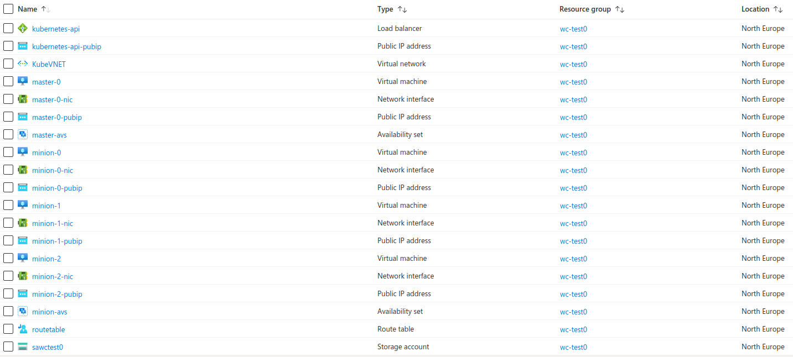

# Compliant Kubernetes Deployment on Azure

This document contains instructions on how to setup a service cluster and a workload cluster in Azure.
The following are the main tasks addressed in this document:

1. Infrastructure setup for two clusters: one service and one workload cluster
1. Deploying Compliant Kubernetes on top of the two clusters.
1. Creating DNS Records
1. Deploying Rook Storage Orchestration Service
1. Deploying Compliant Kubernetes apps

Before starting, make sure you have [all necessary tools](getting-started.md).

!!!note
    This guide is written for compliantkubernetes-apps [v0.13.0](https://github.com/elastisys/compliantkubernetes-apps/tree/v0.13.0)

## Setup

Choose names for your service cluster and workload clusters, as well as the DNS domain to expose the services inside the service cluster:

```bash
SERVICE_CLUSTER="sc-test"
WORKLOAD_CLUSTERS=( "wc-test0" )
BASE_DOMAIN="example.com"
```

## Infrastructure Setup using AzureRM

We suggest to set up Kubernetes clusters using kubespray.
If you haven't done so already, clone the Elastisys Compliant Kubernetes Kubespray repo as follows:

```bash
git clone --recursive https://github.com/elastisys/compliantkubernetes-kubespray
cd compliantkubernetes-kubespray
```

### Install azure-cli

If you haven't done so already, please install and configure [azure-cli](https://docs.microsoft.com/en-us/cli/azure/install-azure-cli?view=azure-cli-latest).

### Login with azure-cli

```bash
az login
```

### Customize your infrastructure

Create a configuration for the service and the workload clusters:

```bash
pushd kubespray/contrib/azurerm/
for CLUSTER in ${SERVICE_CLUSTER} "${WORKLOAD_CLUSTERS[@]}"; do
    az group create -g $CLUSTER -l northeurope
    mkdir -p $CLUSTER/inventory
done
popd
```

!!!note
    Please specify the value for the `ssh_public_keys` variable in `kubespray/contrib/azurerm/group_vars/all`.
    It must be your SSH public key to access your Azure virtual machines.
    Besides, the value for the `cluster_name` variable must be globally unique due to some restrictions in Azure.
    Make sure that `$SERVICE_CLUSTER` and `$WORKLOAD_CLUSTERS` are unique.

Review and, if needed, adjust the files in `kubespray/contrib/azurerm/group_vars/all` accordingly.

### Generate and apply the templates

```bash
pushd kubespray/contrib/azurerm/
tmp=""
for CLUSTER in ${SERVICE_CLUSTER} "${WORKLOAD_CLUSTERS[@]}"; do
   cat group_vars/all \
   | sed \
       -e "s@^cluster_name:.*@cluster_name: \"$CLUSTER\"@" \
   > group_vars/all1
   cat group_vars/all1 > group_vars/all
   rm group_vars/all1
   if [ -z $tmp ]
   then
           sed -i "s/{{ playbook_dir }}/{{ playbook_dir }}\/$CLUSTER/g"  roles/generate-templates/tasks/main.yml

           ansible-playbook generate-templates.yml

           az deployment group create --template-file ./$CLUSTER/.generated/network.json -g $CLUSTER
           az deployment group create --template-file ./$CLUSTER/.generated/storage.json -g $CLUSTER
           az deployment group create --template-file ./$CLUSTER/.generated/availability-sets.json -g $CLUSTER
           az deployment group create --template-file ./$CLUSTER/.generated/bastion.json -g $CLUSTER
           az deployment group create --template-file ./$CLUSTER/.generated/masters.json -g $CLUSTER
           az deployment group create --template-file ./$CLUSTER/.generated/minions.json -g $CLUSTER
   else
           sed -i "s/{{ playbook_dir }}\/$tmp/{{ playbook_dir }}\/$CLUSTER/g"  roles/generate-templates/tasks/main.yml

           ansible-playbook generate-templates.yml

           az deployment group create --template-file ./$CLUSTER/.generated/network.json -g $CLUSTER
           az deployment group create --template-file ./$CLUSTER/.generated/storage.json -g $CLUSTER
           az deployment group create --template-file ./$CLUSTER/.generated/availability-sets.json -g $CLUSTER
           az deployment group create --template-file ./$CLUSTER/.generated/bastion.json -g $CLUSTER
           az deployment group create --template-file ./$CLUSTER/.generated/masters.json -g $CLUSTER
           az deployment group create --template-file ./$CLUSTER/.generated/minions.json -g $CLUSTER
   fi
   tmp=$CLUSTER
 done
 sed -i "s/{{ playbook_dir }}\/$tmp/{{ playbook_dir }}/g"  roles/generate-templates/tasks/main.yml
 sed -i "s/{{ playbook_dir }}\/$tmp/{{ playbook_dir }}/g"  roles/generate-inventory_2/tasks/main.yml
 sed -i "s/{{ playbook_dir }}\/$tmp/{{ playbook_dir }}/g"  roles/generate-inventory/tasks/main.yml
popd
```

### Generating an inventory for kubespray

```bash
pushd kubespray/contrib/azurerm/
tmp=""
for CLUSTER in ${SERVICE_CLUSTER} "${WORKLOAD_CLUSTERS[@]}"; do
 if [ -z $tmp ]
   then
         sed -i "s/{{ playbook_dir }}/{{ playbook_dir }}\/$CLUSTER/g"  roles/generate-inventory_2/tasks/main.yml
         sed -i "s/{{ playbook_dir }}/{{ playbook_dir }}\/$CLUSTER/g"  roles/generate-inventory/tasks/main.yml
         ./generate-inventory.sh $CLUSTER

   else
           sed -i "s/{{ playbook_dir }}\/$tmp/{{ playbook_dir }}\/$CLUSTER/g"  roles/generate-inventory_2/tasks/main.yml
           sed -i "s/{{ playbook_dir }}\/$tmp/{{ playbook_dir }}\/$CLUSTER/g"  roles/generate-inventory/tasks/main.yml
           ./generate-inventory.sh $CLUSTER
    fi
    tmp=$CLUSTER
done
sed -i "s/{{ playbook_dir }}\/$tmp/{{ playbook_dir }}/g"  roles/generate-inventory_2/tasks/main.yml
sed -i "s/{{ playbook_dir }}\/$tmp/{{ playbook_dir }}/g"  roles/generate-inventory/tasks/main.yml
popd
```

The inventory files for for cluster will be created under `*/inventory/`.
Besides, two `loadBalancer_vars.yaml` files will be created, one for each cluster.

You may also want to check the Azure portal if the infrastructure was created correctly.
The figure below shows for `wc-test0`.



## Deploying vanilla Kubernetes clusters using Kubespray

With the infrastructure provisioned, we can now deploy Kubernetes using kubespray.
First, change to the `compliantkubernetes-kubespray` root directory.

```bash
cd ..
```

### Init the Kubespray config in your config path

```bash
export CK8S_CONFIG_PATH=~/.ck8s/azure
export CK8S_PGP_FP=<your GPG key fingerprint>  # retrieve with gpg --list-secret-keys

for CLUSTER in ${SERVICE_CLUSTER} "${WORKLOAD_CLUSTERS[@]}"; do
    ./bin/ck8s-kubespray init $CLUSTER default $CK8S_PGP_FP
done
```

### Copy the generated inventory files in the right location

```bash
for CLUSTER in ${SERVICE_CLUSTER} ${WORKLOAD_CLUSTERS[@]}; do
  #add calico to the inventory file
  cat kubespray/contrib/azurerm/$CLUSTER/inventory/inventory.j2 \
        | sed  '/\[k8s-cluster:children\]/i \[calico-rr\]' \
        > $CK8S_CONFIG_PATH/$CLUSTER-config/inventory.ini
echo "calico-rr" >> $CK8S_CONFIG_PATH/$CLUSTER-config/inventory.ini $CK8S_CONFIG_PATH/$CLUSTER-config/inventory.ini
    # Add ansible_user ubuntu (note that this assumes you have set admin_username in azurerm/group_vars/all to ubuntu)
    echo -e 'ansible_user: ubuntu' >> $CK8S_CONFIG_PATH/$CLUSTER-config/group_vars/k8s-cluster/ck8s-k8s-cluster.yaml

    # Get the IP address of the loadbalancer (to be added in kubadmin certSANs list which will be used for kubectl)
    ip=$(grep -o '[0-9]\{1,3\}\.[0-9]\{1,3\}\.[0-9]\{1,3\}\.[0-9]\{1,3\}' kubespray/contrib/azurerm/$CLUSTER/loadbalancer_vars.yml)
    echo 'supplementary_addresses_in_ssl_keys: ["'$ip'"]' >> $CK8S_CONFIG_PATH/$CLUSTER-config/group_vars/k8s-cluster/ck8s-k8s-cluster.yaml
    echo -e 'nameservers:\n  - 1.1.1.1' >> $CK8S_CONFIG_PATH/$CLUSTER-config/group_vars/k8s-cluster/ck8s-k8s-cluster.yaml
    echo 'resolvconf_mode: host_resolvconf' >> $CK8S_CONFIG_PATH/$CLUSTER-config/group_vars/k8s-cluster/ck8s-k8s-cluster.yaml

done
```

### Run kubespray to deploy the Kubernetes clusters

```bash
for CLUSTER in ${SERVICE_CLUSTER} "${WORKLOAD_CLUSTERS[@]}"; do
    ./bin/ck8s-kubespray apply $CLUSTER --flush-cache
done
```

This may take up to 30 minutes per cluster.

Please increase the value for timeout, e.g `timeout=30`, in `kubespray/ansible.cfg` if you face the following issue while running step-3.

```console
TASK [bootstrap-os : Fetch /etc/os-release] ****************************************************
fatal: [minion-0]: FAILED! => {"msg": "Timeout (12s) waiting for privilege escalation prompt: "}
fatal: [minion-1]: FAILED! => {"msg": "Timeout (12s) waiting for privilege escalation prompt: "}
fatal: [minion-2]: FAILED! => {"msg": "Timeout (12s) waiting for privilege escalation prompt: "}
fatal: [master-0]: FAILED! => {"msg": "Timeout (12s) waiting for privilege escalation prompt: "}
```

### Correct the Kubernetes API IP addresses

Get the public IP address of the loadbalancer:

```bash
grep -o '[0-9]\{1,3\}\.[0-9]\{1,3\}\.[0-9]\{1,3\}\.[0-9]\{1,3\}' kubespray/contrib/azurerm/$CLUSTER/loadbalancer_vars.yml
```

Locate the encrypted kubeconfigs `kube_config_*.yaml` and edit them using sops.
Copy the IP shown above into `kube_config_*.yaml`. Do not overwrite the port.

```bash
for CLUSTER in ${SERVICE_CLUSTER} "${WORKLOAD_CLUSTERS[@]}"; do
    sops ${CK8S_CONFIG_PATH}/.state/kube_config_$CLUSTER.yaml
done
```

### Test access to the clusters as follows

```bash
for CLUSTER in ${SERVICE_CLUSTER} "${WORKLOAD_CLUSTERS[@]}"; do
    sops exec-file ${CK8S_CONFIG_PATH}/.state/kube_config_$CLUSTER.yaml \
        'kubectl --kubeconfig {} get nodes'
done
```





## Deploying Compliant Kubernetes Apps







The following are the minimum change you should perform:

```yaml
# ${CK8S_CONFIG_PATH}/sc-config.yaml and ${CK8S_CONFIG_PATH}/wc-config.yaml
global:
  baseDomain: "set-me"  # set to <enovironment_name>.$DOMAIN
  opsDomain: "set-me"  # set to ops.<environment_name>.$DOMAIN
  issuer: letsencrypt-prod

objectStorage:
  type: "s3"
  s3:
    region: "set-me"  # Region for S3 buckets, e.g, west-1
    regionEndpoint: "set-me"  # e.g., https://s3.us-west-1.amazonaws.com

storageClasses:
  default:  rook-ceph-block
  nfs:
    enabled: false
  cinder:
    enabled: false
  local:
    enabled: false
  ebs:
    enabled: false
```

```yaml
# ${CK8S_CONFIG_PATH}/sc-config.yaml
ingressNginx:
    controller:
      service:
        type: "this-is-not-used"
        annotations: "this-is-not-used"

harbor:
  oidc:
    groupClaimName: "set-me" # set to group claim name used by OIDC provider

issuers:
  letsencrypt:
    prod:
      email: "set-me"  # set this to an email to receive LetsEncrypt notifications
    staging:
      email: "set-me"  # set this to an email to receive LetsEncrypt notifications
```

```yaml
# ${CK8S_CONFIG_PATH}/secrets.yaml
objectStorage:
  s3:
    accessKey: "set-me" #set to your s3 accesskey
    secretKey: "set-me" #set to your s3 secretKey
```







## Teardown



### Remove infrastructure

To teardown the cluster, please go to the `compliantkubernetes-kubespray` repo root directory and run the following.

```bash
pushd kubespray/contrib/azurerm
for CLUSTER in ${SERVICE_CLUSTER} "${WORKLOAD_CLUSTERS[@]}"; do
    ansible-playbook generate-templates.yml
    az group deployment create -g "$CLUSTER" --template-file ./$CLUSTER/.generated/clear-rg.json --mode Complete
done
popd
```

## Further Reading

* [Elastisys Compliant Kubernetes Kubespray](https://github.com/elastisys/compliantkubernetes-kubespray/blob/main/README.md)
* [Compliant Kubernetes apps repo](https://github.com/elastisys/compliantkubernetes-apps)
* [Configurations option](https://github.com/elastisys/compliantkubernetes-apps#elastisys-compliant-kubernetes-apps)
