# OpenSearch Mappings

OpenSearch organizes data into indexes. Each index is a collection of JSON documents. If you have a set of log lines that you want to add to OpenSearch, you must first convert them to JSON. A simple JSON document for a movie might look like this:

```json
{
  "title": "Forrest Gump",
  "release_date": "1994-07-06"
}
```

When you add the document to an index, OpenSearch adds some metadata, such as the unique document ID:

```json
{
  "_index": "<index-name>",
  "_type": "_doc",
  "_id": "<document-id>",
  "_version": 1,
  "_source": {
    "title": "Forrest Gump",
    "release_date": "1994-07-06"
  }
}
```

Indexes also contain mappings and settings:

- A mapping is the collection of fields that documents in the index have. In this case, those fields are title and release_date.
- Settings include data like the index name, creation date, and number of shards.

You can define how documents and their fields are stored and indexed by creating a mapping. The mapping specifies the list of fields for a document. Every field in the document has a field type, which corresponds to the type of data the field contains. For example, you may want to specify that the `release_date` field should be of type `date`. To learn more, see [Supported field types](https://opensearch.org/docs/latest/field-types/supported-field-types/index/).


## Dynamic mapping

When you index a document, OpenSearch adds fields automatically with dynamic mapping. You can also explicitly add fields to an index mapping.

Let's create an index called **movies**, and add a document:

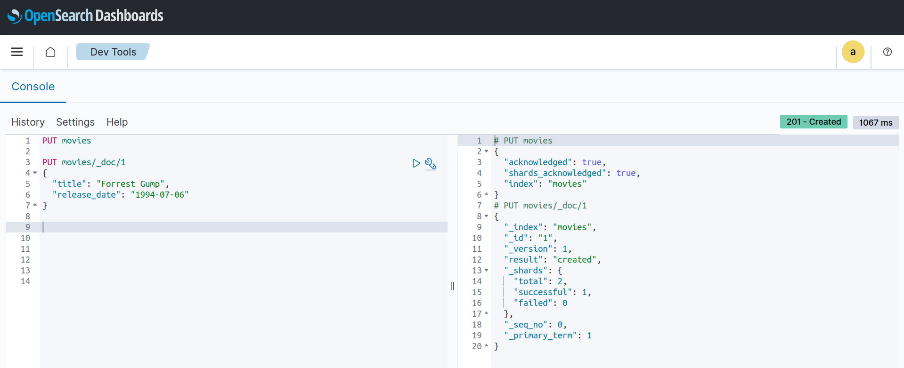

We can see the dynamic mapping of all the document fields :

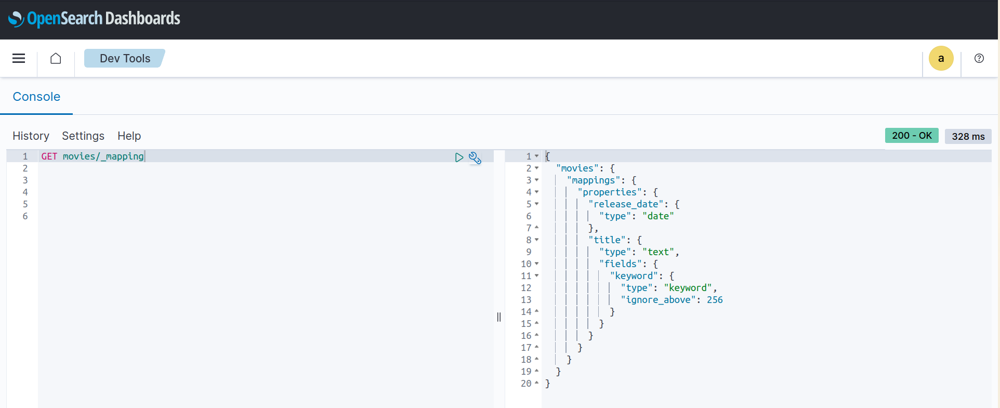

And OpenSearch was able to infere that **release_date** is of type **date**, and **title** is of type **text**.

You should be aware that OpenSearch type detection is based on some Internal rules, which by no means will infere the correct type for every field. Let's take this example:

We will recreate the **movies** index, and add a new field called `duration_minutes`, and wrap the value in quotes:

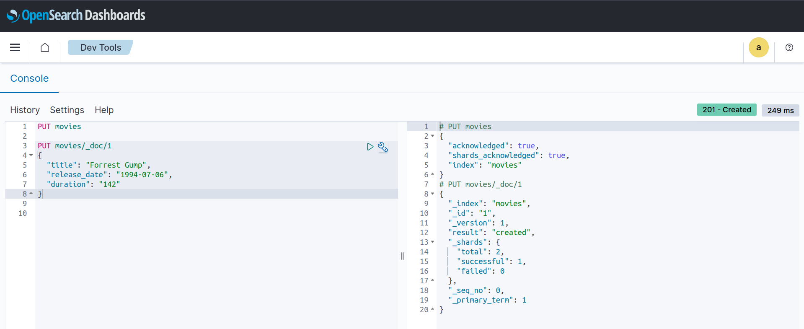

Let's check the new dynamic mapping

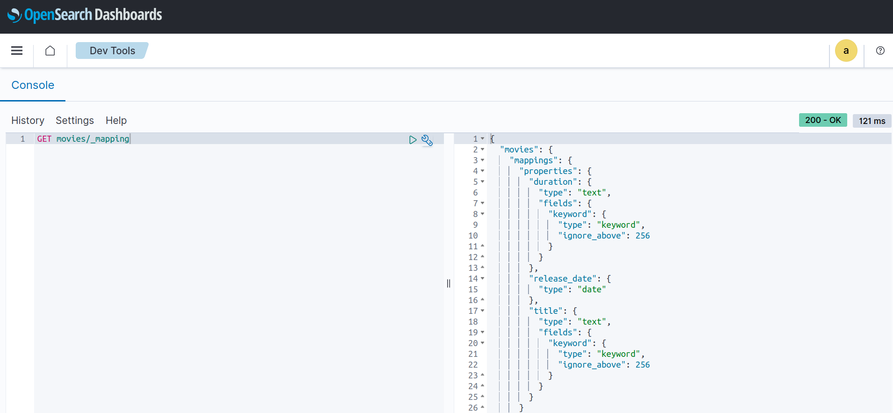

You can see that OpenSearch choose a type of text for duration, which is technically correct, but it won't be of value especially if we were to run custom queries on the *duration_minutes* field, for example: Get all movies longer than a certain duration .. etc

We can instruct OpenSearch to detect numeric values, by configuring the Index at creation time. Let' recreate the index and enable numeric detection:

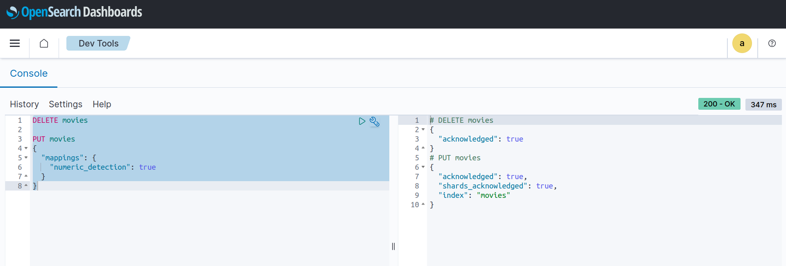

Checking the dynamic mapping again, we can see that Opensearch was able to detect the numeric, and set the value of field to **long**

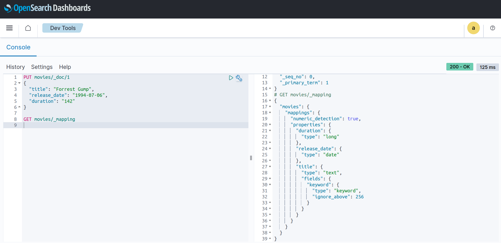

Although OpenSearch was able to detect the numeric type, **long** in our case is not the best data type, as it is an inefficient use of memory space. A better data type here could be **short**.

| Field data type | Description                                                      |
|-----------------|------------------------------------------------------------------|
| short           | A signed 16-bit integer. Minimum is −2 <sup>15</sup> . Maximum is 2 <sup>15 − 1</sup>. |
| long            | A signed 64-bit integer. Minimum is −2 <sup>63</sup> . Maximum is 2 <sup>63 − 1</sup>  |

To learn more, see [Numeric field types](https://opensearch.org/docs/latest/field-types/supported-field-types/numeric/)


Dynamic mappings are fine when you're getting started with elasticsearch or when you're working with a new dataset. Once you have a more concrete idea of how you want to use the data, you want to be much more deliberate with your mappings, this is where an explicit mapping will be beneficial.

## Explicit mapping

Explicit mappings allow us to be more precise with our field definitions taking the creative control away from elasticsearch. We describe everything upfront providing the structure of our data and the relevant properties.

Here is an example where we define explicitly the fields type of an index :

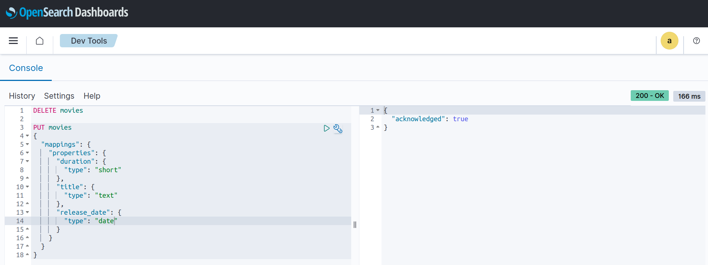

An explicit mapping only bypasses the type inference that elasticsearch does for the fields we provide in the explicit mapping. If we index a document with a field not described in the explicit mapping, elasticsearch will still add that new field to the mapping and infer data type to use.

Let's index a new document containing a new field `producer`:

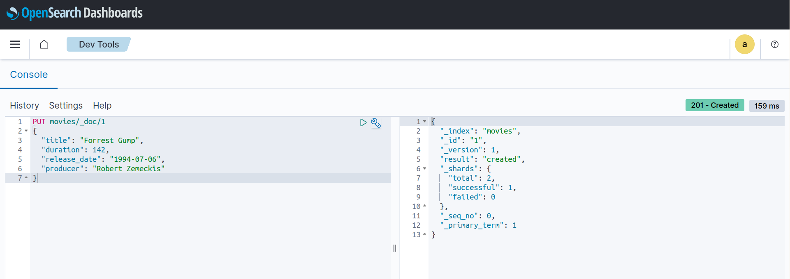

The document gets indexed fine, and the mapping now contains the additional field with type text

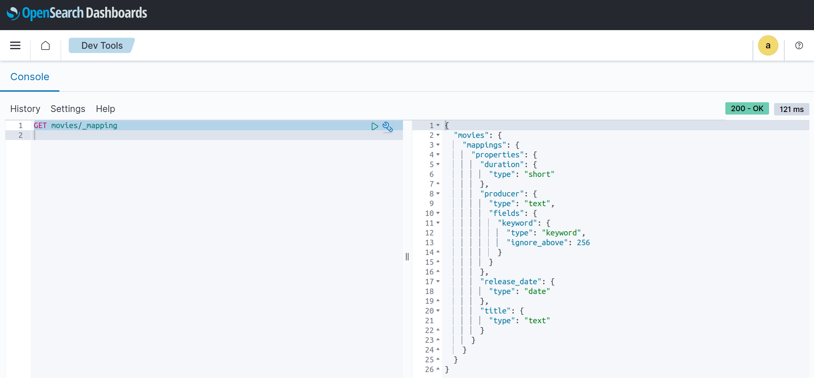

But now if start adding all sorts of fields we don't know about, we're going to start having problems, and will probably end up with bad quality data, which will make it more difficult to work with.

There are some options on how to deal when documents contains new fields that were not explicitly defined in the mapping. We can tell Elastisearch to either reject the document completely or we can allow the document to be indexed but ignore fields not in the explicit mapping.

Let's configure the index to reject documents that contains fields not defined in the explicit mapping, to do this we set *dynamic* to *strict*:

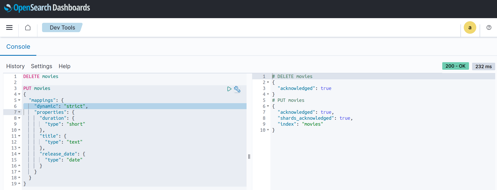

If we try now to index a document with a field not in the explicit mapping, we'll get an error :

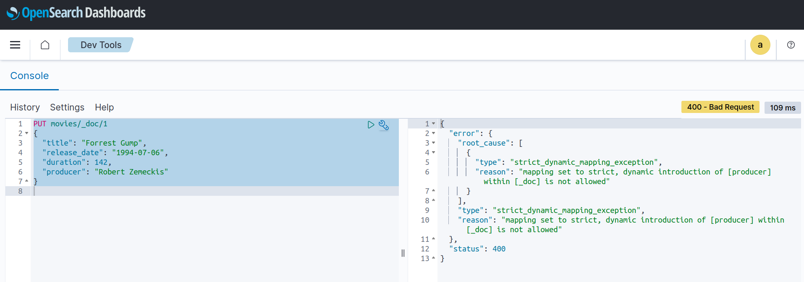

This is really handy as it will prevent field count explosion, especially in production environments, as the fields will always be increasing as clients can add documents with previously unmapped fields.
However this might be too strict in some cases, so an alternative is still to allow the document to be indexed but ignore fields not defined in the explicit mapping. To do this we set dynamic to false :

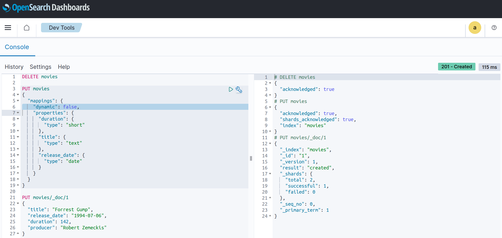

Now we won't get an error when we index with the same document, and the field is not in the mapping for the index

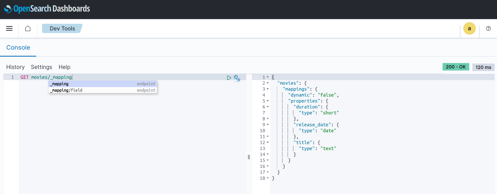

One thing worth mentioning is that while the *producer* field was not indexed, and can't be used for queries, it is still there if we get the document, and the *_source*:

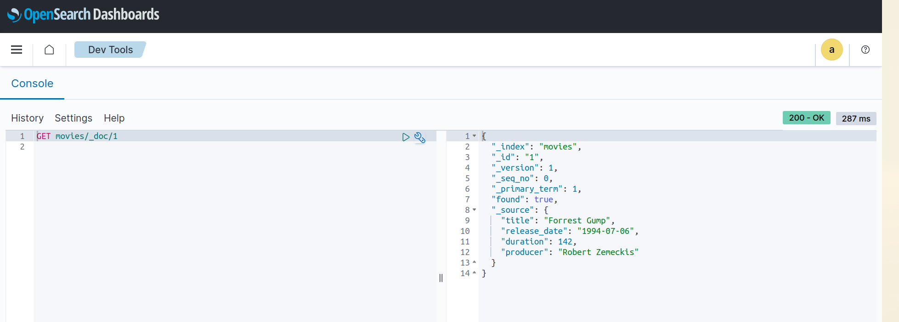

While this new field is not usable for queries as said before, but if we saw the need, we can create a new index with the *producer* field in the explicit mapping, then re-index the documents in **movies** index to where the new index is.

## Mapping constraints

There is a limit to the number of fields a mapping can have but it's a limit that can be changed. The default value is a 1000 fields per index. This limit is there to prevent cluster performance issues, as resource utilization increases a lot when you have a large number of fields in an index.

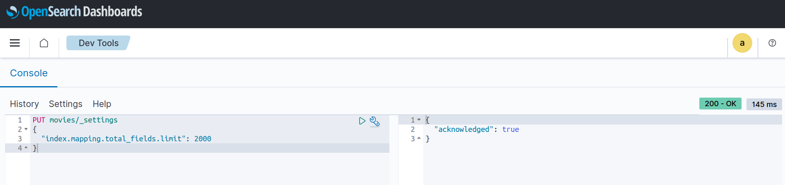

Also, note that new fields can be added to an explicit mapping, but field types cannot be changed. The general pattern here is to create a new index with a new mapping and bring documents over in what's called a re-index operation.
