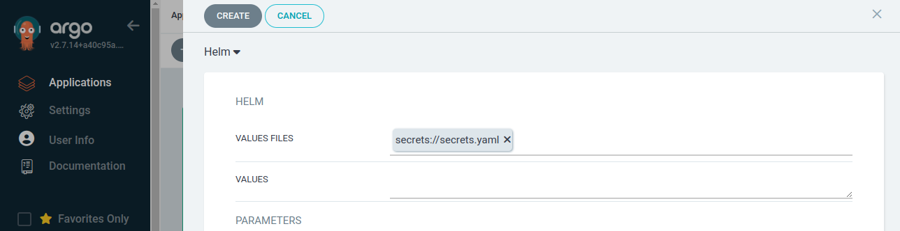

---
tags:
  - BSI IT-Grundschutz APP.4.4.A2
  - BSI IT-Grundschutz APP.4.4.A10
---

# Argo™ CD (preview)

!!! elastisys "For Elastisys Managed Services Customers"

    You can order Managed Argo™ CD by filing a [service ticket](https://elastisys.atlassian.net/servicedesk/). Here are the highlights:

    * **Disaster recovery**:
        * Backup scope includes Argo CD resources that can be created by application developers, such as:
            * ApplicationSets
            * Applications
            * AppProjects
            * Secrets and ConfigMaps as needed to store configuration on repositories and notifications.
        * A backup is taken every day between 0:00 am and 6:00 am CET. The backup retention period is 30 days unless otherwise requested by the customer.
        * Recovery time objective (RTO): 4 hours.
    * **Monitoring, security patching and incident management**: included.

    For more information, please read [ToS Appendix 3 Managed Additional Service Specification](https://elastisys.com/legal/terms-of-service/#appendix-3-managed-additional-service-specification-managed-services-only).

    This is a preview feature. For more information, please read [ToS 9.1 Preview Features](https://elastisys.com/legal/terms-of-service/#91-preview-features).

!!!important

    You cannot ask Argo CD to create a Namespace. This also means that you cannot template the Namespace in ApplicationSets.

    Why? See [ADR-0042](../../adr/0042-argocd-dynamic-hnc-namespaces.md)

<figure>
    
    <figcaption>
        <strong>Argo CD on Compliant Kubernetes Deployment Model</strong>
        <br>
        This help you build a mental model of how to levarage Argo CD for deploying your application.
    </figcaption>
</figure>

This page will help you succeed in connecting to Argo CD application which meets your security and compliance requirements.

## Getting Access

Your administrator will set up the authentication inside Compliant Kubernetes, which will give you access to ArgoCD UI.

## Follow the Go-Live Checklist

You should be all set.
Before going into production, don't forget to go through the [go-live checklist](../go-live.md).

## CK8S Argo CD Release Notes

Check out the [release notes](../../release-notes/argocd.md) for the Argo CD setup that runs in Compliant Kubernetes environments!

## Secret Management

Secret values should never be stored in plain-text in code repositories. The following sections will describe two supported approaches on how Application Developers can do secret management with Elastisys Managed Argo CD.

### With Helm Secrets

Argo CD can be configured to decrypt files encrypted with `sops` using [Helm Secrets](https://github.com/jkroepke/helm-secrets#helm-secrets). To be able to use Helm-secrets with Argo CD, you will need to contact your Platform Administrator requesting that you want to use this feature and for which OIDC group, users or ServiceAccounts (otherwise the Application Developer group used for accessing the cluster is assumed). Once your Platform Administrator has approved your request, you should be able to create and manage a Kubernetes Secret resource in the `argocd-system` namespace as instructed below.

The following steps will show how to get started with encrypting files using `sops` and `gpg`, storing the encrypted files in a Helm chart, and lastly deploying the Helm chart with Argo CD.

1.  Generate a new GPG key-pair (make sure not to add a passphrase as otherwise Argo CD will not be able to use the key) and then export the private key. The following example will create a GPG key and export the private key to a file named `private.asc`:

    ```bash
    gpg --batch --rfc4880 --passphrase '' --quick-generate-key "set-me@example.com" default default
    fpr=$(gpg --with-colons --list-keys "set-me@example.com" | awk -F: '$1 == "fpr" {print $10; exit}')
    gpg --output "private.asc" --armor --export-secret-key $fpr
    ```

1.  For Argo CD to be able to use this key for decrypting `sops` encrypted values files in your Helm charts, you will need to create a Kubernetes Secret in the `argocd-system` namespace named `helm-secrets-private-keys`. This secret will then be mounted and read by the Argo CD repo server. Create the Secret using the private key file created in the previous step:

    ```bash
    PRIVATE_KEY_FILE="private.asc"
    kubectl -n argocd-system create secret generic helm-secrets-private-keys --from-file=key.asc=$PRIVATE_KEY_FILE --dry-run=client -oyaml | \
        kubectl label -f- -oyaml argocd.argoproj.io/secret-type=repository --dry-run=client --local | \
        kubectl create -f-
    ```

    Deploy the Secret:

    ```bash
    kubectl create -f helm-secrets-private-keys.yaml
    ```

    !!! note

        Once your Platform Administrator has enabled Helm-secrets with Argo CD, the Argo CD repo server pod will not be able to initialize if this secret does not exist. Check pods in the `argocd-system` namespace after creating the secret to confirm that the secret got mounted properly by the repo server:

        ```console
        $ kubectl get pods -n argocd-system -l app.kubernetes.io/component=repo-server
        NAME                                  READY   STATUS    RESTARTS   AGE
        argocd-repo-server-77fd58b498-kjm95   1/1     Running   0          3m45s
        ```

1.  Create a `.sops.yaml` file in the Helm chart in which you want to use Helm Secrets. Add your GPG **public** key to this file. You can get the public key with:

    ```bash
    gpg --list-key "set-me@example.com"
    ```

    The `.sops.yaml` file should look something like this:

    ```yaml
    ---
    creation_rules:
      - pgp: <public-gpg-key>
    ```

1.  Create a values file in your Helm chart repository and put values that should be encrypted into this file:

    ```bash
    touch secrets.yaml
    ```

    These values can then be referenced in templates as any other Helm values.

1.  Encrypt the values file using `sops` (as long as there is a `.sops.yaml` file in the same folder containing your public GPG key you do not have to specify the GPG key when running the following command):

    ```bash
    sops --encrypt --in-place secrets.yaml
    ```

    To test using the now encrypted `secrets.yaml` file together with the Helm chart, [install the Helm Secrets plugin](https://github.com/jkroepke/helm-secrets/wiki/Installation), and then run the following from the root folder of the Helm chart to template the Helm chart:

    ```bash
    helm template . --values secrets://secrets.yaml
    ```

1.  The file `secrets.yaml` can now safely be stored in a code repository as long as it is encrypted.

    !!! tip

        To edit values in the encrypted values file, you can use `sops` which will open the file in clear text in a configured editor:

        ```bash
        sops secrets.yaml
        ```

        There is also a [VSCode plugin](https://marketplace.visualstudio.com/items?itemName=signageos.signageos-vscode-sops) which can simplify editing `sops` encrypted files directly in the VSCode editor.

    !!! tip

        Add a [pre-commit hook](https://github.com/yuvipanda/pre-commit-hook-ensure-sops) to ensure to not push files containing sensitive data that are not encrypted with `sops`.

1.  In Argo CD, when you create your Application, add the secret values file (`secrets.yaml`) as follow:

    

    Here, `secrets.yaml` is the relative path and name of the file containing encrypted values.

### With SealedSecrets

The following steps assumes SealedSecrets is installed in the cluster. For installing SealedSecrets in a Compliant Kubernetes cluster, refer to [the self-managed guide](../self-managed-services/sealedsecrets.md). You will need to contact your Platform Administrator requesting that you want to use SealedSecrets together with Argo CD.

1.  Create a SealedSecret, the following steps will create a SealedSecret for the namespace in the current Kubernetes context:

    ```bash
    export SEALED_SECRETS_CONTROLLER_NAMESPACE=sealed-secrets # set this to the namespace in which the controller is running in
    export SECRET_VALUE=<secret-data> # this will be a value that should be encrypted/sealed
    export KEY=foo # the key used for referencing SECRET_VALUE in the secret

    kubectl create secret generic mysecret --dry-run=client --from-literal=$KEY=$SECRET_VALUE -o yaml | \
        kubeseal --format yaml > mysealedsecret.yaml
    ```

    !!! note

        With SealedSecrets it is possible to set a _scope_ of a secret. By default this scope is set to `strict` in which the SealedSecret controller uses the name and namespace of the secret as attributes during encryption, hence, the SealedSecret needs to be created with the same values for these attributes if the controller is to be able to decrypt the SealedSecret. It is possible to change the scope with the `--scope` flag for `kubeseal`, refer to the [official documentation for SealedSecrets](https://github.com/bitnami-labs/sealed-secrets#scopes) for possible scopes.

1.  The generated SealedSecret manifest file `mysealedsecret.yaml` will contain the encrypted `$SECRET_VALUE` and is safe to store on, for example, GitHub. Push this manifest file to the repository containing the rest of your application manifests.

1.  Deploy the application containing the SealedSecret with Argo CD as any other application.

### Using vals with HashiCorp's Vault

If you want to use [vals](https://github.com/helmfile/vals) with [Vault](https://www.vaultproject.io/), you will need to contact your Platform Administrator requesting that you want to use vals with Vault together with Argo CD.

1.  Create a secret in the `argocd-system` Namespace called `vals-secret`:

    ```yaml
    apiVersion: v1
    kind: Secret
    metadata:
      name: vals-secret
      namespace: argocd-system
      labels:
        argocd.argoproj.io/secret-type: vals-secret
    type: Opaque
    data:
      VAULT_ADDR: ""
      VAULT_NAMESPACE: ""
      VAULT_AUTH_METHOD: ""
      VAULT_ROLE_ID: ""
      VAULT_SECRET_ID: ""
      VAULT_TOKEN: ""
    ```

    Fill out required data in secret to connect it to your Vault.

    <!-- prettier-ignore -->
    !!! note
        When encoding your data, make sure to use `echo -n <data> | base64` to avoid adding a new line at the end of your encoded secret.

1.  Contact your Platform Administrator to restart the `argocd-repo-server`. It is needed to load your secret environment variables so that Argo CD can connect to your Vault.

1.  Argo CD should now be able to connect to your Vault, to replace a value with a secret from your Vault, use the following syntax:

    ```text
    secrets+literal://vals!ref+vault://path/to/#/secret
    ```

    Here's an example of an Argo CD Application manifest:

    ```yaml
    apiVersion: argoproj.io/v1alpha1
    kind: Application
    metadata:
      name: argocd-application
      namespace: argocd-system
      finalizers:
        - resources-finalizer.argocd.argoproj.io
    spec:
      destination:
        namespace: staging
        server: https://kubernetes.default.svc
      project: default
      source:
        helm:
          valueFiles:
            - values.yaml
          fileParameters:
            - name: password
              path: secrets+literal://vals!ref+vault://secret/user/#/password
        path: deploy/helm/app
        repoURL: https://github.com/username/repoistory.git
        targetRevision: HEAD
      syncPolicy:
        automated:
          prune: true
          selfHeal: true
    ```

## Argo CD Notifications

Argo CD Notifications continuously monitors Argo CD applications and provides a flexible way to notify users about important changes in the application state. Using a flexible mechanism of [triggers](https://argocd-notifications.readthedocs.io/en/stable/triggers/) and [templates](https://argocd-notifications.readthedocs.io/en/stable/templates/) you can configure when the notification should be sent as well as notification content.

To configure Argo CD notifications, make sure you are allowed to update the current Kubernetes objects:

- `secret/argocd-notifications-secret`
- `configmap/argocd-notifications-cm`

For Elastisys Managed Argo CD, you should be able to modify those objects if you belong to any customer admin group, or if you are a customer admin user.

In case you're not, ask your platform administrator to add you accordingly.

### Triggers & Templates

The trigger defines the condition when the notification should be sent. The definition includes name, condition and notification templates reference.

The notification template is used to generate the notification content. Templates are meant to be reusable and can be referenced by multiple triggers.

Both triggers & notification templates can be configured in `argocd-notifications-cm` ConfigMap.

Argo CD Notifications includes the [catalog](https://argocd-notifications.readthedocs.io/en/stable/catalog/) of useful triggers and templates. So you can just use them instead of reinventing new ones.

!!! note

    The catalog triggers and templates can be found in the **argocd-notifications-cm** ConfigMap.

    ```console
    $ kubectl edit cm/argocd-notifications-cm -n argocd-system
    ```

    If you don't have any triggers or templates defined, you can add the [catalog template and trigger definitions](https://raw.githubusercontent.com/argoproj-labs/argocd-notifications/release-1.0/catalog/install.yaml)

    ```yaml
    apiVersion: v1
    kind: ConfigMap
    metadata:
    name: argocd-notifications-cm
    data:
        context: |
            argocdUrl: "https://argocd.example.com"
        template.app-deployed: |
            ...
        template.app-health-degraded: |
            ...
        template.app-sync-failed: |
            ...
        template.app-sync-running: |
            ...
        template.app-sync-status-unknown: |
            ...
        template.app-sync-succeeded: |
            ...
        trigger.on-deployed: |
            ...
        trigger.on-sync-failed: |
            ...
        trigger.on-sync-running: |
            ...
        trigger.on-sync-status-unknown: |
            ...
        trigger.on-sync-succeeded: |
            ...
    ```

### Notification Services

The notification services represent integration with services such as slack, email or custom webhook. Services are configured in `argocd-notifications-cm` ConfigMap using `service.<type>.(<custom-name>)` keys and might reference sensitive data from `argocd-notifications-secret` Secret.

Argo CD Notifications support multiple [service types](https://argocd-notifications.readthedocs.io/en/stable/services/overview/#service-types), and provide detailed steps on how to configure each service. To learn more, see [Notification services](https://argocd-notifications.readthedocs.io/en/stable/services/overview/).

### Subscriptions

The subscription to Argo CD application events can be defined using `notifications.argoproj.io/subscribe.<trigger>.<service>: <recipient>` annotation. For example, the following annotation subscribes two Slack channels to notifications about every successful synchronization of the Argo CD application:

```bash
kubectl edit Application my-argo-application
```

```yaml
apiVersion: argoproj.io/v1alpha1
kind: Application
metadata:
  name: my-argo-application
  annotations:
    notifications.argoproj.io/subscribe.on-sync-succeeded.slack: my-channel1;my-channel2
```

### Example

To configure Email service for example:

1.  Add Email username and password token to `argocd-notifications-secret` secret

    ```bash
    echo -n "sender@example.com" | base64 -w0 # c2VuZGVyQGV4YW1wbGUuY29t
    echo -n "secretPassword" | base64 -w0 #  c2VjcmV0UGFzc3dvcmQ=
    kubectl edit -n argocd-system argocd-notifications-secret
    ```

    ```yaml
    apiVersion: v1
    kind: Secret
    metadata:
      name: argocd-notifications-secret
      namespace: argocd-system
    data:
      email-username: c2VuZGVyQGV4YW1wbGUuY29t
      email-password: c2VjcmV0UGFzc3dvcmQ=
    ```

1.  Register Email notification service

    ```bash
    kubectl edit -n argocd-system argocd-notifications-cm
    ```

    Add the service under the ConfigMap data

    ```yaml
    apiVersion: v1
    kind: ConfigMap
    metadata:
      name: argocd-notifications-cm
    data:
      service.email.gmail: |
        username: $email-username
        password: $email-password
        host: smtp.gmail.com
        port: 465
        from: $email-username
    ```

    In case you want to use a separate SMTP server instead of gmail

    ```yaml
    apiVersion: v1
    kind: ConfigMap
    metadata:
      name: argocd-notifications-cm
    data:
      service.email.custom: |
        username: $email-username
        password: $email-password
        host: smtp.custom.com
        port: 587
        from: $email-username
    ```

1.  Subscribe to notifications by adding the notifications.argoproj.io/subscribe.on-sync-succeeded.gmail annotation to the Argo CD application:

    ```bash
    kubectl patch app my-argo-application -p '{"metadata": {"annotations": {"notifications.argoproj.io/subscribe.on-sync-succeeded.gmail":"receiver@example.com"}}}' --type merge
    ```

Now, if we try syncing an application, we will get the notification once sync is completed.

!!! note

    Email notification will not work if the sender has 2FA enabled.

## Restrictions

Example error:

```Failed to load live state: Cluster level Namespace "application" can not be managed when in namespaced mode```

Our ArgoCD installation is using the [namespaced method](https://argo-cd.readthedocs.io/en/stable/operator-manual/installation/#non-high-availability). This means that ArgoCD has access to Roles with permissions to CRUD on objects in the inclusion list. It has a [list of namespaces](https://argo-cd.readthedocs.io/en/stable/operator-manual/declarative-setup/#clusters) that it can look at and reconcile things every few seconds. Any feature that requires ArgoCD cluster-wide installation will not be supported with our offering.

The reason for this choice is to prevent ArgoCD from having access to objects in the inclusions list across the entire cluster. This prevents objects from being deployed onto unwanted namespaces.

ArgoCD is not allowed to manage its own namespace. This means that features such as [Apps of Apps](https://argo-cd.readthedocs.io/en/stable/operator-manual/cluster-bootstrapping/#app-of-apps-pattern) is not available in our offering. Read more about the decision [here](../../adr/0044-argocd-managing-its-own-namespace.md).

ArgoCD cannot create [HNC](https://github.com/kubernetes-sigs/hierarchical-namespaces) namespaces and deploy services into them. This means that as an Application Developer you cannot template the namespace as a value in a manifest. As an Application Developer you need to create subnamespaces manually and deploy applications into it. Read more about the decision [here](../../adr/0042-argocd-dynamic-hnc-namespaces.md).

## Further Reading

- [Argo CD documentation](https://argo-cd.readthedocs.io/en/stable/)
- [Helm Secrets usage](https://github.com/jkroepke/helm-secrets/wiki/Usage)
- [SOPS](https://github.com/getsops/sops#sops-secrets-operations)
