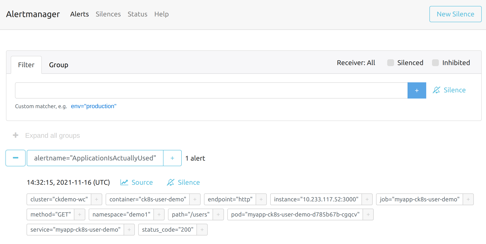

# Alerts

Compliant Kubernetes (CK8S) includes alerts via [Alertmanager](https://prometheus.io/docs/alerting/latest/alertmanager/).

!!!important
    By default, you will get some platform alerts. This may benefit you, by giving you improved "situational awareness". Please decide if these alerts are of interest to you or not. Feel free to silence them, as the Compliant Kubernetes administrator will take responsibility for them.

    Your focus should be on **user alerts** or **application-level alerts**, i.e., alerts under the control and responsibility of the Compliant Kubernetes user. We will focus on user alerts in this document.

## Compliance needs

Many regulations require you to have an incident management process. Alerts help you discover abnormal application behavior that need attention. This maps to [ISO 27001 – Annex A.16: Information Security Incident Management](https://www.isms.online/iso-27001/annex-a-16-information-security-incident-management/).

## Enabling user alerts

User alerts are handled by a project called [AlertManager](https://prometheus.io/docs/alerting/latest/alertmanager/), which needs to be enabled by the administrator. Get in touch with the administrator and they will be happy to help.

## Configuring user alerts

User alerts are configured via the Secret `alertmanager-alertmanager` located in the `alertmanager` namespace. This configuration file is specified [here](https://prometheus.io/docs/alerting/latest/configuration/#configuration-file).

```bash
# retrieve the old configuration
kubectl get -n alertmanager secret alertmanager-alertmanager -o jsonpath='{.data.alertmanager\.yaml}' | base64 -d > alertmanager.yaml

# edit alertmanager.yaml as needed

# patch the new configuration
kubectl patch -n alertmanager secret alertmanager-alertmanager -p "'{\"data\":{\"alertmanager.yaml\":\"$(base64 -w 0 < alertmanager.yaml)\"}}'"
```

Make sure to configure **and test** a receiver for you alerts, e.g., Slack or OpsGenie.

!!!note
    If you get an access denied error, check with your Compliant Kubernetes administrator.

### Silencing alerts

Compliant Kubernetes comes with a lot of predefined alerts. As a user you might not find all of them relevant and would want to silence/ignore some of them. You can do this by adding new routes in the secret and set `receiver: 'null'`. Here is an example that would drop all alerts from the kube-system namespace (alerts with the label `namespace=kube-system`):

```yaml
routes:
    - receiver: 'null'
      matchers:
        - namespace = kube-system
```

You can match any label in the alerts, read more about how the `matcher` configuration works in the [upstream documentation](https://prometheus.io/docs/alerting/latest/configuration/#matcher).

## Accessing user AlertManager

If you want to access AlertManager, for example to confirm that its configuration was picked up correctly, proceed as follows:

1. Type: `kubectl proxy`.
2. Open [this link](http://127.0.0.1:8001/api/v1/namespaces/alertmanager/services/alertmanager-operated:9093/proxy/) in your browser.

You can configure silences in the UI, but they will not be persisted if alertmanager is restarted. Use the secret mentioned above instead to create silences that persist.

## Configuring alerts

Before setting up an alert, you must first [collect metrics](metrics.md) from your application by setting up either ServiceMonitors or PodMonitors. In general ServiceMonitors are recommended over PodMonitors, and it is the most common way to configure metrics collection.

Then create a `PrometheusRule` following the examples below or the upstream documentation with an expression that evaluates to the condition to alert on. Prometheus will pick them up, evaluate them, and then send notifications to AlertManager.

The [API reference for Prometheus Operator](https://prometheus-operator.dev/docs/operator/api/#monitoring.coreos.com/v1.PrometheusRule) describes how the Kubernetes resource is configured and the [configuration reference for Prometheus](https://prometheus.io/docs/prometheus/latest/configuration/alerting_rules/) describes the rules themselves.

In Compliant Kubernetes the Prometheus Operator in the Workload Cluster is configured to pick up all PrometheusRules, regardless in which namespace they are or which labels they have.

### Running Example

<!--user-demo-alerts-start-->

The user demo already includes a [PrometheusRule](https://github.com/elastisys/compliantkubernetes/blob/main/user-demo/deploy/ck8s-user-demo/templates/prometheusrule.yaml), to configure an alert:

```yaml
--8<---- "user-demo/deploy/ck8s-user-demo/templates/prometheusrule.yaml"
```

The screenshot below gives an example of the application alert, as seen in AlertManager.



<!--user-demo-alerts-end-->

### Detailed example

PrometheusRules have two features, either the rules *alerts* based on expression, or the rules `records` based on a expression.
The former is the way to create alerting rules and the latter is a way to precompute complex queries that will be stored as separate metrics:

```yaml
apiVersion: monitoring.coreos.com/v1
kind: PrometheusRule
metadata:
  labels:
    prometheus: example
    role: alert-rules
  name: prometheus-example-rules
spec:
  groups:
  - name: ./example.rules
    # interval: 30s # optional parameter to configure how often groups of rules are evaluated
    rules:
    - alert: ExampleAlert
      expr: vector(1)
      # for: 1m # optional parameter to configure how long an alert must be triggered to be fired
      labels:
        severity: high
      annotations:
        summary: "Example Alert has been fired!"
        description: "The Example Alert has been fired! It shows the value {{ $value }}."
    - record: example_record_metric
      expr: vector(1)
      labels:
        record: example
```

For alert rules labels and annotations can be added or overridden that will become present in the resulting alert notifications, in addition the annotations support Go Templating allowing access to the evaluated value via the `$value` variable and all labels from the expression using the `$labels` variable.

For recording rules labels can be added or overridden that will become present in the resulting metric.
