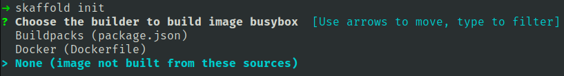
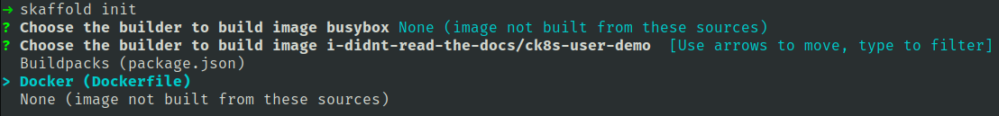
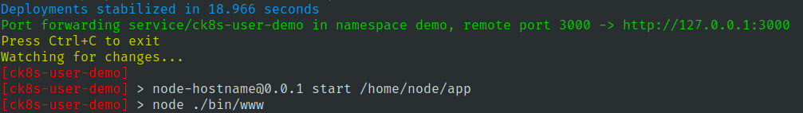

# Continuous Development

When developing on Kubernetes, it can be time-consuming to manually run commands to build new images,
push images to a container registry, update Kubernetes manifests, and deploy new manifests to the cluster with
each source-code change.

[Skaffold](https://skaffold.dev/) is a tool that can be used to ease this process.
Skaffold will automate the process of building, pushing and deploying new images based on changes to the source-code.

Skaffold requires minimal setup as the tool has no cluster-side components, and will automatically detect the configuration to use.

## Installing Skaffold

The Skaffold CLI can be installed by downloading and installing the latest release. Instructions can be found in the [Skaffold
documentation](https://skaffold.dev/docs/install/):

```sh
curl -Lo skaffold https://storage.googleapis.com/skaffold/releases/v2.0.1/skaffold-linux-amd64 && \
sudo install skaffold /usr/local/bin/
```

## Getting started with Skaffold

!!!note

    Skaffold will use the active `KUBECONFIG` to authenticate to the Kubernetes cluster.

If you haven't done so already, clone the user demo:

```bash
git clone https://github.com/elastisys/welkin/
cd welkin/user-demo
```

### Initialize Skaffold

```bash
skaffold init
```

This command will scan the current project for images to build and Kubernetes manifests to deploy. For each image that
Skaffold finds you will be prompted to specify how to build them, or if they are not built by the current project.

The first image Skaffold finds is busybox, however this image is not built from this project, so choose:
`None (image not built from these sources)`



The second image Skaffold finds is the user-demo image and this image is built from the Dockerfile.



Skaffold then asks for which resources we want to create Kubernetes resources, but as the image already has a Helm Chart
this can be skipped by pressing enter.

Skaffold will then create the `skaffold.yaml` file containing our configuration. Skaffold will also automatically detect the
Helm Chart that deploys the `user-demo` image.

The `skaffold.yaml` must then be configured to use the correct domain and project for the image
([More info](registry.md#configure-container-registry-credentials)). You need push access to this repository
(Optionally add a hostname to access the application).

```diff
build:
  artifacts:
- - image: i-didnt-read-the-docs/welkin-user-demo
+ - image: <DOMAIN>/<REGISTRY_PROJECT>/welkin-user-demo
    docker:
      dockerfile: Dockerfile
...
  valuesFiles:
  - deploy/welkin-user-demo/values.yaml
  version: 0.1.0
+ setValues:
+   image.repository: <DOMAIN>/<REGISTRY_PROJECT>/welkin-user-demo
+   ingress.hostname: demo.<DOMAIN>     # (Optional)
```

If the repository is private, a pull secret must be created to use it in Kubernetes, see [Configure an Image Pull Secret](kubernetes-api.md#configure-an-image-pull-secret).

### Developing

To start developing using Skaffold run:

```bash
skaffold dev
```

When you run `skaffold dev`, Skaffold will first build, and deploy all of the artifacts specified in `skaffold.yaml`.
Skaffold will then begin monitoring all source file dependencies for all artifacts specified in the project and rebuild
the associated artifacts and redeploy the new changes to your cluster as changes are made to these source files.
So any changes made to the source-files will automatically be updated in the cluster.

When starting `skaffold dev`, the logs of the deployed artifacts will automatically be directed to the console, which makes it
easy to debug the application in the cluster.

If `ingress.hostname` was configured previously the application can be accessed from there directly. Otherwise the flag
`--port-forward` can be added to the command, and Skaffold will automatically forward the ports on the application
to the local workstation:

```bash
skaffold dev --port-forward
```

### Application updates

When the application has been built and deployed to the cluster Skaffold shows which URL to access,
shows the logs of the application, and starts listening for changes in the source-files.



When visiting the URL to the application or the portforwarded URL the following output can be seen:

```json
{ "hostname": "welkin-user-demo-dd9c58979-rm9rv", "version": "0.0.1" }
```

If you inside the `routes/index.js` file add the following:

```diff
...
res.send({
  hostname: os.hostname(),
  version: process.env.npm_package_version,
+ hello: "world"
});
...
```

And then save the file, Skaffold will automatically detect the change, build a new image, and deploy the new image
to the cluster. After the deployment has stabilized, when visiting the same URL, the output is now:

```json
{ "hostname": "welkin-user-demo-54bbdcf6fc-gthsc", "version": "0.0.1", "hello": "world" }
```

### Configuration updates

To see the amount of pods, run (inside another terminal):

```bash
$ kubectl get pods
NAME                              READY   STATUS    RESTARTS   AGE
welkin-user-demo-7645db4f5c-h4xks   1/1     Running   0          45s
welkin-user-demo-7645db4f5c-svqfs   1/1     Running   0          35s
```

There are two pods running. To change this, edit the file `deploy/welkin-user-demo/values.yaml`:

```diff
- replicaCount: 2
+ replicaCount: 1
```

And save the file, this will also trigger Skaffold to update the deployment.
Because the modification only impacts the Kubernetes configuration, the application image does
not need to be rebuilt, and a new Helm revision may be deployed right away.

Once the deployments have stabilized the amount of pods can be inspected again:

```bash
$ kubectl get pods
NAME                              READY   STATUS    RESTARTS   AGE
welkin-user-demo-7645db4f5c-svqfs   1/1     Running   0          4m45s
```

## Clean-up

To stop Skaffold `ctrl + c` can be used and will trigger Skaffold to stop listening for changes and
clean-up the deployed artifacts from the cluster.

The clean-up can also be triggered by running:

```bash
skaffold delete
```

## Advanced

- Skaffold supports multiple different builder, such as Dockerfile, Bazel, Buildpacks or others
  ([More Info](https://skaffold.dev/docs/builders/)).

- Skaffold supports copying files to the running containers which will avoid rebuilding of
  containers when not needed ([More Info](https://skaffold.dev/docs/filesync/)).

## Further Reading

- [Skaffold Documentation](https://skaffold.dev/docs/)
