# Compliant Kubernetes (CK8S) Dashboard

The CK8S Dashboard provides different visualizations regarding the state of the cluster. It has set of panels organized and arranged into one or more rows. Each panel visualizes different aspect of the system. The different visualizations can be broadly divided into the following five categories.

1. Cluster--  information regarding the state of the state
2. Falco-- runtime security threat monitoring and detection
3. Grafana- metrics visualization and analytics
4. Elastic-- log visualization and analytics
5. Harbor-- manage and serve container images in a secure environment

Once you logged into CK8S dahsboard, you will get the main page similar to the figure below.

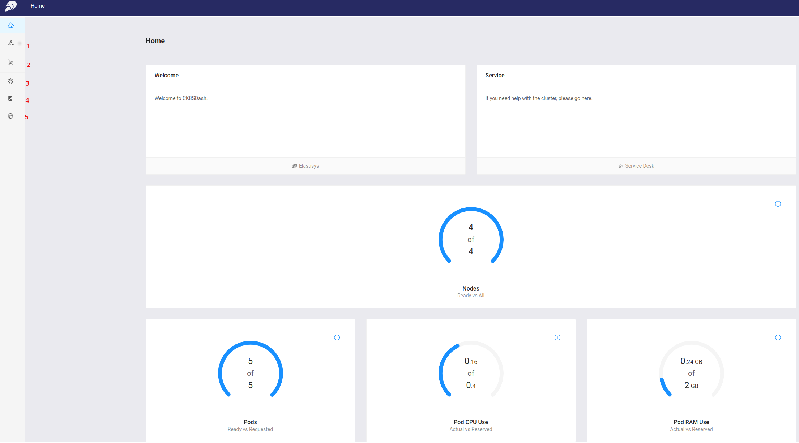

The left panel in the figure shows the link to the five categories, i.e., 1) cluster 2) Falco 3) Grafana 4) Elastic and 5) Harbor. The central part presents different panels with summary information, e.g., number of nodes, pods, CPU and RAM usage, etc, about the cluster.

## Cluster: How to get detail information about the cluster

To get information about the state of the cluster, please click the *Cluster* icon  from the left panel in the main page. You will get a page similar to the one shown below.

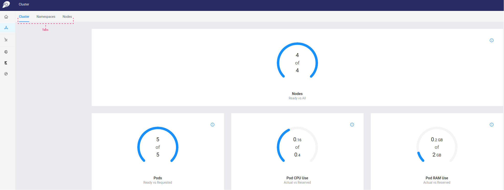

The cluster dashboard contains three tabs, namely *Cluster*, *Namespaces* and *Nodes* which are located on the top right side aligned horizontally (i,e., labeled *Tabs* in the figure). By default the *Cluster* tab is selected when you click the cluster icon from the main left panel. To distinguish the selected tab from the rest the color of the selected tab label is *blue* along with *blue* underline.

The *Cluster* tab has four different panels displaying aggregate information about *Nodes*, *Pods*, *Pods CPU Use* and *Pods RAM use*.

The *Namespaces* tab provides information about the different namespaces in the cluster.

To get information about namespaces:

Select the *Namespaces* tab under cluster dashboard. A panel with list of namespaces in the cluster with their status and how long they have been created will be displayed.  The panel looks like the figure below.

  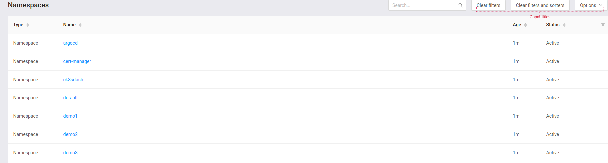

To get different metric information about each namepace,  hover your mouse on the *options* dropdown menu on the top left side under *Namespaces* tab (i,e., labeled *capabilities* in the figure above) and click *Open in Grafana*. You will be redirected to grafana website. By default different visualizations about the first namespace, *argocd* in this example, will be loaded by Grafana. You can change the namespace you if want to see for a different namespace. The following figure shows one of the visualizations loaded by grafana.

  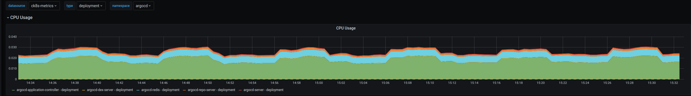

To get further information about each namespace, click on the namespace you want to get more information. Depending on your privilege, you will get one of the following pages.

  1. If you do not have privilege, you will get the following error message

      

  1. If you have privilege to access the namespace, you will get the following page with different panels.

      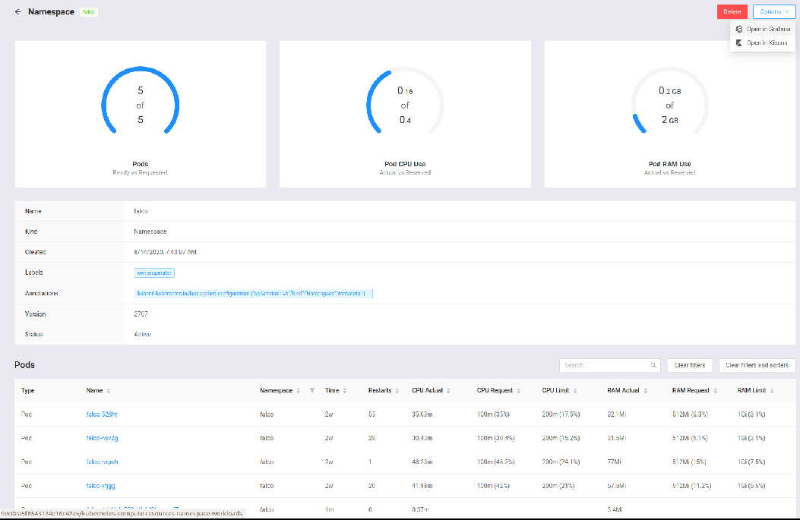

   As you can see in the figure, the different panels provide detail as well as aggregate information about  *Pods*, *CPUs* and *RAM* for the selected namespace.

   If you want to zoom in further and get more information about pods, you can select one pod at a time and get a detailed information.

## Falco: How to get runtime security issues

To get information about security issues, if any, please click the *Falco* icon from the left panel in the main page. You will get a page similar to the one shown below.

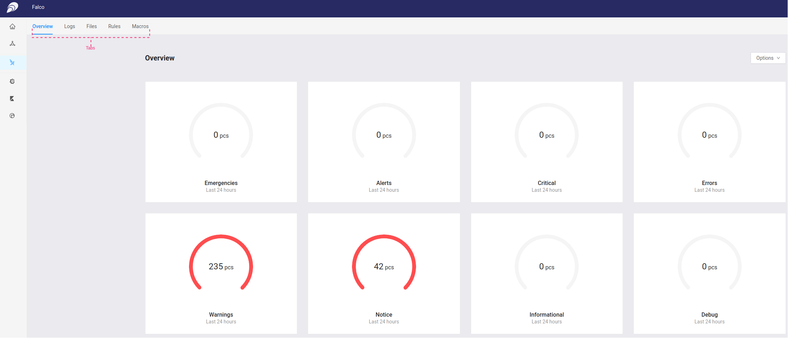

The Falco dashboard contains five tabs, namely *Overview*, *Logs*, *Files*, *Rules* and *Macros* which are located on the top right side aligned horizontally (i,e., labeled *Tabs* in the figure). By default the *Overview* tab is selected when you click the Falco icon from the main left panel. Similar to the *Cluster* dashboard, to distinguish the selected tab from the rest the color of the selected tab label is  *blue* along with *blue* underline.

The *Overview* tab has multiple panels displaying aggregate information about different issues such as *Emergencies*,  *Alerts*, *Critical*, *Errors*, *Warnings*, etc that happened in the past 24 hours.

To get detail information about the issue, click on the graph inside the panel. For example, the following screen shows part of the information displayed when we click inside the graph in the *Warnings* panel.

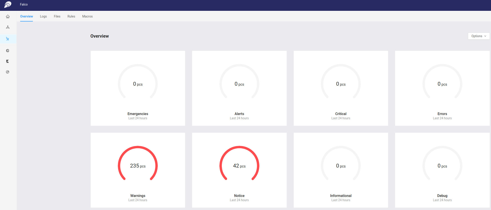

The *Logs* panel provides all logs for all issues collected by Falco in the system. The figure below shows a sample screenshot from the *Logs* panel.

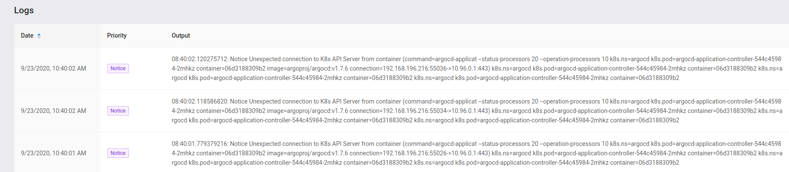

The *Files* panel shows Falco configuration files along with their content. The screenshot below shows a sample list of configuration files in the *Files* panel.

The *Rules* panel shows the different Falco rules in the system. The screenshot below shows a sample list of rules in the *Rules* panel.

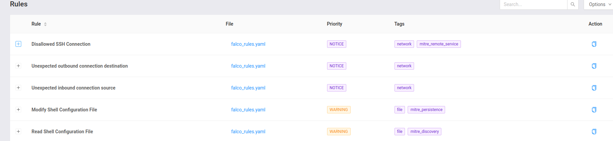

The *Macro* panel shows the different Falco Macros in the system. Note that *Macros* in Falco are rules that are re-usable ([For more](https://falco.org/docs/rules/)). The screenshot below shows a sample list of rules in the *Rules* panel.

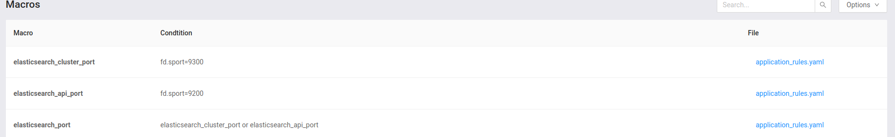

## Grafana: Metrics visualization and analysis

Grafana is used to provide visualizations about the system based on different metrics collected from the system. To get such visualization, please click the *Grafana* icon from the left panel in the main page. You will be redirected to grafana website. You will land to a page similar to the figure shown below.

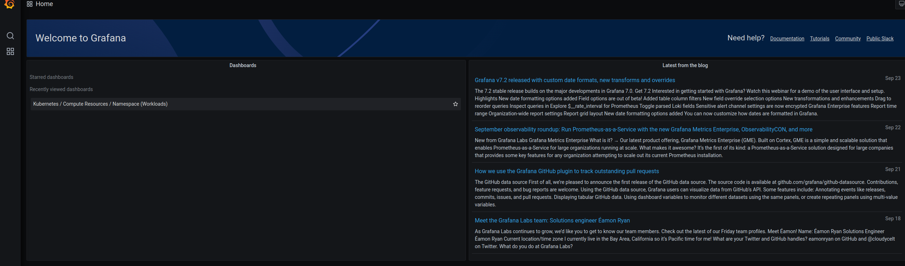

To learn more on how to explore the Grafana dashboard, please visit the official [Grafana](https://grafana.com/docs/grafana/latest/features/dashboard/) website.

## Elasticsearch: Log visualization and analysis
Open Distro for Elasticsearch is used for logs visualization and analytics. To  visualization and analytics logs, please click the *Elastic* icon from the left panel in the main page. You will be redirected to grafana website.
**Open Distro for Elasticsearch doesn't work OIDC.. This should be fixed**

##Harber: Log visualization and analysis

Harbor is used to manage and scan container images to ensure that there no any vulnerability. To access Harbor, please click the *Harbor* icon from the left panel in the main page. You will be redirected to harbor website.

You will land to a page similar to the figure shown below. Currently nothing is displayed since there is no data.

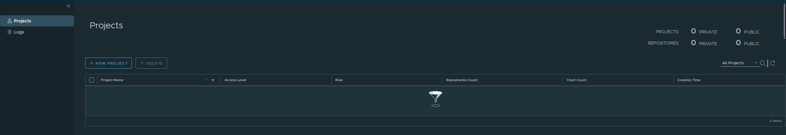

To learn more on how to manage and work with Harbor, please visit the official [Harbor](https://goharbor.io/docs/2.1.0/working-with-projects/create-projects/) website.
