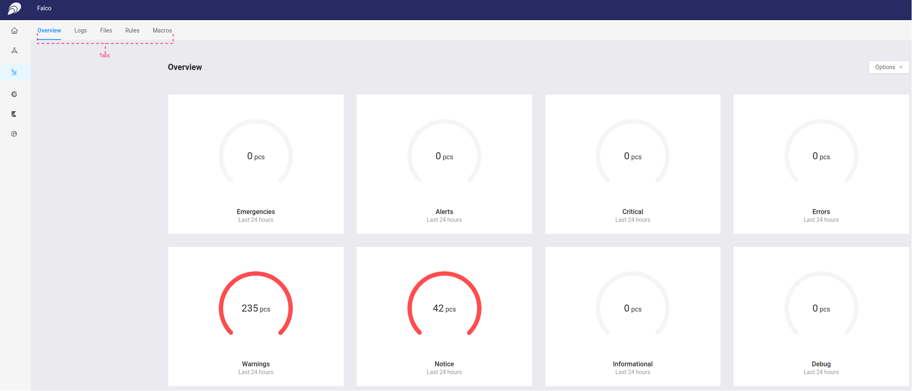

## Falco: How to get runtime security issues

This guide gives an introduction to Falco and where they fit in Compliant Kubernetes, in terms of reducing the compliance burden.

## What is falco
Falco is an open-source cloud-native runtime security project which serves as  the de facto Kubernetes threat detection engine. Falco was originally created by [Sysdig](https://sysdig.com/opensource/falco/#:~:text=Falco%2C%20the%20open%2Dsource%20cloud,alerts%20on%20threats%20at%20runtime.) in 2016 and is the first runtime security project to join CNCF as an incubation-level project. It detects unexpected application behavior and alerts on threats at runtime.

## Why is Harbor used in Compliant Kubernetes?

Falco is used in Compliant Kubernetes to monitor, detect and alert runtime security threats. You can create detection rules to define unexpected application behavior. These rules can be enriched via context from the cloud provider and Kubernetes environments. Your teams can detect policy violations using community-sourced detections of malicious activity and  Common Vulnerabilities and Exposures (CVE) exploits. They can then alert by plugging Falco into your current security response workflows and processes.

The figure below shows the Falco dhashboard which is accessible from [Compliant Kubernetes (CK8s) Dashboard](../dashboard).

The Falco dashboard contains five tabs, namely *Overview*, *Logs*, *Files*, *Rules* and *Macros* which are located on the top right side aligned horizontally (i,e., labeled *Tabs* in the figure). By default the *Overview* tab is selected when you click the Falco icon from the main left panel. Similar to the *Cluster* dashboard, to distinguish the selected tab from the rest the color of the selected tab label is  *blue* along with *blue* underline.

The *Overview* tab has multiple panels displaying aggregate information about different issues such as *Emergencies*,  *Alerts*, *Critical*, *Errors*, *Warnings*, etc that happened in the past 24 hours.

To get detail information about the issue, click on the graph inside the panel. For example, the following screen shows part of the information displayed when we click inside the graph in the *Warnings* panel.

The *Logs* panel provides all logs for all issues collected by Falco in the system. The figure below shows a sample screenshot from the *Logs* panel.

The *Files* panel shows Falco configuration files along with their content. The screenshot below shows a sample list of configuration files in the *Files* panel.

The *Rules* panel shows the different Falco rules in the system. The screenshot below shows a sample list of rules in the *Rules* panel.

The *Macro* panel shows the different Falco Macros in the system. Note that *Macros* in Falco are rules that are re-usable ([For more](https://falco.org/docs/rules/)). The screenshot below shows a sample list of rules in the *Rules* panel.

# Further Reading
[The Falco Project: Cloud Native Runtime Security](https://falco.org/docs/)
