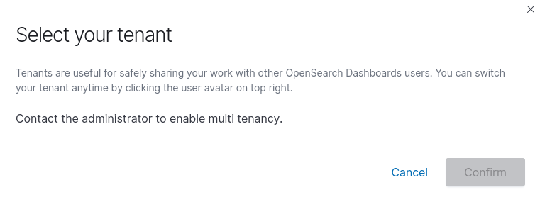

# Application Developer FAQ

## Why can't I `kubectl run`?

To increase security, Compliance Kubernetes does not allow by default to run containers as root.
Additionally, the container image is not allowed to be pulled from a public docker hub registry and all Pods are required to be selected by some NetworkPolicy.
This ensures that an active decision has been made for what network access the Pod should have and helps avoid running "obscure things found on the internet".

Considering the above, you should start by pushing the container image you want to use to Harbor and [make sure it doesn't run as root][docker-user].
See [this document][harbor-oidc-docker] for how to use OIDC with docker.
With that in place, you will need to create a NetworkPolicy for the Pod you want to run.
Here is an example of how to create a NetworkPolicy that allows all TCP traffic (in and out) for Pods with the label `run: blah`.

!!!note
    This is just an example, not a good idea!
    You should limit the policy to whatever your application really needs.

```bash
kubectl apply -f - <<EOF
apiVersion: networking.k8s.io/v1
kind: NetworkPolicy
metadata:
  name: blah
spec:
  podSelector:
    matchLabels:
      run: blah
  policyTypes:
  - Ingress
  - Egress
  ingress:
  # Allow all incoming traffic
  - {}
  egress:
  # Allow all outgoing traffic
  - {}
EOF
```

Now you are ready to run a Pod!
Make sure you match the name with the label you used for the NetworkPolicy.
Kubectl will automatically set the label `run: <name-of-pod>` when you create a Pod with `kubectl run <name-of-pod>`.
Here is an example command (please replace the `$MY_HARBOR_IMAGE`):

```bash
kubectl run blah --rm -ti --image=$MY_HARBOR_IMAGE
```

If your image runs as root by defaults, but can handle running as another user, you may override the user by adding a flag like this to the above command:

```
--overrides='{ "spec": { "securityContext": "runAsUser": 1000, "runAsGroup": 1000 } }'
```

[harbor-oidc-docker]: https://goharbor.io/docs/1.10/administration/configure-authentication/oidc-auth/#using-oidc-from-the-docker-or-helm-cli
[docker-user]: https://docs.docker.com/develop/develop-images/dockerfile_best-practices/#user


## How do I give access to a new application developer to a Compliant Kubernetes environment?

Add the new user to the correct **group via your Identity Provider (IdP)**, and Compliant Kubernetes will automatically pick it up.

Feeling lost? To find out what users and groups currently have access to your Compliant Kubernetes environment, type:

```bash
kubectl get rolebindings.rbac.authorization.k8s.io workload-admin -o yaml
# look at the 'subjects' field
```

If you are not using groups, contact your administrator.

## How do I add a new namespace?

See [Namespaces](namespaces.md).

## Why can't I access my cluster? 'Bad Request Unregistered redirect_uri ("http://localhost:18000").'

Port 8000 is the only allowed port for OpenID callback URL and is needed by the `kubectl` OpenID plugin. If that port is used locally, then `kubectl` will try to bind to port 18000 which is not allowed due to security concerns. Make sure that nothing is running locally that is using port 8000.

## Select your tenant?

If you are using Compliant Kubernetes `<v0.26.0` then you will likely see this popup when logging in to Opensearch.



We have disabled multi tenancy in Opensearch and there is a bug in older versions of Opensearch which makes this popup appear when multi tenancy is disabled. It has been fixed in a newer version of Opensearch which is included in Compliant Kubernetes version `v0.26.0`.

So if you are using Compliant Kubernetes `<v0.26.0` then please just click `Cancel` or `X` and continue to use Opensearch as you would.

## What is encrypted at rest?

Compliant Kubernetes encrypts everything at rest, including Kubernetes resources, PersistentVolumeClaims, logs, metrics and backups, **if the underlying cloud provider supports it**.

Get in touch with your administrator to check the status. They are responsible for performing a [provider audit](/compliantkubernetes/operator-manual/provider-audit).

!!!important "Why does Compliant Kubernetes not offer encryption-at-rest at the platform level?"

    **TL;DR**: operational scalability and to avoid [security theatre](https://en.wikipedia.org/wiki/Security_theater).

    We are frequently asked why we don't simply do full-disk encryption at the VM level, using something like [cryptsetup](https://linux.die.net/man/8/cryptsetup). Let us explain our rationale.

    The reason why people want encryption-at-rest is to add another safeguard to data confidentiality. Encryption-at-rest is a must-have for laptops, as they can easily be stolen or get lost. However, it is a nice-to-have addition for servers, which are supposed to be in a physically protected data-center, with disks being safely disposed. This is verified during a [provider audit](/compliantkubernets/operator-manual/provider-audit).

    At any rate, if encryption-at-rest is deployed it must: (a) actually safeguard data confidentiality; (b) without prohibitive costs in terms of administration.

    A Compliant Kubernetes environment may comprise as many as 10 Nodes, i.e., VMs. These Nodes need to be frequently rebooted, to ensure Operating System (OS) security patches are applied. This is especially important for Linux kernel, container runtime (Docker) and Kubernetes security patches. Thanks to the power of Kubernetes, a carefully engineered and deployed application can tolerate such reboots with zero downtime. (See the [go-live checklist](../go-live).)

    The challenge is how to deliver the disk encryption key to the VM when they are booting. Let us explore a few options:

    * Non-option 1: Store the encryption key on the VM's `/boot` disk. This is obvious security theatre. For example, if server disks are stolen, the VM's data is in the hands of the thiefs.

    * Non-option 2: Let admins type the encryption key on the VM's console. Asking admins to do this is time-consuming, error-prone, effectivly jeopardizing uptime. Instead, Compliant Kubernetes recommends automatic VM reboots during application "quiet times", such as at night, to ensure the OS is patched without sacrificing uptime.

    * Non-option 3: Let the VM pull the encryption key via instance metadata or [instance configuration](https://cloudinit.readthedocs.io/en/latest/topics/format.html#cloud-config-data). This would imply storing the encryption key on the cloud provider. If the cloud provider doesn't have encryption-at-rest, then the encryption key is also stored unencrypted, likely on the same server as the VM is running. Hence, this quickly ends up being security theatre.

    * Non-option 4: Let the VM pull the encryption key from an external location which features encryption-at-rest. This would imply that the VM needs some kind of credentials to authenticate to the external location. Again these credentials are stored unencrypted on the cloud provider, so we are back to non-option 3.

    **Okay, so what is the real option, then?**

    The only real option is to rely on support from the cloud provider. The latest generation (physical) servers feature a [TPM](https://en.wikipedia.org/wiki/Trusted_Platform_Module) to store the disk encryption key. This can be [securely release to the Linux kernel](https://en.wikipedia.org/wiki/Disk_encryption#Full_disk_encryption) thanks to [pre-boot authentication](https://en.wikipedia.org/wiki/Pre-boot_authentication). This process is performance-neutral and fully transparent to the VMs running on top of the servers.

    And that is why Compliant Kubernetes encrypts everything at rest, **only if the underlying cloud provider supports it**.
