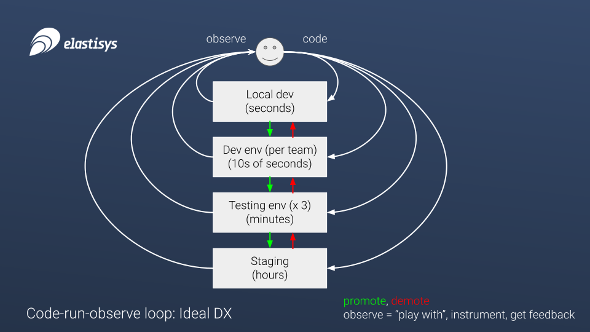
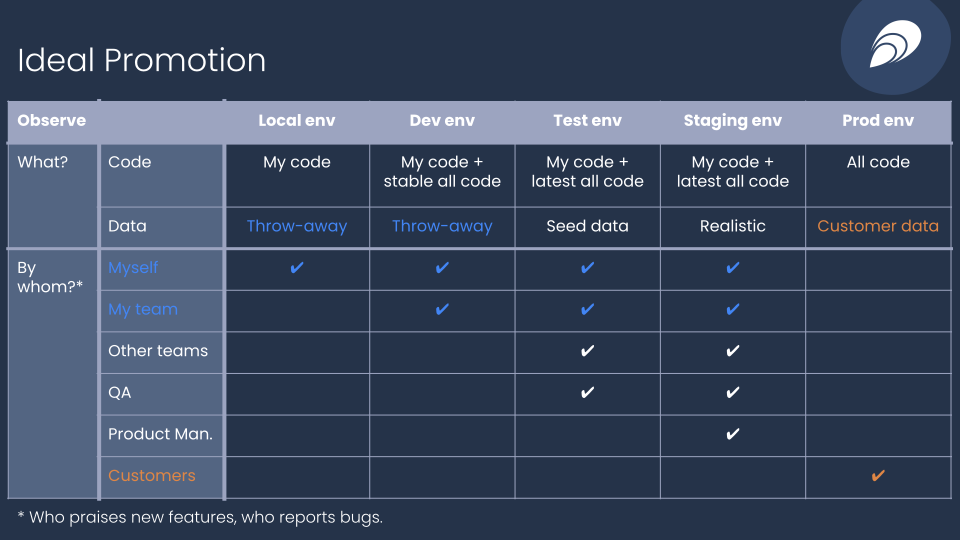

---
tags:
- ISO 27001 A.12.1.4 Separation of Development, Testing & Operational Environments
- HIPAA S12 - Information Access Management - Isolating Healthcare Clearinghouse Functions - § 164.308(a)(4)(ii)(A)
- MSBFS 2020:7 3 kap. 1 §
- MSBFS 2020:7 3 kap. 2 §
- HSLF-FS 2016:40 3 kap. 10 § Upphandling och utveckling
- BSI IT-Grundschutz APP.4.4.A1
- BSI IT-Grundschutz APP.4.4.A15
- MDR Annex VI UDI-related
---
!!! elastisys "For Elastisys Managed Services Customers"

    You can order a new environment by filing a [service ticket](https://elastisys.atlassian.net/servicedesk/customer/portals).

    If you have multiple Environments, and one or more have been clearly designated to be non-production Environments, Elastisys will apply major and minor updates to your non-production Environment(s) at least five working days before applying said update to your production Environment(s).

    For more information, please read [ToS 3.5 Updates and Upgrades](https://elastisys.com/legal/terms-of-service/#35-updates-and-upgrades).

Compliant Kubernetes recommends to setting up at least two separate environments: one for testing and one for production.

---

# How Many Environments?

Many regulations require strict separation between testing and production environments.
In particular, production data should not be compromised, no matter what happens in testing environments.

Similarly, some regulations -- such as Medical Devices Regulation (MDR) -- require you to take a risk-based approach to changing the tech stack. Depending on your risk assessment, this implies verifying changes in a non-production environment before going into production.

Therefore, Compliant Kubernetes recommends setting up **at least two environments**:

- staging;
- production.

However, the exact number of environments will depend on your needs.
Please use the two figures below to reason about environments, trading developer productivity and data security:

