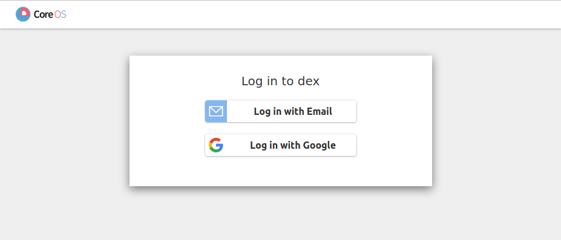
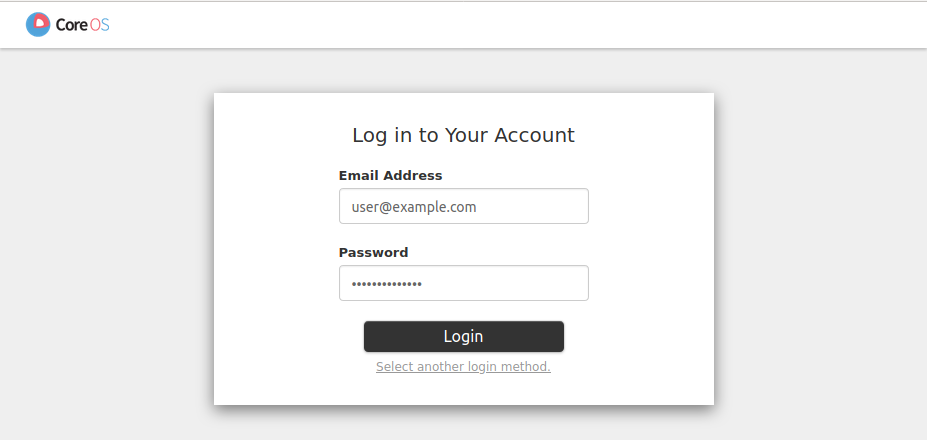

# Kubernetes API

The Kubernetes API is the entrypoint to managing your Kubernetes resources.
Your Compliant Kubernetes administrator will provide you with a kubeconfig file upon onboarding, which is required to access the API.

The following sections describe how to access the cluster in order to manage your Kubernetes resources.

## Authentication and Access Control in Compliant Kubernetes

In order to facilitate access control and audit logging, Compliant Kubernetes imposes a certain way to access the Kubernetes API.
The kubeconfig file provides individual access to the Kubernetes API through [dex](https://github.com/dexidp/dex).
Normally, you should authenticate using your organizations identity provider connected to dex, but it is also possible for your administrator to configure static usernames and passwords.

The authorization is done by the Kubernetes API based on [Kubernetes role-based access controls](https://kubernetes.io/docs/reference/access-authn-authz/rbac/).
Your cluster administrator will grant you permissions as part of onboarding.
You have administrator access to the user workload Kubernetes Namespaces by default.
In order to follow [the principle of least privilege](https://en.wikipedia.org/wiki/Principle_of_least_privilege), you as an user should only have sufficient access to manage resources required by your application.
User access to the Kubernetes API may need to be restricted from case to case to follow the principle of least privilege.

!!!note
    Regardless of your privilege, you will not be able to see components such as Harbor and Elasticsearch via the Kubernetes API. This is in order to comply with common logging policies, which requires logging to be sent to a tamper-proof environment. The tamper-proof environment needs to be separated from the production cluster.


## Usage guide

This section focuses on using the kubeconfig.

### Using the kubeconfig file

The kubeconfig file can be used with `kubectl` by:

* Setting and exporting the `KUBECONFIG` environment variable:

  

* Merging the configuration with your existing kubeconfig file, see [Kubernetes documentation on merging kubeconfig files](https://kubernetes.io/docs/concepts/configuration/organize-cluster-access-kubeconfig/#merging-kubeconfig-files).

### Authenticating to the Kubernetes API

To authenticate to the Kubernetes API, run a `kubectl` command.
The `oidc-login` plugin will launch a browser where you log in to the cluster:



This page contains the authentication options provided by your administrator.
Select your log in method and log in:



Once you have logged in through the browser, you are authenticated to the cluster:


Your credentials will then be used by the Kubernetes API to make sure you are authorized.
You are now logged in and can use kubectl to manage your Kubernetes resources!

## Running Example

### Pre-verification

Make sure you are in the right namespace on the right cluster:

```bash
kubectl get nodes
kubectl config view --minify --output 'jsonpath={..namespace}'; echo
```

### Configure an Image Pull Secret

To start, make sure you configure the Kubernetes cluster with an image pull secret. Ideally, you should create a container registry [Robot Account](https://goharbor.io/docs/2.2.0/working-with-projects/project-configuration/create-robot-accounts/), which only has pull permissions and use its token.

!!!important
    Using your own registry credentials as an image pull secret, instead of creating a robot account, is against best practices and may violate data privacy regulations.

    Your registry credentials identify **you** and allow you to both push and pull images. A robot account should identify the Kubernetes cluster and be only allowed to pull images.

```bash
DOCKER_USER=      # enter robot account name
DOCKER_PASSWORD=  # enter robot token
```

Now create a pull secret and (optionally) use it by default in the current namespace.

```bash
# Create a pull secret
kubectl create secret docker-registry pull-secret \
    --docker-server=harbor.$DOMAIN \
    --docker-username=$DOCKER_USER \
    --docker-password=$DOCKER_PASSWORD

# Set default pull secret in current namespace
kubectl patch serviceaccount default -p '{"imagePullSecrets": [{"name": "pull-secret"}]}'
```

!!!note
    For each Kubernetes namespace, you will have to create an image pull secret and configure it to be default. Aim to have a one-to-one-to-one mapping between Kubernetes namespaces, container registry projects and robot accounts.

### Apply a NetworkPolicy

!!!important
    This section helps do comply with ISO 27001

Depending on configuration, Compliant Kubernetes clusters may require you to configure [NetworkPolicies](https://kubernetes.io/docs/concepts/services-networking/network-policies/). These act like firewall rules in containerized worklods and require you to make an active choice on what ingress and egress traffic to allow to/from a container. This is necessary for


### Deploy user demo

!!!example
    Here is an [example Helm Chart](https://github.com/elastisys/compliantkubernetes/tree/main/user-demo/deploy/ck8s-user-demo) to get you started.

If you haven't done so already, clone the user demo and ensure you are in the right folder:

```bash
git clone https://github.com/elastisys/compliantkubernetes/
cd compliantkubernetes/user-demo
```

Ensure you use the right registry project and image tag, i.e., those that you pushed in the [previous example](../registry#running-example):

```bash
REGISTRY_PROJECT=demo
TAG=v1
```

You are ready to deploy the application.

```bash
helm upgrade \
    --install \
    myapp \
    deploy/ck8s-user-demo/ \
    --set image.repository=harbor.$DOMAIN/$REGISTRY_PROJECT/ck8s-user-demo \
    --set image.tag=$TAG \
    --set ingress.hostname=demo.$DOMAIN
```

### Verification

Verify that the application was deployed successfully:

```bash
kubectl get pods
# Wait until the status of your Pod is Running.
```

Verify that the certificate was issued successfully:

```bash
kubectl get certificate
# Wait until your certificate shows READY True.
```

Verify that your application is online. You may use your browser or `curl`:

```bash
curl --include https://demo.$DOMAIN
# First line should be HTTP/2 200
```

!!!important "Do not expose `$DOMAIN` to your users."

    Although your administrator will set `*.$DOMAIN` to point to your applications, prefer to buy a branded domain. For example, register the domain `myapp.com` and point it via a [CNAME](https://en.wikipedia.org/wiki/CNAME_record) or [ALIAS](https://en.wikipedia.org/wiki/CNAME_record#ANAME_record) record to `myapp.$DOMAIN`.

!!!important "Use `topologySpreadConstraints` if you want cross-data-center resilience"

    If you want your application to tolerate a whole zone (data-center) to go down, you need to add `topologySpreadConstraints` by uncommenting the relevant section in [values.yaml](https://github.com/elastisys/compliantkubernetes/blob/main/user-demo/deploy/ck8s-user-demo/values.yaml#L76-L82).

    In order for this to work, your administrator must configure the Nodes with zone labels. You can verify if this was performed correctly typing `kubectl get nodes --show-labels` and checking if Nodes feature the `topology.kubernetes.io/zone` label.

## Further reading

* [dex on GitHub](https://github.com/dexidp/dex)
* [oidc-login/kubelogin on GitHub](https://github.com/int128/kubelogin)
* [Organizing Cluster Access Using kubeconfig Files
](https://kubernetes.io/docs/concepts/configuration/organize-cluster-access-kubeconfig/)
