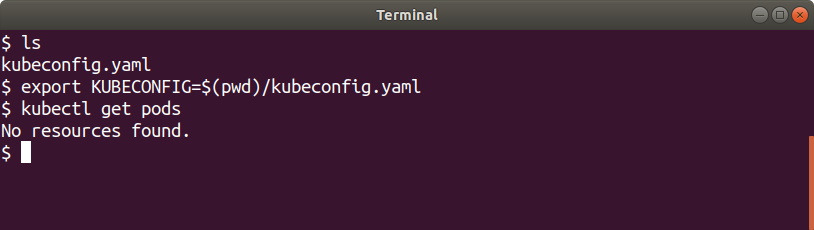
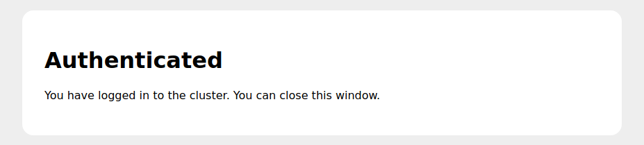

# Kubernetes API

The Kubernetes API is the entrypoint to managing your Kubernetes resources.
Your Compliant Kubernetes administrator will provide you with a kubeconfig file upon onboarding, which is required to access the API.

The following sections describe how to access the cluster in order to manage your Kubernetes resources.

## Authentication and Access Control in Compliant Kubernetes

In order to facilitate access control and audit logging, Compliant Kubernetes imposes a certain way to access the Kubernetes API.
The kubeconfig file provides individual access to the Kubernetes API through [dex](https://github.com/dexidp/dex).
Normally, you should authenticate using your organizations identity provider connected to dex, but it is also possible for your administrator to configure static usernames and passwords.

The authorization is done by the Kubernetes API based on [Kubernetes role-based access controls](https://kubernetes.io/docs/reference/access-authn-authz/rbac/).
Your cluster administrator will grant you permissions as part of onboarding.
You have administrator access to the user workload Kubernetes Namespaces by default.
In order to follow [the principle of least privilege](https://en.wikipedia.org/wiki/Principle_of_least_privilege), you as an user should only have sufficient access to manage resources required by your application.
User access to the Kubernetes API may need to be restricted from case to case to follow the principle of least privilege.

## Usage guide

This section focuses on using the kubeconfig.

### Using the kubeconfig file

The kubeconfig file can be used with `kubectl` by:

* Setting and exporting the `KUBECONFIG` environment variable:

  

* Merging the configuration with your existing kubeconfig file, see [Kubernetes documentation on merging kubeconfig files](https://kubernetes.io/docs/concepts/configuration/organize-cluster-access-kubeconfig/#merging-kubeconfig-files).

### Authenticating to the Kubernetes API

To authenticate to the Kubernetes API, run a `kubectl` command.
The `oidc-login` plugin will launch a browser where you log in to the cluster:

This page contains the authentication options provided by your administrator.
Select your log in method and log in:

Once you have logged in through the browser, you are authenticated to the cluster:

Your credentials will then be used by the Kubernetes API to make sure you are authorized.
You are now logged in and can use kubectl to manage your Kubernetes resources!

## Further reading

* [dex on GitHub](https://github.com/dexidp/dex)
* [oidc-login/kubelogin on GitHub](https://github.com/int128/kubelogin)
* [Organizing Cluster Access Using kubeconfig Files
](https://kubernetes.io/docs/concepts/configuration/organize-cluster-access-kubeconfig/)
