# Kubernetes UI (Lens)

!!!important
    As of September 2022, the Lens binary includes proprietary code on top of the open-source Lens source code.
    Unfortunately, some of that code includes **non-features**, like requiring a Lens ID for "activating" Lens and tracking your activity.

    We find such practices questionable, especially in highly-regulated industries.
    Therefore, we currently recommend using [OpenLens](https://github.com/MuhammedKalkan/OpenLens/releases), which is a "clean" binary of the Lens source code.
    OpenLens consists of all the open-source Lens code without the prioprietary code.
    Even better, OpenLens does not require "activation" and does not track your actions.

    The Compliant Kubernetes project monitors the situation and will decide on permanently switching to OpenLens or finding a suitable replacement, like the [VSCode plugin for Kubernetes](https://code.visualstudio.com/docs/azure/kubernetes).

[Lens](https://k8slens.dev/) is a graphical user interface that you install locally on your machine. It provides an attractive and easy to use way of interacting with your Kubernetes cluster. Similar to `kubectl`, it can be used to manage multiple clusters. You can also install [extensions that help you manage your clusters or applications deployed on them](https://github.com/lensapp/lens-extensions/blob/main/README.md) from a growing list of community-provided extensions.

Because Lens is installed locally, and has no cluster-side component, it uses the *exact same permissions* as your Compliant Kubernetes user has. This makes it a perfectly *safe and secure* user interface to use and does **not** compromise your cluster's stability or security posture.

## Installing Lens

Head over to the [official Lens website](https://k8slens.dev/) and download the appropriate installation package for your operating system. Follow the instructions, and you should have Lens installed.

On Debian or Ubuntu-based systems, once you've downloaded the `.deb` file for your architecture, you simply run the following command (assuming you called the downloaded file `lens.deb`):

```bash
sudo dpkg -i lens.deb
```

### Note for macOS and Linux users

If you followed the [Install Prerequisites](prepare.md) steps of this documentation, you have probably installed the `oidc-login` plugin to `kubectl` via `krew`. If so, Lens will not be able to find it. That makes Lens fail to authenticate via Dex, the OpenID Connect provider in Compliant Kubernetes.

You have two options for making the `oidc-login` plugin findable by Lens:

1. Edit `~/.profile` and add:

        if [ -d "$HOME/.krew/bin" ] ; then
            PATH="$HOME/.krew/bin:$PATH"
        fi

2. Run the following command:

```bash
sudo ln -s ~/.krew/bin/kubectl-oidc_login /usr/local/bin
```

## Getting started with Lens


### Connecting to a cluster

When Lens starts up, it will have located all the `kubectl` configuration files that are in your default directory (`$HOME/.kube`) and presents these in a list for you as clusters you can connect to.

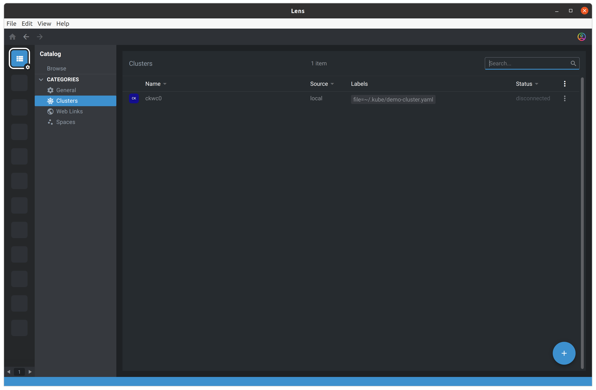

If you choose a cluster on this screen, you can then connect to it by hitting the big image for it above the "Click to open" text:

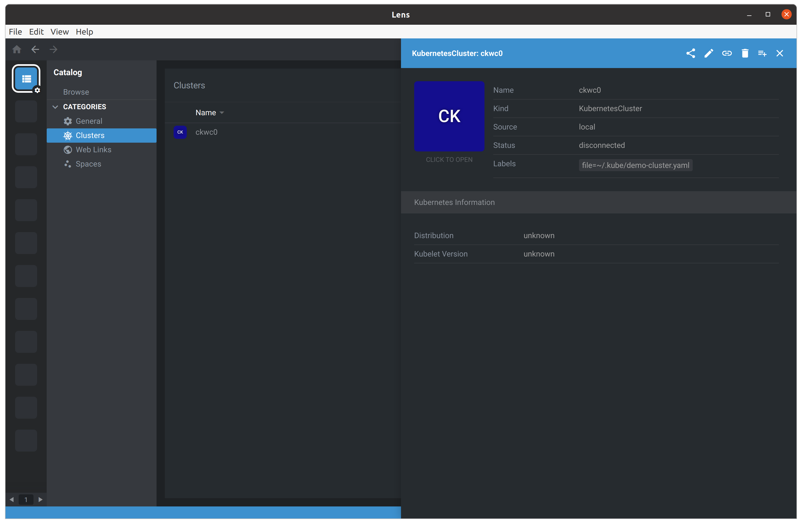

Authentication with Dex does not happen within Lens itself, but it starts the correct component and will show the following screen:

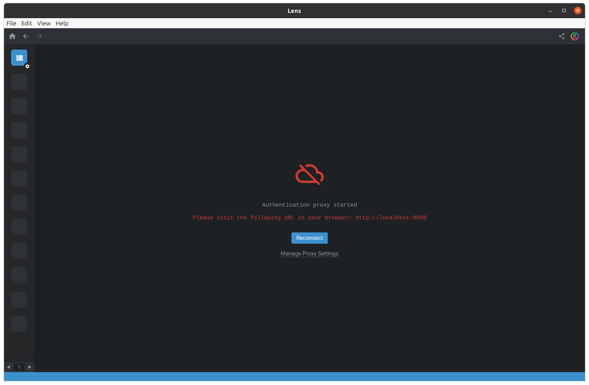

Go to the address it says, i.e., [localhost:8000](http://localhost:8000/) to authenticate via Dex:

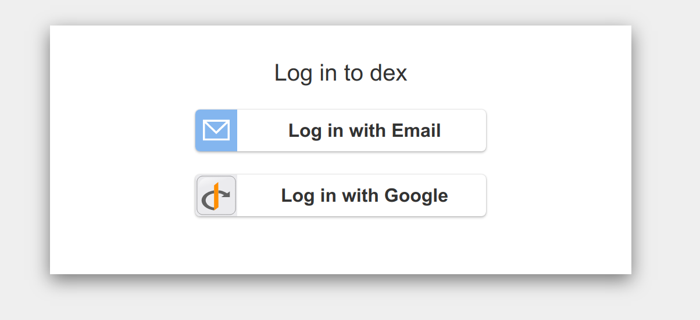

Log in as usual with your identity provider and return to Lens. Hit the Reconnect button, and you're in!

### Cluster settings

When you view your cluster's overview page, it comes up with an empty loading icon. That is because your user account does not have the permissions to view all Pods in all Namespaces. Lens assumes you do, but you do not.

To remedy this, we can tell Lens which Namespaces to pull data from. Going back to the cluster selection screen, choose the Pen icon to configure the cluster's settings.

You can then go to the setting called Namespaces and enter the names of the ones you have access to:

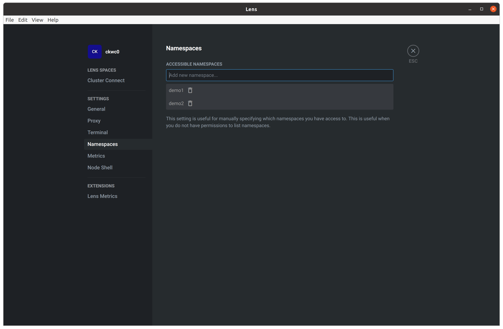

Going back to the Overview of the cluster, you will now instead see information about it:

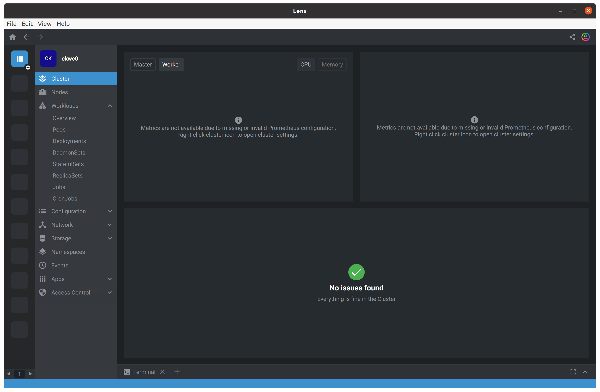

Note that, for security reasons, monitoring metrics are not enabled, but you can read about that in the section below.

### Pod information and interaction

In the Workload pane, you can see the Pods in your chosen Namespace:

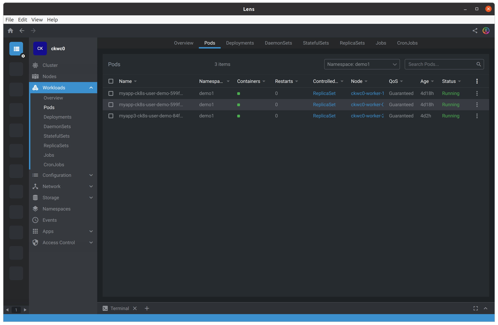

If you choose a Pod, you will see detailed information about that Pod, such as its labels, and other metadata. Again, note that for security reasons, the monitoring metrics part is empty.

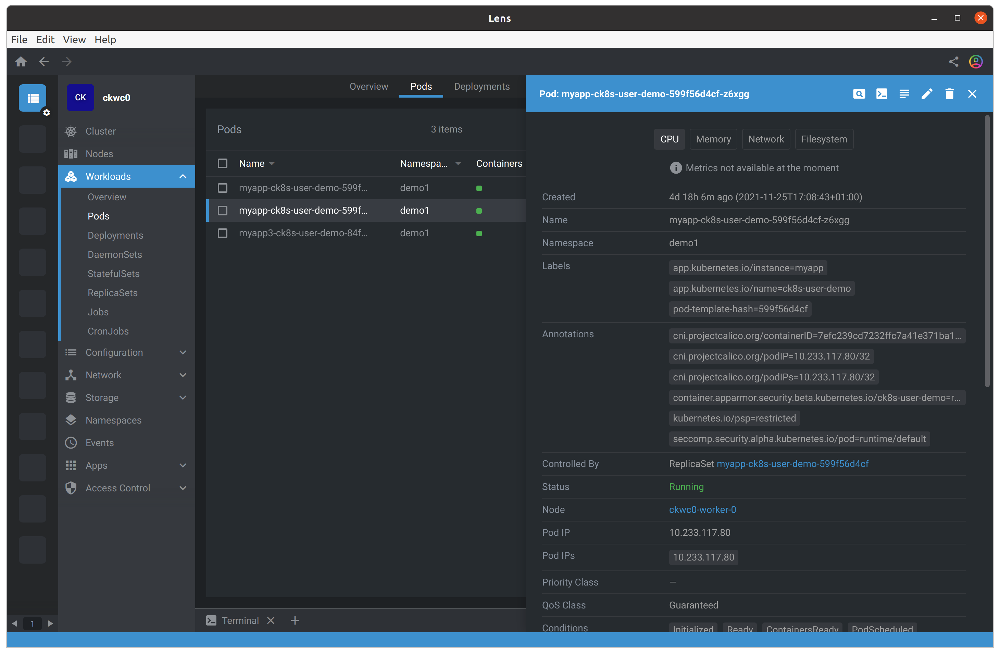

Among the things one can do with this overview, if the user has access to it, is to both manipulate the Pod as one would be able to do with `kubectl edit`, but also start an interactive shell session against it (like `kubectl exec` does):

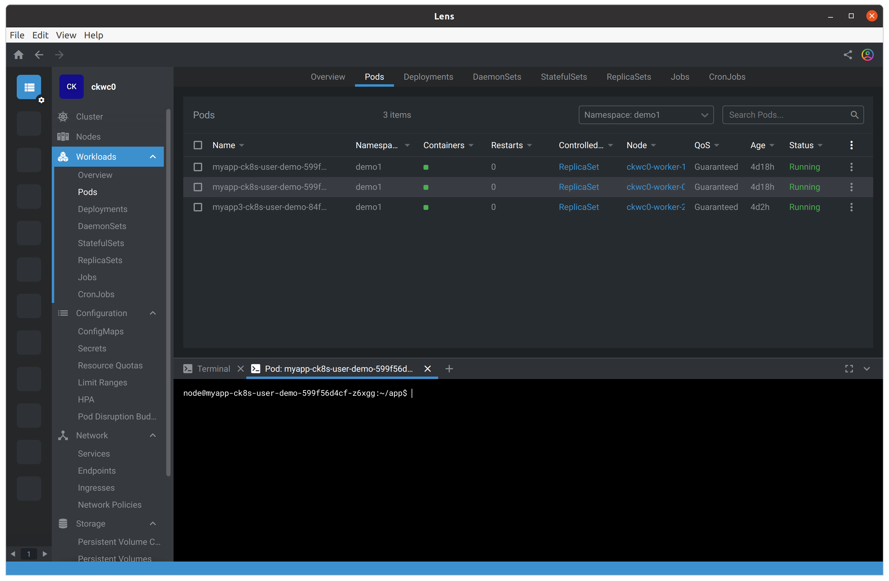

## Optional permissions and steps required for Prometheus integration

Lens can present monitoring information regarding your Pods if you have the appropriate permissions. To get the monitoring data for the graphs, it needs to query the Prometheus component in Compliant Kubernetes.

However, your cluster administrator may have forbidden this access for security reasons.

!!! warning "Why Prometheus integration can be a security risk"

    With the Prometheus access Lens requires, one is able to exfiltrate the credentials that Prometheus itself uses for writing to long-term storage of metrics in Compliant Kubernetes. These could be used to send in junk data and possibly also overwrite the metrics that the real Prometheus process has written.

    For more information about this issue and how it develops, Compliant Kubernetes is tracking the implications of [in this GitHub issue](https://github.com/elastisys/compliantkubernetes-apps/issues/691).

That said, if you self-administer your cluster, are aware of the potential risks, and **still** would like to have Prometheus integration, you can do as follows.

Download the [lens-user-role.yaml](lens-user-role.yaml) file, the contents of which is shown below:

```yaml
--8<-- "docs/user-guide/lens-user-role.yaml"
```

Apply it, as-is, to your cluster by running `kubectl apply -f lens-user-role.yaml`.

Assign this role to your user or the group your user belongs to by downloading and modifying it so that it lists your user name (typically that will be your email address) or the group you want to give these permissions to. Do that by downloading the [lens-user-rolebinding-example.yaml](lens-user-rolebinding-example.yaml) file and editing it. The file is shown below:

```yaml
--8<-- "docs/user-guide/lens-user-rolebinding-example.yaml"
```

Apply it to your cluster after making your changes to a copy of the template via, for instance, `kubectl apply -f lens-user-rolebinding.yaml`.

Next, we must configure Lens to connect to the Prometheus instance correctly:

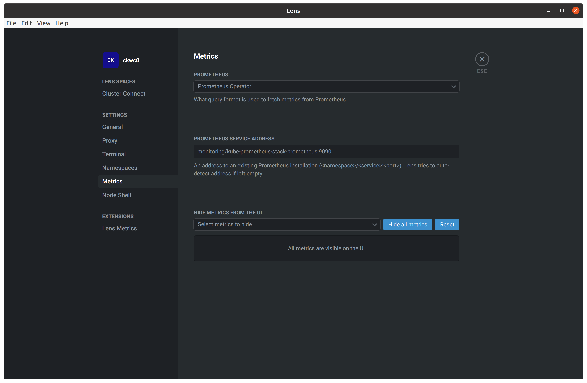

The address to your Prometheus instance is: `monitoring/kube-prometheus-stack-prometheus:9090` and you should choose the `Prometheus Stack` option in the dropdown.

With these settings in place, you will have metrics integration working, showing e.g. output like this for the overview and Pod information:

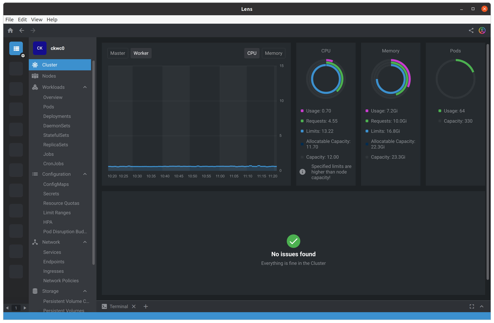

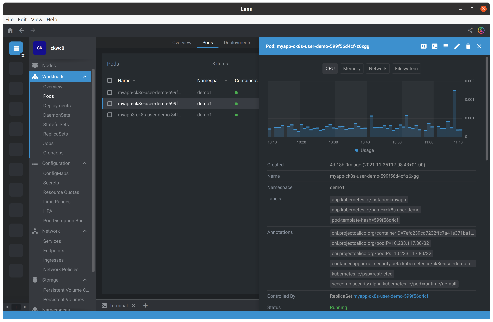
