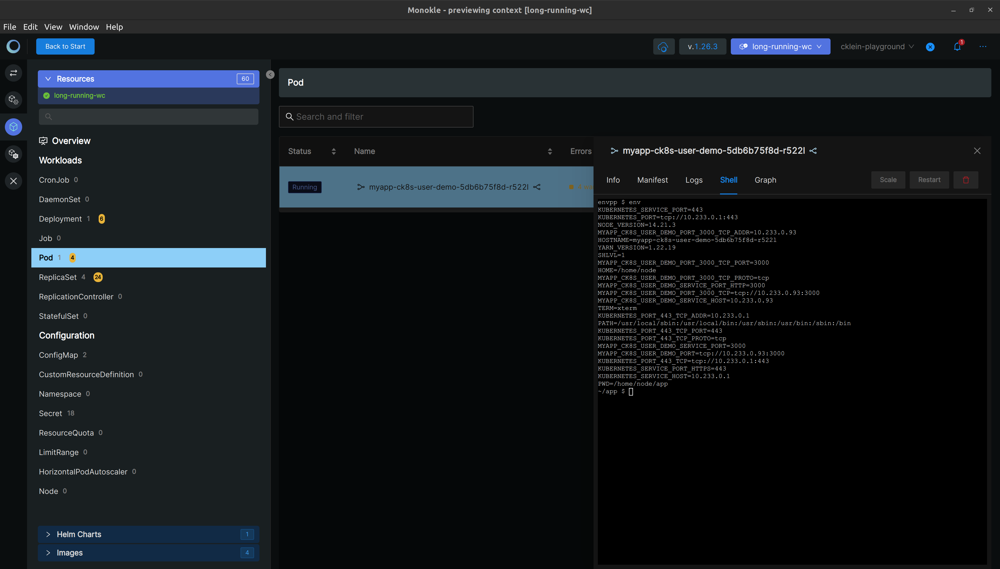
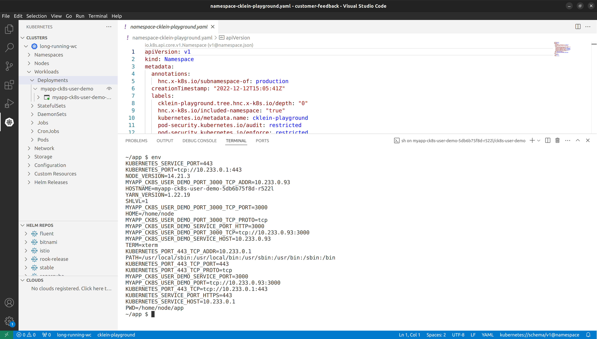

# Kubernetes UI

Welkin recommends operations to be done via script -- if possible the GitOps way -- to improve repeatability and application developer productivity, as well as reduce human errors.
That being said, User Interfaces (UIs) have their advantages.
In particular, they have a reduced learning curve and make features more discoverable.

Welkin does not come with a UI for the sake of resource efficiency.
However, you can run a locally-installed Kubernetes UI yourself.
We have tested:

- [Monokle](#monokle)
- [Kubernetes Extension for Visual Studio Code](#kubernetes-extension-for-visual-studio-code)

Both of these projects are installed locally, and have no cluster-side component.
Both use the _exact same permissions_ as your Welkin user has.
This makes it a perfectly _safe and secure_ user interface to use and does **not** compromise your cluster's stability or security posture.

## Note for macOS and Linux users

If you followed the [Install Prerequisites](prepare.md) steps of this documentation, you have probably installed the `oidc-login` plugin to `kubectl` via `krew`.
If so, a locally-installed Kubernetes UI might not be able to find it.
That makes it fail to authenticate via Dex, the OpenID Connect provider in Welkin.

You have two options for making the `oidc-login` plugin findable by locally-installed Kubernetes UIs:

1. Edit `~/.profile` and add:

    ```bash
    if [ -d "$HOME/.krew/bin" ] ; then
      PATH="$HOME/.krew/bin:$PATH"
    fi
    ```

1. Run the following command:

    ```bash
    sudo ln -s ~/.krew/bin/kubectl-oidc_login /usr/local/bin
    ```

## Monokle

To get started with Monokle:

1. Make sure you performing the [above changes](#note-for-macos-and-linux-users).
1. Install [Monokle](https://monokle.io/) as instructed in the upstream documentation.
1. Perform OpenID authentication via your browser.
1. Make sure to select a valid namespace, since Welkin does not allow access to the `default` namespace.

Monokle should work out-of-the-box with Welkin.



## Kubernetes Extension for Visual Studio Code

To get started:

1. Make sure you performing the [above changes](#note-for-macos-and-linux-users).
1. Install the [Kubernetes extension](https://code.visualstudio.com/docs/azure/kubernetes) as instructed in the upstream documentation.
1. Perform OpenID authentication via your browser.

The Kubernetes extension should work out-of-the-box with Welkin.


