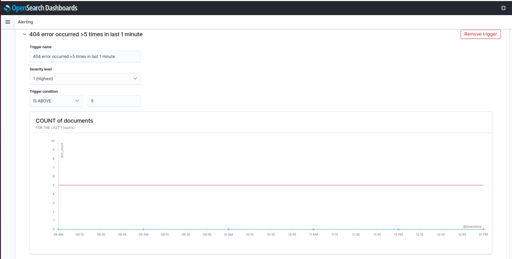

# OpenSearch Alert

The alerting feature notifies you when data from one or more OpenSearch indices meets certain conditions. For example, you might want to notify a Slack channel if your application logs more than five HTTP 404 errors in one hour/minute, or you might want to page a developer if no new documents have been indexed in the past 20 minutes.

Alerting features have been enabled by default in Elastisys Compliant Kubernetes as of version 0.19.X

## OpenSearch Alert Demo

When you log into **OpenSearch Dashboards**, you will start at the home page as shown below.

From here click **"Visualize & analyze"** to continue and you will be greeted with the options to go forward to either **Dashboard** or **Discover**. Opening the sidebar in the top left will also provide navigation to OpenSearch Dashboards features, and here **Alerting** can be found in the page shown below.

Once you click  **Alerting**, it will navigate to the below page.

To use OpenSearch alerting feature, it involves two steps described below.

1. **Create Destination** - A reusable location for the information that you want the monitor to send out after being triggered. Supported locations are Amazon Chime, Email, Slack, or custom webhook.
2. **Create Monitor** - A job that runs on a defined schedule and queries OpenSearch indices. The results of these queries are then used as input for one or more triggers (Conditions that, if met, generate alerts).

**Step 1 - Create Destination**

Go to Destination & Create Destinations as shown in the below.

-  **Name** - Name of the destination, for example “**user-demo-404-slack-notify**”
-  **Type** - choose Slack or any other available types you want to use it.
-  **Webhook URL** - If using Slack, paste the webhook URL. Please refer for more information [slack-webhook](https://api.slack.com/incoming-webhooks)

**Step 2 - Create Monitors**

Go to Monitors & Create Monitor as shown in the below.

- **Monitor Name** -  Name of the monitor, for example **“user-demo-404-error”**
- Select **Per query monitor or Per bucket monitor**. - For more information [Monitor-types](https://opensearch.org/docs/latest/monitoring-plugins/alerting/monitors/#create-monitors)
- **Frequency** -  How often to monitor, for instance, to check every 1 minute
- **Data source**
     - **Index**  where your logs are stored, for instance, “kubernetes” (per default, Compliant Kubernetes will store all application logs indices that match the **“kubernetes*”** index pattern)

     - **Time field** should be set to **“@timestamp”**

- **Query**
    - **Metrics** - optional
    - **Time range for the last** - Time frame of data the plugin should monitor . Ex-  1 minute(s)
     Data filter - **status-code is 404**

- **Triggers**
     - **Trigger name** -  Name of the trigger. Ex- **“404-error occurred >5 times in last 1 minute”**
     - **Severity level** - Select the severity level range with **1**(Highest) & **5**(Lowest)
     - **Trigger condition** - Select the condition according to your applications . Ex- **IS ABOVE = 5**
     - **Actions** - Create an action with name , destination and customized message notification accordingly.

- Finally click - **Create** button to complete the creation of the monitor.

- You can see the status of the monitor under **Alerting> Monitors> user-demo-404-error** as shown below.

#Test alert notification to Slack.

- Demo application deployed and users get 404 errors many times (5 is the condition set before) as shown below.

- We get the Slack notifications as shown below.

- Users can view the alert status under the **Alerting** tab as shown below and accordingly take the required action.

- Users can **acknowledge** the alerts under the **Alerting** tab as shown below.

## Alert state

- **Active** - The alert is ongoing and unacknowledged. Alerts remain in this state until you acknowledge them, delete the trigger associated with the alert, or delete the monitor entirely.
- **Acknowledged** - Someone has acknowledged the alert, but not fixed the root cause.
- **Completed** - The alert is no longer ongoing. Alerts enter this state after the corresponding trigger evaluates to false.
- **Error** - An error occurred while executing the trigger—usually the result of a bad trigger or destination.
- **Deleted** - Someone deleted the monitor or trigger associated with this alert while the alert was ongoing.

You can find the more information about [OpenSearch alerting](https://opensearch.org/docs/latest/monitoring-plugins/alerting/index/) by following the link.
