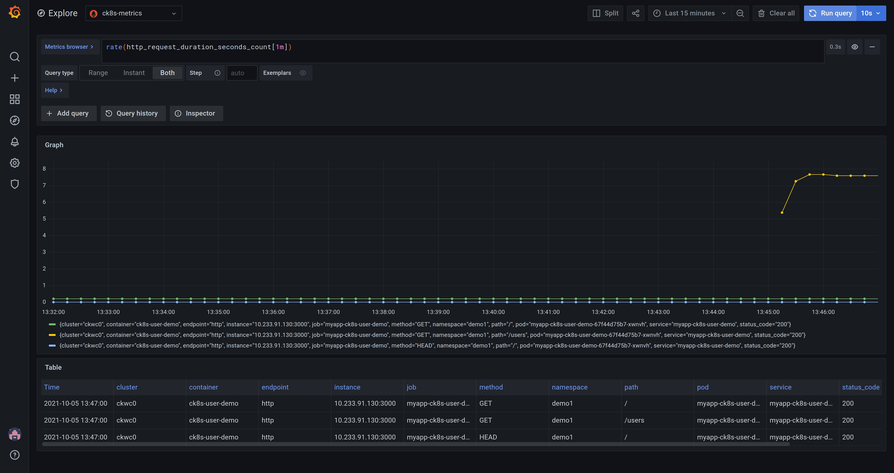

# Metrics

This guide gives an introduction to Prometheus and Grafana and where they fit in Welkin, in terms of reducing the compliance burden.

## Why Prometheus and Grafana?

Prometheus is an open-source solution for monitoring and alerting. It works by collecting and processing metrics from the various services in the cluster. It is widely used, stable, and a [CNCF](https://www.cncf.io/) member. It is relatively easy to write ServiceMonitors for any custom services to get monitoring data from them into Prometheus.

Grafana is the most widely used technology for visualization of metrics and analytics. It supports a multitude of data sources and it is easy to create custom dashboards. Grafana is created by Grafana Labs, a CNCF Silver Member.

## Compliance needs

The requirements to comply with ISO 27001 are stated in ISO [27001:2013](https://www.isms.online/iso-27001/) The annexes that mostly concerns monitoring and alerting are [Annex 12](https://www.isms.online/iso-27001/annex-a-12-operations-security/), article A.12.1.3 "capacity management", and [Annex 16](https://www.isms.online/iso-27001/annex-a-16-information-security-incident-management/) which deals with incident management.

### Capacity management

Article A.12.1.3 states that "The use of resources must be monitored, tuned and projections made of future capacity requirements to ensure the required system performance to meet the business objectives."

- Prometheus and Grafana helps with this as the resource usage, such as storage capacity, CPU, and network usage can be monitored. Using visualization in Grafana, projections can be made as to future capacity requirements.

The article goes on to say that "Capacity management also needs to be: Pro-active – for example, using capacity considerations as part of change management; Re-active – e.g. triggers and alerts for when capacity usage is reaching a critical point so that timely increases, temporary or permanent can be made."

- Prometheus has a rich alerting functionality, allowing you to set up alerts to warn if, for example, thresholds are exceeded or performance is degraded.

### Incident management

Annex A.16.1 is about management of information security incidents, events and weaknesses. The objective in this Annex A area is to ensure a consistent and effective approach to the lifecycle of incidents, events and weaknesses. Incidents needs to be tracked, reported, and lessons learned from them to improve processes and reduce the possibility of similar incidents occurring in the future.

Prometheus and Grafana can help with this by making it easier to:

- collect evidence as soon as possible after the occurrence.
- conduct an information security forensics analysis.
- communicate the existence of the information security incident or any relevant details to the leadership.

## Prometheus and Grafana in Welkin

### Prometheus

Welkin installs the prometheus-operator by default. The Prometheus Operator for Kubernetes provides easy monitoring definitions for Kubernetes services and deployment and management of Prometheus instances as it can create/configure/manage Prometheus clusters atop Kubernetes. The following CRDs are installed by default.

| crd             | apigroup              | kind           | can be used by users |
| :-------------- | :-------------------- | :------------- | :------------------- |
| alertmanagers   | monitoring.coreos.com | Alertmanager   | NO                   |
| podmonitors     | monitoring.coreos.com | PodMonitor     | YES                  |
| prometheuses    | monitoring.coreos.com | Prometheus     | NO                   |
| prometheusrules | monitoring.coreos.com | PrometheusRule | YES                  |
| servicemonitors | monitoring.coreos.com | ServiceMonitor | YES                  |
| thanosrulers    | monitoring.coreos.com | ThanosRuler    | NO                   |

#### Accessing the Prometheus UI

If you want to access the web interface of Prometheus, proceed as follows:

1. Type: `kubectl proxy`
1. Open [this link](http://127.0.0.1:8001/api/v1/namespaces/monitoring/services/kube-prometheus-stack-prometheus:9090/proxy/) in your browser

#### Accessing the Prometheus API

!!!note

    This is an optional feature that is disabled by default to reduce the attack surface and improve security. You can contact your Platform Administrator to enable it.

There is a feature to grant certain Pods access to the Prometheus API, e.g. for the purpose of setting up your own Prometheus instance with [remote read](https://prometheus.io/docs/prometheus/latest/querying/remote_read_api/) or [federation](https://prometheus.io/docs/prometheus/latest/federation/) against the Prometheus instance that is part of Welkin. This feature is disabled by default, but can be enabled by your Platform Administrator.

In order to use this feature, you will need you to provide a list of allowed namespaces, in addition to you labeling any Pod within those namespaces that should have access with `elastisys.io/prometheus-access: allow`.

### Grafana

Grafana can be accessed at the endpoint provided by the Welkin install scripts.
If you have configured Dex you can login with a connected account, which can be limited to specific email domains.

Welkin deploys Grafana with a selection of dashboards by default. Dashboards are accessed by clicking the Dashboard icon (four squares) at the lefthand side of the Grafana window and selecting Browse. Some examples of useful dashboards are listed below.

#### Node health

The Nodes dashboard (Node Exporter / Nodes) gives a quick overview of the status (health) of a node in the cluster. By selecting an instance in the "instance" dropdown metrics for CPU, Load, Memory, Disk and Network I/O is showed for that node. The time frame can be changed either by using the time dropdown or selecting directly in the graphs.


#### Pod health

The Pods dashboard (Kubernetes/Compute resources/Pods) gives a quick overview of the status (health) of a Pod in the cluster. By selecting a Pod in the "Pod" dropdown metrics for CPU, Memory, and Network I/O is showed for that node. The time frame can be changed either by using the time dropdown or selecting directly in the graphs.


## Collecting metrics

Configuring Prometheus to collect metrics from an application requires either a ServiceMonitor or a PodMonitor, targeting a Kubernetes Service or Pod respectively. They are both described upstream in the [API reference for Prometheus Operator](https://prometheus-operator.dev/docs/api-reference/api/). In general ServiceMonitors are recommended over PodMonitors, and it is the most common way to configure metrics collection.

In Welkin the Prometheus Operator in the Workload Cluster is configured to pick up all ServiceMonitors and PodMonitors, regardless in which namespace they are or which labels they have.

The default scrape interval is 30 seconds, this is how often Prometheus will gather metrics from the Pods. The default scrape timeout is 10 seconds, this is how long Prometheus will wait after starting a scrape before it considers the scrape to have failed. These can be configured in your ServiceMonitor or PodMonitor, but we do recommend you to keep the default.

### Running Example

<!--user-demo-metrics-start-->

The user demo already includes a [ServiceMonitor](https://github.com/elastisys/welkin/blob/main/user-demo/deploy/welkin-user-demo/templates/servicemonitor.yaml), as required for Welkin to collect metrics from its `/metrics` endpoint:

```yaml
--8<---- "user-demo/deploy/welkin-user-demo/templates/servicemonitor.yaml"
```

The screenshot below shows Grafana in "Explore" mode (the compass icon to the left) featuring the query `rate(http_request_duration_seconds_count[1m])`. It shows the request rate for the user demo application for each path and status code. As can be seen in the graph, the `/users` endpoint is getting more traffic than the other endpoints.



The "Explore" mode is great for developing queries and exploring the data set. If you want to save a query so you can refer back to it, you can create a Dashboard instead. Dashboards consist of multiple Panels, each of which, can display the results of running queries. Learn more [about Grafana panels](https://grafana.com/docs/grafana/latest/panels-visualizations/).

!!!note

    You may want to save frequently used Dashboards. Welkin saves and backs these up for you.

<!--user-demo-metrics-end-->

### Troubleshooting metrics collection

It is possible to see if monitors are picked up by [accessing the Prometheus web interface](#accessing-the-prometheus-ui). Navigating to "Status" > "Service Discovery" will show all monitors picked by Prometheus, and the "(x/y active targets)" will show how many targets of those monitors are active. Active targets are actively scraped by Prometheus and inactive targets are those that fail to match the selectors of the monitor.

Monitors can be expanded further down to list and inspect its targets, within each one the "Discovered Labels" column will list information about the object in Kubernetes, and in the "Target Labels" it will show the labels recorded from the target.

If the "Target Labels" is "Dropped" for a target then it means that it has been excluded from scraping since it doesn't match the monitor. There are three key things to check to make sure a target is properly picked up by a monitor:

1. Make sure either that the monitor is in the same namespace as the target, or that the monitor has the correct namespace selector for the target:

    ```diff
    apiVersion: monitoring.coreos.com/v1
    kind: ServiceMonitor
    metadata:
      ...
    spec:
      ...
    +  namespaceSelector:
    +    matchNames:
    +      - <namespace>
      ...
    ```

1. Make sure that the selector of the monitor matches the target:

    ```diff
    apiVersion: v1
    kind: Service
    metadata:
      ...
    +  labels:
    +    app: target
      ...
    spec:
      ...
    ---
    apiVersion: monitoring.coreos.com/v1
    kind: ServiceMonitor
    metadata:
      ...
    spec:
      ...
    +  selector:
    +    matchLabels:
    +      app: target
      ...
    ```

1. Make sure that the port of the monitor matches the target:

    ```diff
    apiVersion: v1
    kind: Service
    metadata:
      ...
    spec:
      ...
    +  ports:
    +    - name: target
    +      port: 9000
      ...
    ---
    apiVersion: monitoring.coreos.com/v1
    kind: ServiceMonitor
    metadata:
      ...
    spec:
      ...
    +  endpoints:
        # either
    +    - port: target
        # or
    +    - port: 9000
      ...
    ```

The same concept applies to PodMonitors and Pods.

Then when the targets are active it is possible to see scrape information by navigating to "Status" > "Targets". Here Prometheus gives information about the time, status, and duration for scrapes.

## Grafana Dashboards as Code

You can manage your Grafana Dashboards in a GitOps-fashion using the [Terraform Provider for Grafana](https://registry.terraform.io/providers/grafana/grafana/latest/docs).

Proceed as follows:

1. Log in to Grafana.
1. Create an API key, setting it to Editor or Admin.
1. Provide the API key to Terraform either via the `GRAFANA_AUTH` environment variable or the [auth](https://registry.terraform.io/providers/grafana/grafana/latest/docs#auth) provider variable.
1. Provide the URL of Grafana (`https://grafana.$DOMAIN`) to Terraform either via the `GRAFANA_URL` environment variable or the [url](https://registry.terraform.io/providers/grafana/grafana/latest/docs#url) provider variable.

## Further reading

- [Prometheus](https://prometheus.io/docs/introduction/overview/)
- [Grafana](https://grafana.com/docs/grafana/latest/)
- [Terraform Provider for Grafana](https://registry.terraform.io/providers/grafana/grafana/latest)
