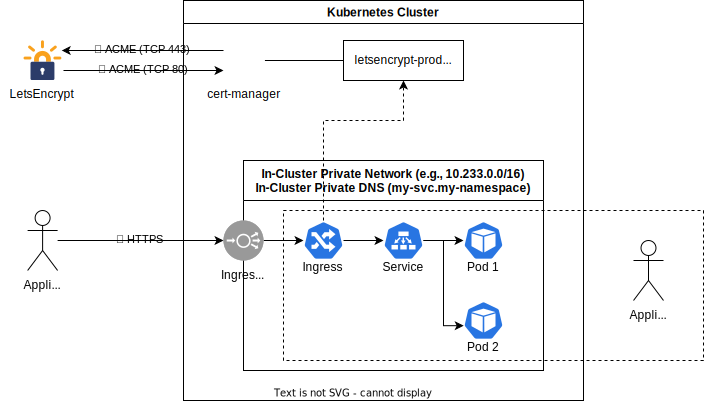
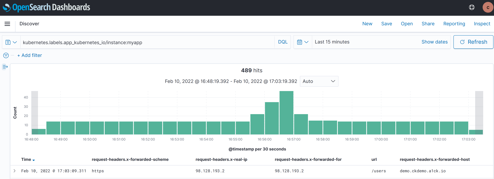

# Network Model

!!!note

    This section helps you implement ISO 27001, specifically:

    * A.10.1.2 Key Management
    * A.13.1.1 Network Controls
    * A.13.1.2 Security of Network Services
    * A.13.1.3 Segregation in Networks



The diagram above present a useful model when reasoning about networking in Compliant Kubernetes.

!!!note

    This is just a **model** and not an architectural diagram. Under the hood, things are a lot more complicated.

## Private Network

Your application Pods, as well as Pods of [additional services](additional-services/index.md), can communicate on a secure private network, via [RFC1918](https://datatracker.ietf.org/doc/html/rfc1918) private IP addresses. It is analogous to a [VPC](https://en.wikipedia.org/wiki/Virtual_private_cloud) in VM-based workloads.

In Compliant Kubernetes, it is the responsibility of the administrator to ensure the in-cluster private network is secure and trusted, either by performing an [infrastructure audit](../operator-manual/provider-audit.md) or deploying [Pod-to-Pod encryption](https://elastisys.com/redundancy-across-data-centers-with-kubernetes-wireguard-and-rook/).

You should use NetworkPolicies to segregate your Pods. This improves your security posture by reducing the blast radius in case parts of your application are under attack.

!!!example

    Feel free to take inspiration from the [user demo](https://github.com/elastisys/compliantkubernetes/blob/main/user-demo/deploy/ck8s-user-demo/templates/networkpolicy.yaml).

    More example recipes for Kubernetes Network Policies that you can just copy paste can be found [here](https://github.com/ahmetb/kubernetes-network-policy-recipes).

## Private DNS

The private network also features a private DNS. A Service `my-svc` in the namespace `my-namespace` can be accessed from within the Kubernetes cluster as `my-svc.my-namespace`.

IP addresses of Pods are not stable. For example, the rollout of a new container image creates new Pods, which will have new IP addresses. Therefore, you should always use private DNS names of Services to connect your application Pods, as well as to connect your application to [additional services](additional-services/index.md).

## Ingress

Your End Users should never ever access the private network directly. Instead external access is enabled by creating Ingress objects. Compliant Kubernetes already comes with cert-manager and is already configured with a ClusterIssuer. A secure ACME protocol is used to issue and rotate certificates using the [Let's Encrypt](https://letsencrypt.org/) public service.

Assuming you configured a Service and a Deployment for you application, making End Users access your application involves two steps:

1. Create the right DNS CNAME record.
1. Create the right Ingress resource.

### Running Example

Let us assume you want to host your application behind the nicely branded domain `demo.example.com`. Proceed as follows:

For step 1, create a DNS CNAME as follows:

```text
demo.example.com. 900 CNAME app.$DOMAIN.
```

where `$DOMAIN` is the environment-specific variable [you received from the administrator](prepare.md#access-your-web-portals). The line above is presented in [DNS Zone file](https://en.wikipedia.org/wiki/Zone_file) format and is widely accepted by DNS providers.

After configuration, make sure the DNS record is properly configured and propagated, by typing:

```bash
host -a demo.example.com.
```

!!!important

    In the above examples, the domain name is [fully qualified](https://en.wikipedia.org/wiki/Fully_qualified_domain_name), i.e., it ends with a dot. Make sure your DNS provider does not mis-interpret it as a relative domain name. Otherwise, you risk creating a DNS record like `demo.example.com.example.com` which is rarely what you want.

!!!important

    Be cautious when using CNAMEs and apex domains (e.g., `example.com`). See [here](https://serverfault.com/questions/613829/why-cant-a-cname-record-be-used-at-the-apex-aka-root-of-a-domain) for a long discussion of potential problems and current workarounds.

For step 2, create an Ingress object with the right `metadata.annotations` and `spec.tls`, as exemplified below:

```yaml
apiVersion: networking.k8s.io/v1
kind: Ingress
metadata:
  name: myapp-ck8s-user-demo
  annotations:
    # To list your current ClusterIssuers, simply use 'kubectl get ClusterIssuers'.
    cert-manager.io/cluster-issuer: letsencrypt-prod
    ## Uncomment the line below to implement source IP allowlisting.
    ## Blocklisted IPs will get HTTP 403.
    # nginx.ingress.kubernetes.io/whitelist-source-range: 98.128.193.2/32
    ## Uncomment the lines below to get OAuth authentication
    ## You will also need to configure and install oauth2-proxy.
    ## For an example and more details, see https://github.com/elastisys/compliantkubernetes/blob/main/user-demo/deploy/oauth2-proxy.yaml
    # nginx.ingress.kubernetes.io/auth-url: "https://$host/oauth2/auth"
    # nginx.ingress.kubernetes.io/auth-signin: "https://$host/oauth2/start?rd=$escaped_request_uri"
    # nginx.ingress.kubernetes.io/auth-response-headers: "authorization"
spec:
  ingressClassName: nginx
  rules:
    - host: "demo.example.com"
      http:
        paths:
          - path: /
            pathType: Prefix
            backend:
              service:
                name: myapp-ck8s-user-demo
                port:
                  number: 3000
  tls:
    - hosts:
        - "demo.example.com"
      secretName: demo.example.com-tls
```

!!!example

    Feel free to take inspiration from the [user demo](https://github.com/elastisys/compliantkubernetes/blob/main/user-demo/deploy/ck8s-user-demo/values.yaml#L34).

    If you want to protect your Ingress with OAuth2-based authentication, check out [oauth2-proxy](https://github.com/elastisys/compliantkubernetes/blob/main/user-demo/deploy/oauth2-proxy.yaml).

!!!important

    The DNS name in `spec.rules[0].host` and `spec.tls[0].hosts[0]` must be the same as the DNS entry used by your End Users, in the example above `demo.example.com`. Otherwise, the End Users will get a "Your connection is not private" error.

!!!important

    Some load-balancers fronting Compliant Kubernetes do not preserve source IP. This makes source IP allowlisting unusable.

    To check if source IP is preserved, check the HTTP request headers received by your application, specifically `x-forwarded-for` and `x-real-ip`. The [user demo](https://github.com/elastisys/compliantkubernetes/blob/main/user-demo/app.js#L24) logs all HTTP request headers, as shown in the screenshot below.

    

## Let's Encrypt

Let’s Encrypt is a certificate authority that provides free SSL/TLS certificates via an automated process. Their certificates are accepted by most of today’s browsers.

On Compliant Kubernetes, we provide a cert-manager setup which you can use to create, sign, install and renew certificates for your domains/apps running in CK8S.

### Issuing a Certificate

You can use cert-manager setup for general purpose certificates not directly linked to an Ingress object.

```yaml
apiVersion: cert-manager.io/v1
kind: Certificate
metadata:
  name: custom-cert
spec:
  dnsNames: # (1)
    - "domain.example.com"
  issuerRef: # (2)
    kind: ClusterIssuer
    name: letsencrypt-prod
  secretName: custom-cert # (3)
```

1. For which domains the certificate will be valid for.
1. Reference to the issuer to use.
1. The created certificate is stored in this secret.

And you can directly link a certificate to an Ingress object:

```yaml
apiVersion: networking.k8s.io/v1
kind: Ingress
metadata:
  annotations:
    cert-manager.io/cluster-issuer: letsencrypt-prod # (1)
  name: webapp-ingress
  namespace: default # (2)
spec:
  rules:
    - host: example.com
      http:
        paths:
          - pathType: Prefix
            path: /
            backend:
              service:
                name: myservice
                port:
                  number: 80
  tls: # (3)
    - hosts:
        - example.com
      secretName: webapp-certificate # (4)
```

1. Annotation indicating the issuer to use.
1. Target namespace where the object will be created.
1. Placing a host in the TLS config will determine what ends up in the cert’s subjectAltNames.
1. The created certificate is stored in this secret.

### Let's Encrypt Environments

Let's Encrypt provides two environments as part of their ACME V2 standardization: Staging & Production.

The ACME URL for Let's Encrypt ACME v2 staging environment is: https://acme-staging-v02.api.letsencrypt.org/directory

The ACME URL for Let's Encrypt ACME v2 production environment is: https://acme-v02.api.letsencrypt.org/directory

Both environments serve to issue valid certificates, the difference is the CA, on staging, the CA is not trusted by any application, web browser ..

We highly recommend testing against the Let’s Encrypt staging environment and use it for any non-production workloads. This will allow you to get things right before issuing trusted certificates and reduce the chance of you running up against rate limits. It should be to test that your client is working fine and can generate the challenges, certificates…

!!!important

    Certificates issued by the Let's Encrypt staging environment are signed by untrusted authorities, similar to self-signed certificates. They are typically not used in production environments.

### Rate Limits

Let's Encrypt provides rate-limits on generated certificates to ensure fair usage across all clients. The production environment limits can be exceeded more frequently in environments where certificates are installed or reinstalled frequently. This can result in failed installations due to rate limit exceptions on certificate generation.

In such environments, it is better to use the Let's Encrypt staging environment, which has much higher limits than the production environment.

The default rate limits for the production environment are listed in the following page by Let's Encrypt: [Production Rate Limits](https://letsencrypt.org/docs/rate-limits/).

The staging environment uses the same rate limits as described for the production environment with some exceptions that are listed here : [Staging Rate Limits](https://letsencrypt.org/docs/staging-environment/).

## Demarcation of Responsibilities

You are responsible for:

- creating Pods (via Deployments), Service and Ingress;
- segregating the private network via NetworkPolicies;
- configuring Ingresses as required to enable HTTPS encryption.

The [user demo](https://github.com/elastisys/compliantkubernetes/tree/main/user-demo/deploy/ck8s-user-demo) already showcases the above.

The Compliant Kubernetes administrator is responsible for:

- ensuring cert-manager works and is configured correctly;
- ensuring ClusterIssuers exist and are configured correctly;
- ensuring the private network is secure or trusted.

## Further Reading

- [DNS for Services and Pods](https://kubernetes.io/docs/concepts/services-networking/dns-pod-service/)
- [Ingress](https://kubernetes.io/docs/concepts/services-networking/ingress/)
- [NetworkPolicies](https://kubernetes.io/docs/concepts/services-networking/network-policies/)
