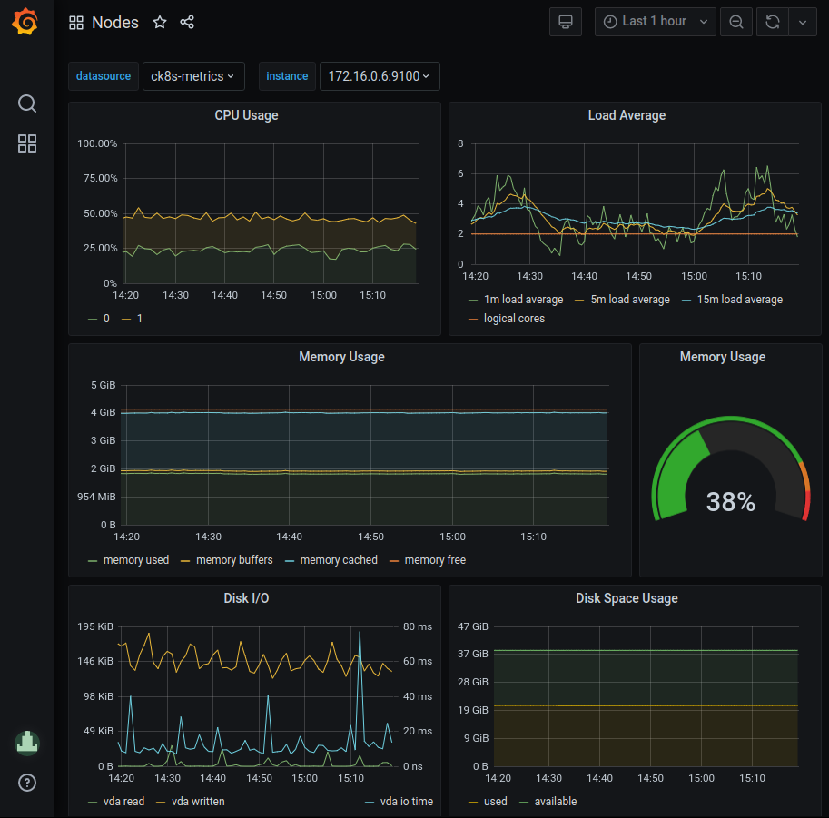
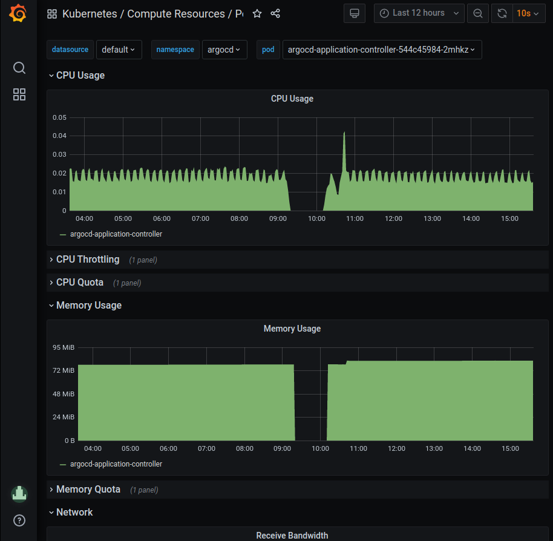

# Prometheus and Grafana
This guide gives am introduction to Prometheus and Grafana and where they fit in Compliant Kubernetes, in terms of reducing the compliance burden.

## Why Prometheus and Grafana?
Prometheus is open-source solution for monitoring and alerting. It works by collecting and processing metrics from the various services in the cluster. It is widely used, stable and a [CNCF](https://www.cncf.io/) member. It is relatively easy to write ServiceMonitors for any custom services to get monitoring data from them into Prometheus.

Grafana is the most widely used technology for visualization of metrics and analytics. It supports a multitude of data sources and it is easy to create custom dashboards. Grafana is created by Grafana Labs, a CNCF Silver Member.

##Compliance needs
The requriements to comply with ISO 27001 are stated in ISO [27001:2013](https://www.isms.online/iso-27001/) The annexes that mostly concerns monitoring and alerting are [Annex 12](https://www.isms.online/iso-27001/annex-a-12-operations-security/), article A.12.1.3 "capacity management", and [Annex 16](https://www.isms.online/iso-27001/annex-a-16-information-security-incident-management/) which deals with incident management.

### Capacity management
Article A.12.1.3 states that "The use of resources must be monitored, tuned and projections made of future capacity requirements to ensure the required system performance to meet the business objectives."

* Promethus and Grafana helps with this as the resource usage, such as storage capacity, cpu, and network usage can be monitored. Using visualization in Grafana, projections can be made as to future capacity requriements.

The article goes on to say that "Capacity management also needs to be: Pro-active – for example, using capacity considerations as part of change management; Re-active – e.g. triggers and alerts for when capacity usage is reaching a critical point so that timely increases, temporary or permanent can be made."

* Prometheus has a rich alerting functionality, allowing you to set up alerts to warn if, for example, thresholds are exceeded or performance is degraded.

### Incident management
Annex A.16.1 is about management of information security incidents, events and weaknesses. The objective in this Annex A area is to ensure a consistent and effective approach to the lifecycle of incidents, events and weaknesses. Incidents needs to be tracked, reported, and lessons learned from them to improve processes and reduce the possibility of similar icidents occuring in the future.

Prometheus and Grafana can help with this by maing it easier to:

* collect evidence as soon as possible after the occurrence.
* conduct an information security forensics analysis
* communicate the existence of the information security incident or any relevant details to the leadership.

## Prometheus and Grafana in Compliant Kubernetes

###Prometheus
Compliant Kubernetes installs the prometheus-operator by default. The Prometheus Operator for Kubernetes provides easy monitoring definitions for Kubernetes services and deployment and management of Prometheus instances as it can create/configure/manage Prometheus clusters atop Kubernetes. The folloing CRDs are installed by defualt.

| crd | apigroup | kind | used by | description | 
| :-- | :-- | :-- | :-- | :-- |
| alertmanagers	| monitoring.coreos.com | Alertmanager | prometheus-alerts | |
| podmonitors | monitoring.coreos.com | PodMonitor | customer-rbac | |
| prometheuses | monitoring.coreos.com | Prometheus | | |
| prometheusrules | monitoring.coreos.com | PrometheusRule | customer-rbac, elasticsearch | |
| servicemonitors | monitoring.coreos.com | ServiceMonitor | customer-rbac, dex, grafana, kibana, elastisearch, influxdb | |
| thanosrulers | monitoring.coreos.com | ThanosRuler | | |

####Accessing Prometheus
The web interface is not exposed by default in Compliant Kubernetes. In order to access it, the most straight-forward way is to use port forwarding via the [Kubernetes API](../kubernetes-api).

	kubectl -- -n monitoring port-forward prometheus-prometheus-operator-prometheus-0 9090:9090

Depending on your Compliant Kubernetes settings, access to the Prometheus server might have been disabled by the operator.

###Grafana
Grafana can be accessed at the endpoint provided by the compliant kubernetes install scripts. If you have configured dex you can login with a connected account. 

Compliant Kubernetes deploys Grafana with a selection of dashboards by default. Dashboards are accessed by clicking the Dashboard icon (for squares) at the lefthand side of the grafana window and selecting Manage. Some examples of useful dashboards are listed below.

#### Node health
The Nodes dashboard (Nodes) gives a quick overview of the status (health) of a node in the cluster. By selecting an instance in the "instance" dropdown metrics for CPU, Load, Memory, Disk and Network I/O is showed for that node. The time frame can be changed either by using the time dropdown or selecting directly in the graphs.

#### Pod health
The Pods dashboard (Kubernetes/Compute resources/Pods) gives a quick overview of the status (health) of a pod in the cluster. By selecting a pod in the "pod" dropdown metrics for CPU, Memory, and Network I/O is showed for that node. The time frame can be changed either by using the time dropdown or selecting directly in the graphs.

### Further reading
For more information please refer to the official [Prometheus](https://prometheus.io/docs/) and [Grafana](https://grafana.com/docs/grafana/latest/) documentation.
