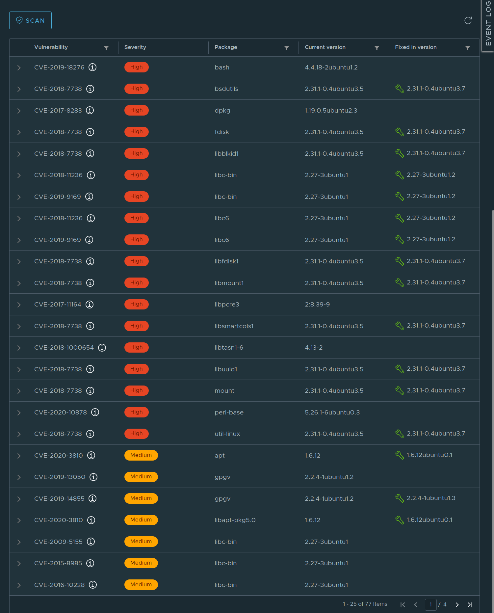

# Harbor - private container registry

This guide gives an introduction to Harbor and where it fits in Compliant Kubernetes, in terms of reducing the compliance burden.

## What is a container registry and why it is needed?

A container registry is a system where you can store your container images in order to later use the images when you deploy your application (e.g. as a Pod in a Kubernetes cluster). The images need a permanent storage since they are used many times by different instances, especially in Kubernetes where Pods (which are using the images) are considered ephemeral, so it is not enough to just store images directly on nodes/virtual machines. There are many popular container registries available as services, e.g. Docker Hub and Google Container Registry.

A common workflow with container registries is to build your images in a CI/CD pipeline, push the images to your registry, let the pipeline change your deployments that uses the images, and let the deployments pull down the new images from the repository.


## What is Harbor?

Harbor is an open source container registry tool that allows you to host a registry privately. It also comes with some extra features such as vulnerability scanning and role based access control, this increases security and eases compliance with certain regulations. Harbor is also a [CNCF Graduated project](https://www.cncf.io/projects/), proving that it is widely used and is well supported.

## Why is Harbor used in Compliant Kubernetes?

Harbor is used in Compliant Kubernetes to provide a secure container registry and a way to manage container image vulnerabilities. Harbor comes packaged with a container image vulnerability scanner that can check if there are any known vulnerabilities in the images you upload to Harbor. The default scanner is Trivy, which provides a comprehensive vulnerability detection both at the OS package and language-specific package levels.

Below you can see both an image that has not been scanned and the same image after it has been scanned. After the image is scanned you can see the description, vulnerable package, and severity of each vulnerability as well as if it has been fixed in a later version. You can either scan the images manually or enable automatic scanning whenever a new image is pushed to Harbor, we recommend automatic scanning.




In Harbor you can then also restrict so that you can't pull down images that have vulnerabilities of a certain severity or higher. This ensures that you don't accidentally start to use vulnerable images.

If you try to deploy a Pod that uses a vulnerable image it will fail to pull the image. When you then inspect the Pod with `kubectl describe` you will find an error message similar to this:

```Text
Failed to pull image "harbor.test.compliantkubernetes.io/test/ubuntu": rpc error: code = Unknown desc = Error response from daemon: unknown: current image with 77 vulnerabilities cannot be pulled due to configured policy in 'Prevent images with vulnerability severity of "Medium" or higher from running.' To continue with pull, please contact your project administrator to exempt matched vulnerabilities through configuring the CVE whitelist.
```

By default we also prevent you from running images from anywhere else than your Harbor instance. This is to ensure that you use all of these security features and don't accidentally pull down vulnerable images from other container registries. We are using Open Policy Agent and Gatekeeper to manage this prevention. If you try to deploy a Pod with an image from another registry you will get an error message similar to this:

```Text
for: "unsafe-image.yaml": admission webhook "validation.gatekeeper.sh" denied the request: [denied by require-harbor-repo] container "unsafe-container" has an invalid image repo "unsafe.registry.io/ubuntu", allowed repos are ["harbor.test.compliantkubernetes.io"]
```

## Running Example

<!--user-demo-registry-start-->

### Configure container registry credentials

First, retrieve your Harbor CLI secret and configure your local Docker client.

1. In your browser, type `harbor.$DOMAIN` where `$DOMAIN` is the information you retrieved from your administrator.
2. Log into Harbor using Single Sign-On (SSO) via OpenID.
3. In the right-top corner, click on your username, then "User Profile".
4. Copy your CLI secret.
5. Now log into the container registry: `docker login harbor.$DOMAIN`.
6. You should see `Login Succeeded`.

### Create a registry project

!!!example
    Here is an [example Dockerfile](https://github.com/elastisys/compliantkubernetes/blob/main/user-demo/Dockerfile) and [.dockerignore](https://github.com/elastisys/compliantkubernetes/blob/main/user-demo/.dockerignore) to get you started. Don't forget to run as non-root.

If you haven't already done so, create a project called `demo` via the Harbor UI, which you have accessed in the previous step.

### Clone the user demo

If you haven't done so already, clone the user demo:

```bash
git clone https://github.com/elastisys/compliantkubernetes/
cd compliantkubernetes/user-demo
```

### Build and push the image

```bash
REGISTRY_PROJECT=demo  # Name of the project, created above
TAG=v1                 # Container image tag

docker build -t harbor.$DOMAIN/$REGISTRY_PROJECT/ck8s-user-demo:$TAG .
docker push harbor.$DOMAIN/$REGISTRY_PROJECT/ck8s-user-demo:$TAG
```

You should see no error message. Note down the `sha256` of the image.

### Verification

1. Go to `harbor.$DOMAIN`.
2. Choose the `demo` project.
3. Check if the image was uploaded successfully, by comparing the tag's `sha256` with the one returned by the `docker push` command above.
4. (Optional) While you're at it, why not run the vulnerability scanner on the image you just pushed.

<!--user-demo-registry-end-->

## User access
If OIDC was enabled (e.g. DeX) your Harbor user will be created when you first login to the web interface. That user will not have admin privileges, if you need admin rights please contact the administrator by opening a support ticket.

## Further reading

For more information please refer to the official [Harbor](https://goharbor.io/docs/2.0.0/), [Trivy](https://github.com/aquasecurity/trivy), [Open Policy Agent](https://www.openpolicyagent.org/docs/latest/) and [Gatekeeper](https://github.com/open-policy-agent/gatekeeper) documentation.
