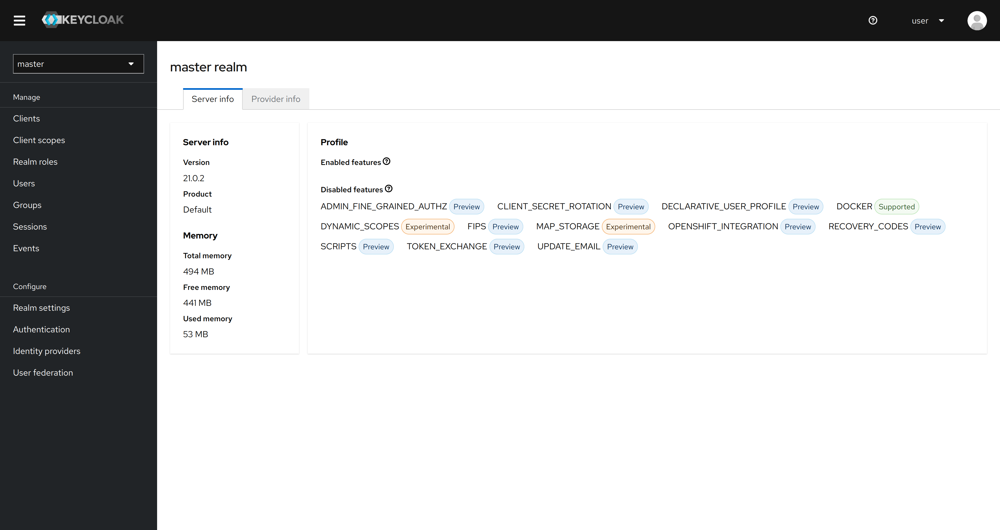

---
search:
  boost: 2
---
# Keycloak™ (self-managed)





This page will help you succeed in connecting your application to an identity and access management solution Keycloak, which meets your security and compliance requirements.

Keycloak is a widely recognized open-source Identity and Access Management (IAM) solution that provides user authentication and authorization services for applications. It offers a comprehensive set of features, including Single Sign-On (SSO), user federation, and social login support, making it a popular choice for securing applications in a variety of industries.

As of May 2023, Keycloak is a [CNCF Incubating project](https://www.cncf.io/blog/2023/04/11/keycloak-joins-cncf-as-an-incubating-project/).

In this guide we outline the necessary steps to configure and deploy a Keycloak instance on a Welkin cluster that is using the [managed PostgreSQL service](../additional-services/postgresql.md).

This will provide you with a robust and secure IAM solution to manage user access and authorization for your applications running on Welkin.

## Initial preparation

_Note: This guide assumes that you have managed PostgreSQL as an additional service._

[Setup an application database and user in PostgreSQL](../additional-services/postgresql.md)

Take note of the following variables for the next section.

- The application secret you have created.

- The following environment variables:

```sh
echo $PGHOST
echo $APP_USERNAME
echo $APP_DATABASE
```

## Configure Keycloak with managed PostgreSQL

We chose Bitnami's Helm chart for [Keycloak](https://github.com/bitnami/charts/tree/main/bitnami/keycloak) due to its open-source nature, ease of deployment, security optimization, and active maintenance.

Bitnami is a well known provider of pre-configured, open-source application stacks that simplify deployment and management in various environments, such as Kubernetes. They offer a Helm chart for Keycloak, which streamlines deployment while adhering to Kubernetes best practices for security.

### Deploying Keycloak

Below is a sample **values.yaml** file that can be used to deploy Keycloak, please read the notes and change what is necessary.

```yaml
resources: # (1)
  limits:
    #cpu: 1000m
    memory: 1000Mi
  requests:
    cpu: 1000m
    memory: 400Mi

postgresql:
  enabled: false

externalDatabase: # (2)
  host: "<PGHOST>"
  port: 5432
  user: <APP_USERNAME>
  database: <APP_DATABASE>
  existingSecret: "<secret-name>"
  existingSecretPasswordKey: "PGPASSWORD"

ingress: # (3)
  enabled: true
  ingressClassName: "nginx"
  hostname: <URL>
  annotations:
    cert-manager.io/cluster-issuer: letsencrypt-prod
  tls: true

containerSecurityContext:
  allowPrivilegeEscalation: false
  capabilities:
    drop: ["ALL"]
  runAsNonRoot: true
  seccompProfile:
    type: "RuntimeDefault"

production: true # (4)
proxy: edge
```

1. The example provided serves as a starting point for configuring resource requests and limits for your Keycloak deployment. Be sure to tailor these values to your specific requirements, and monitor your deployment to optimize resource allocation for your unique use case.
1. Insert the variables that you got from initial preparation.
1. Configure the Ingress hostname and which issuer you will be using.
1. Enabling production mode and TLS for HTTPS. Disclaimer: Enabling production mode does not mean that the configuration here is ready for production. Please see further reading on Production configuration.

!!!failure

    The values file above was produced for Keycloak Chart version 16.1.5 (appVersion 22.0.3).
    The shape of the values files and the required configuration may have changed with newer versions of the Keycloak Chart.
    Prefer installing the latest version to make sure you get all security updates.
    If you understand the security risks and only want to "kick-the-tires" then add `--version 16.1.5` in the command below.

With the above values you can deploy Keycloak with:

```sh
helm repo add bitnami https://charts.bitnami.com/bitnami
helm upgrade --install keycloak bitnami/keycloak --values values.yaml
```

It might take up to 2 minutes for Keycloak to start. You can check progress as follows:

```sh
kubectl get pods --watch
```

Make sure you see `READY 1/1` for the Keycloak Pod.

### Accessing Keycloak

When you have deployed Keycloak and can access the URL you can:

[Login as admin and configure realms, users, and clients.](https://www.keycloak.org/getting-started/getting-started-kube)

The default admin user is `user`.

The initial admin password can be fetched using the command below (assuming default namespace):

```sh
kubectl get secret keycloak -o jsonpath="{.data.admin-password}" | base64 -d
```

Note: If you uninstall and install Keycloak the initial admin password will be regenerated but the previous initial admin password may still be used unless you clear the PostgreSQL database.

For more information about using Keycloak to secure/protect your applications, see “Securing your applications” and “Reverse Proxy” in the further reading section.

## Further Reading

- [Documentation](https://www.keycloak.org/documentation)
- [Guides](https://www.keycloak.org/guides)
- [Production Configuration](https://www.keycloak.org/server/configuration-production)
- [Reverse Proxy](https://www.keycloak.org/server/reverseproxy)
    - [Ingress NGINX](https://kubernetes.github.io/ingress-nginx/examples/auth/oauth-external-auth/)
    - [Oauth2-Proxy](https://oauth2-proxy.github.io/oauth2-proxy/configuration/providers/keycloak)
        - Note: the “oidc-issuer-url” may be outdated in the guide. See [this issue.](https://stackoverflow.com/questions/70577004/keycloak-could-not-find-resource-for-full-path)
        - Note: Keycloak realm steps may be different if you are using the new admin console. Instructions for that can be found on their [GitHub](https://github.com/oauth2-proxy/oauth2-proxy/blob/master/docs/docs/configuration/providers/keycloak_oidc.md).
- [Securing your applications](https://www.keycloak.org/securing-apps/overview)
